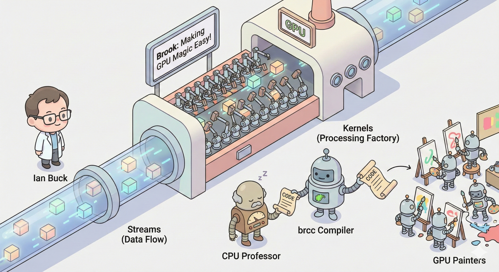

# 【AI】小白话系列——人工智能简史（四十七）

Ian Buck 在斯坦福研发的初版 Brook，相当于把只有计算机图形博士能干的那些「魔法技能」包装了一下：

#### 首先，Brook 扩展了 C 语言的功能 —— 支持流的 C 语言。

C 语言是当时几乎所有高级程序员都会用的计算机编程语言，自从 70 年代发明 C 语言以来，一直是系统程序员的母语。

Ian Buck 基于 C 语言的语法，增加了两个关键概念：

1. Streams：数据流

   * 数据流顾名思义，就像一条装满数据的河流。你可以把它理解为一种二维、三维或者更多维的数组。最关键的是，这里面的数据是相互独立的，可以并行计算。也就是说，这些数据它们不是排着队一个跟一个慢慢过闸，而是像洪水一样直接漫过河床。

   * 语法像这样：

     ``float a<1024, 1024>; // 声明一个包含100万个浮点数的二维流``

2. Kernels：处理工厂

   * 它对 Streams 里的每个数据点“同时”操作（其实是 GPU 的上千个小核心并行干活）。

   * 语法像这样：

     ```C
     kernel void vector_add(float a<>, float b<>, out float c<>) {
         c = a + b; // 对流中的每一个元素执行加法
     }
     ```

于是，科学家们不再需要理解计算机图形的复杂理论，只要懂 C 语言，就能把自己的各种科学计算需求，映射到 Streams 和 Kernels 这一对并行数据的存取和处理模式中。

#### 其次，他构造了一个编译器 brcc

这是一个源码到源码级的编译器。你写好的 Brook 程序编译时，被一刀劈成两半：

1. 一部分是 CPU 要执行的常规流程控制代码。
2. 另一部分，Kernel 里那些需要 GPU 执行的数学计算函数，被编译成图形渲染的汇编指令。

它就像一个兼职快递分拣员的翻译，一份代码到手，它左手把日常流程扔给 CPU 那位老教授，右手把科学计算翻译成绘画蓝图，扔给会画画的那群天才小学生画手。

#### 最后，他用运行环境把运算变成绘图过程

之前所说那些搭建舞台、让GPU 渲染图形、截图取证的复杂过程，全部 Brook 运行库被自动化了。

当然，虽然把计算机图形博士才能掌握的魔法包装进了Brook，那个时代 GPU 的硬件限制依然还在：显存不够大，数据传输慢，还只能随机读，不能随机写等等……

……

科学家们需要更通用的并行计算硬件，黄仁勋也正在苦思冥想用什么战略来应对 CPU 巨头对 GPU 小厂的步步绞杀。

于是，几乎就在前后脚，黄仁勋把博士毕业的 Ian Buck 再次招进了英伟达，并把他塞进 G80 这个肩负着「下一代顶级 GPU 显卡」的项目团队里，负责把 Brook 做成真正的通用计算平台。

最开始，这个团队算上 Ian Buck 自己，总共只有两个人。 但在黄仁勋 和 David Kirk 的支持下，他们对下一代显卡的硬件架构产生了关键的影响。



<待续>