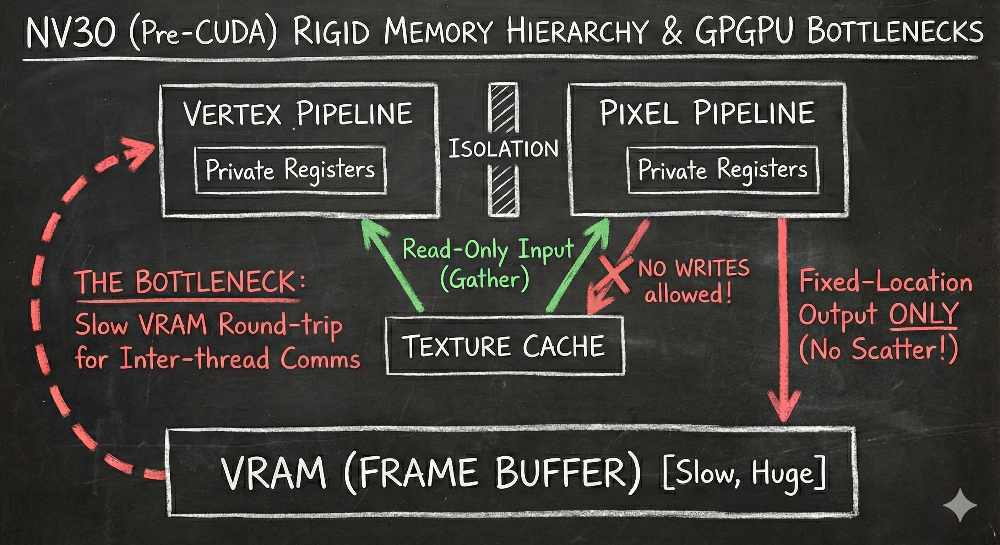
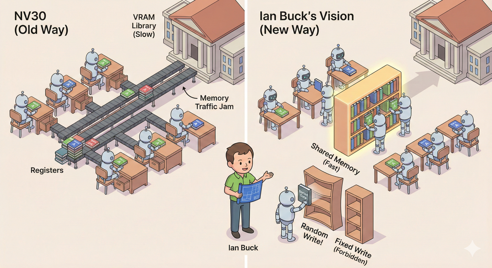

# 【AI】小白话系列——人工智能简史（四十八）

Ian Buck 到了英伟达后，首先扔给 N80 硬件架构总监 John Nickolls 的，就是之前纯粹靠软件绝对搞不定的那两个需求：

#### 1. 共享内存

在游戏 3D 的绘图场景中，屏幕的像素和像素之间是没有关联的。所以以前显卡，比如 NV30 架构中的 16 条管线，是完全隔离的。

就好像之前的比喻，把教室的小学生分成 16 组，它们只管照着说明绘自己的图就行，根本不用管旁边那组在干什么。

但这种互不相干的并行计算，放到科学研究的和计算的场景中，其实及其罕见。更多的情况下，不同并行线程之间，有着大量的数据交互。

哪怕还是用之前用过的，最简单的矩阵乘法 ($C = A \times B$) 作为例子。

线程 A 被分配计算 元素$C_{1,1}$，它必须去遥远的主显存里，把 $A$ 的第一行和 $B$ 的第一列全部读过来。

与此同时，旁边的 线程 B 被分配计算 元素$C_{1,2}$，它需要$A$ 的第一行和 $B$ 的第二列。但是，线程 A 刚刚拿到 $A$ 的第一行数据，放在自己私有的寄存器里。线程 B 用不了，也看不到。它必须重新从主显存 VRAM 里再读一次——也就是上面那张示意图里的红色虚线箭头。

注意这张架构示意图里有三种存储：

一种叫寄存器，速度极快（0延迟）——相当于小学生手边的抽屉，放在里面的东西伸手可得。

另一种叫高速缓存，速度也很快（1～2个时钟周期）——相当于教室里的黑板，抬头就能看见。

还有一种叫主显存（VRAM），容量巨大但是速度也慢很多（400～600个时钟周期）——相当于学校的图书馆，通常在另一栋楼里，去拿一次资料得费不老少功夫。

教学楼到图书馆的路虽然宽敞（主显存带宽有几十 GB/s），但架不住小学生们来回图书馆搬同一套画册，最终全堵在路上，教室里反而没人画图了。

所以，Ian Buck 的第一个诉求就是，能不能考虑科学计算的场景，把这大堵车场景先解决了？

比如把教室里的大黑板，改造成一个教室里的公共大书架？教室里不同小组同学都要用的参考画册，甚至中间结果，都可以搬到这里先？

#### 2.  随机写

老的显卡架构是为了 3D 画图效率极致设计过的。每个小学生的工作是算出交给他们的那个像素点是什么颜色。然后这个颜色要被严格地画到屏幕上的指定坐标。

也就是右边那个红色箭头，算完的数字，只能被写到指定坐标（也就是指定的内存位置）——相当于，每个小学生回图书馆上交自己任务画册时，只能把结果放到指定的楼层，指定的书架，指定的格子里。

比如，学过基础编程我们都知道，各种排序是最最常见的操作。

假如——我们需要把刚刚做过矩阵乘法的数据，进行最最简单的从大到小的排序。然后根据排序结果，把数据放到新位置上去——这在NV30 的老架构上，居然是被严格禁止的。

这给 Brook 时代用想用 GPU 做科学计算的科学家们带来了深深的困扰：

* 不能随机写，就没法用 C 语言最灵活的指针。
* 不能随机写，连最基本的排序的数据排序操作都做不了。

Ian Buck 的第二个诉求，就是开放随机写功能。可是，这会给原本高效简洁的并行 3D 渲染流程，带来什么不可预知的后果呢？

<待续>