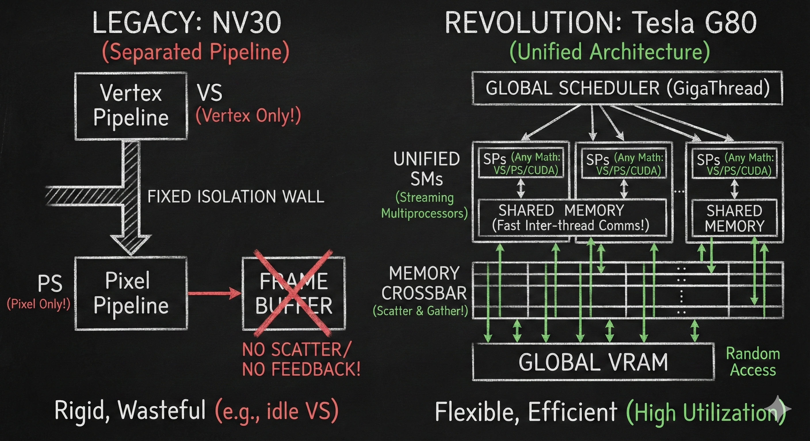

# 【AI】小白话系列——人工智能简史（四十九）

 John Nickolls 不仅仅要解决 Ian Buck 提出的科学计算需求。

实际上，他负责设计的这下一代架构，更肩负着这样的使命——复仇战胜 ATI ，一雪前耻，成为业界遥遥领先的 3D 显卡。

成年人的世界，果然不能做选择题，到处都是既要、又要的两难：

* 想要本来就拥挤到极限的芯片里，再塞进一大块共享内存，就好像在寸土寸金的 CBD 里重新规划一个巨大的中央公园，但不能减少摩天大楼的数量；
* 想要让硬件支持 C 语言的随机写，就好像在十六车道的高速公路出口，设计直接连通大型商超立体停车场的通路，允许每辆车直接停到自己要去的楼层和区域，却不发生拥堵和事故。

每一个难题都足够薅禿硬件架构师的一层头皮。不过，英伟达找到了强力外援。

实际上，Ian Buck 设计的 Brook 语言，最初是跑在斯坦福的流处理器 (Stream Processor)架构上的，只不过后来被 Ian Buck 移植到了消费级显卡上。

而负责流处理器项目的，正是当时斯坦福的大牛 Bill Dally 教授。他的团队曾拿到美国国防部（DARPA）和能源部（DOE）的资金，研发了著名的 Imagine 和 Merrimac 这两个基于流式计算的超算架构。

从2003年起，Bill Dally 就成为了英伟达的外部高级顾问。Bill 把自己在超算架构上的理论和构思，毫无保留地传授给了 John Nickolls 这群年轻的工程师。

比如，像上面这张示意图里左边画得那样，原本被固定的 **Rasterizer (光栅化器)**分隔开，只能依次干活的 Vertex （顶点着色器）和 Pixel （像素着色器）被统一成像右边那样的统一的**SM (Streaming Multiprocessor)** 阵列。

Bill Dally 的核心思想之一就是——既然显存慢，需要等待，那就接受现实，让它等待。只要让系统支持海量的线程，那么等待的时候，就可以光速切换到其他线程，抓紧干其他活。

为了实现这一点，John Nickolls 丧心病狂地给每个 SM 内部，配置了8，192 个 32位处理器，总容量 32 KB。整个 G80 ，16 个 SM 一共就有131，072 个寄存器，总容量 512 KB。别小看这 512 KB，这可是计算单元内部， 速度最快（0 延迟），造假最昂贵的 SRAM 电路。

相比上一代 NV30 / GeForce FX，每个像素着色器只有 16 / 32 个临时寄存器。而同时代——2006 年的顶级 CPU —— Intel Core 2 Duo ，每核心也不过 16 个通用寄存器，16 个向量寄存器，加起来不超过 400 字节。

换句话说，G80 单核心的寄存器数量，是同时代 CPU 核心的 100 倍！

这就像给教室里的每个小学生，都配备了一个巨大的、就在手边的工具柜。柜子数量多到他们可以暂存成千上万的工作的相关工件。

你可以想象一下，当正在画《星空图》的小学生画到一半时发现，重要的参考画册还需要等着从图书馆运来时，他不需要坐在那里发呆等待，而是立马把手头的半成品和所有那些蓝色、黄色的颜料、画笔通通扔进柜子里。然后从柜子里取出另一套家伙事，眨眼就从梵高变身维米尔，开始画《戴珍珠的少女》上那一抹微妙的红唇。

图书馆仍然在另一栋楼，取资料依然要时间，但这次，没有哪个小学生会闲着发呆。

对了，注意看示意图右边最上面的那个全局调度员 Global Scheduler，它会负责把任务（ Block，也就是线程组 ）分配给空闲的 SM。确保所有教室里，都能忙得热火朝天。

Block 可大可小，但每个 SM 最多同时处理 768 个线程。

768 这个庞大数字，会带来另一个大问题，我们下次再说。 

<待续>