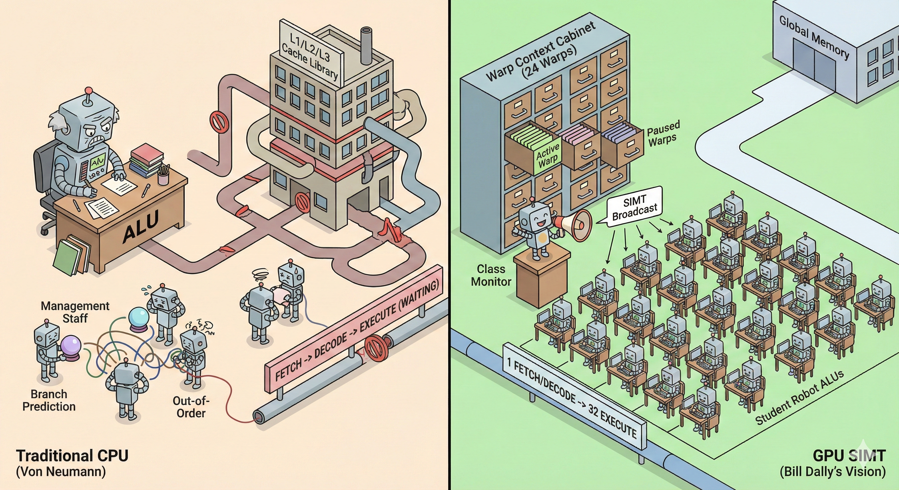

# 【AI】小白话系列——人工智能简史（五十）

现代计算机的理论基石来自冯诺伊曼，在这种架构下——计算单元（ALU）和存储单元（Memory）是物理分离的。正如我们之前的比喻：小学生干活的教室和存放数据的图书馆分别在两栋大楼里。

一个经典的冯氏数据处理流程是这样的：
**指令周期：** 取指令(Fetch) $\rightarrow$ 解码 (Decode) $\rightarrow$ 执行 (Execute)。

在这个过程中，只要遇到需要去内存取数据的指令，整个流程就不得不停下来等待。传统的 CPU 为了加快这个过程，减少延迟，在芯片上增加了各种复杂的电路：

1. 加盖多层图书室（L1/L2/L3 Cache）：在教室旁边，教学楼里修建大量图书室，把可能用到的数据提前搬到里教室最近的地方来。
2. 增加管理人员：进行分支预测（Branch Prediction）和乱序执行（Out-of-Order），用复杂的电路猜测后续可能的指令分支，提前把指令取出；或者在当前指令等待时，用复杂的电路找到后面不依赖当前数据的指令，提前进行后面的运算。

按照 CPU 的设计方法，如果再把并行线程数量提升到 768，也就是将近 100 倍，意味着整个芯片里要塞下以前100倍的电路，这在当时显然是不可能的。就算尽量省掉那些缓存和管理电路也一样。

而 Bill Dally 发现在科学计算的场景中，大量的数据需要的是相同类型的并行计算。既然如此，不如把取指令 / 解码指令的电路和执行指令的电路比例从 1  ：1 变成 1  ：N。

这就是 SIMT 广播机制——Bill Dally 和 John Nickolls 把相关线程组成线程束 Warp —— Warp 不是软件称呼，实质上是电流的共振—— 32 个线程共用一个大脑，同一个指令被取出、解码后，直接广播给  32 个 ALU，让它们针对各自的数据进行运算。

就好像有一个班长， 拿着大喇叭告诉 32 个小学生现在要画什么画，怎么画。不像 CPU 那个老教授，干活时旁边得有一整套管家班子、助手团队伺候着。

与此同时，教室里的大工具柜，允许同时暂存 24 组 Warp 的上下文，遇到阻碍随时切换，这样，只用一套取码、解码单元，32套执行单元，就能支持 768 个并行线程了。

<待续>