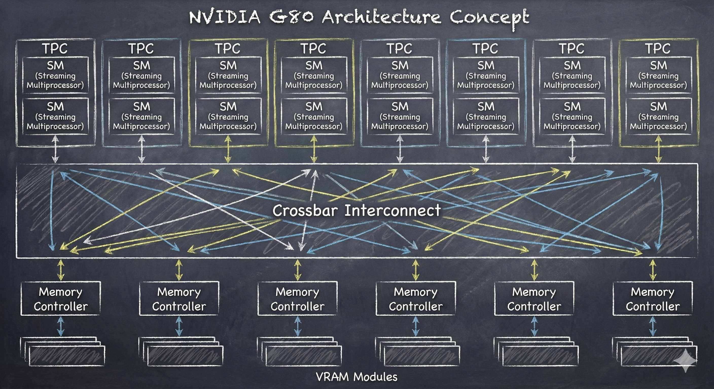
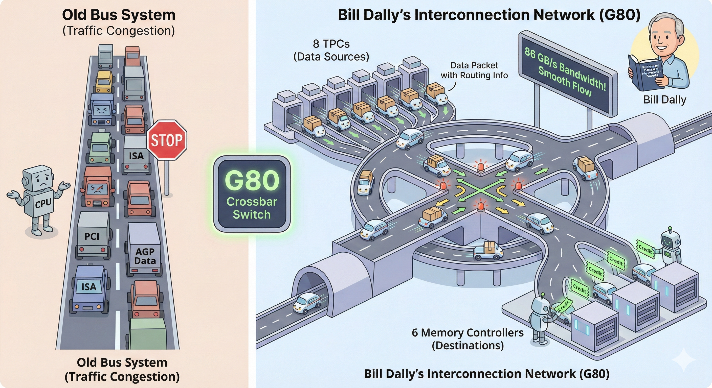

# 【AI】小白话系列——人工智能简史（五十二）

至于怎么解决这上千个并发线程同时随机写入任意地址内存的「交通拥堵」问题，不得不稍微展开说说 Bill Dally 这位祖师爷级的业界大拿，以及他和Brian Towlers在 2004 年出的那本经典教材《Principles and Practices of Interconnection Networks（互连网络原理与实践）》。

这本书，至今还是全球顶尖芯片设计工程师的必读圣经。而这本书的思想源头，则要追溯到 1986 年 Bill Dally 的博士论文——《[虫洞路由 The Torus Routing Chip](https://link.springer.com/article/10.1007/BF01660031)》，以及 1987 年在 IEEE发表的封神之作——《[Deadlock-Free Message Routing in Multiprocessor Interconnection Networks](https://authors.library.caltech.edu/records/fd0yr-br438/files/5231-TR-86.pdf)》。

他不仅提出，并从数学上证明了可以用虚拟通道解决死锁问题，并且在后来近二十年的学术生涯中，用实践证明了这条路线。

早年间电脑上的总线（Bus）真的是固定线路大巴车，这个名字，脱胎于电力时代发电厂里那根粗壮的，用来把分发给所有变压器、电路的巨大铜排。

那时候的电脑上，是真的有一排平行的铜线，贯穿整个电路板。从 CPU 到内存、硬盘全都挂在这排铜线上。和公交车一样，同一时间只能有一个人（设备）在上面传数据。

一开始是 ISA 总线（8 MB/s），

到后来解决显示带宽问题，有了直接挂接在 CPU 上的 VESA（133 MB/s），但是不够稳定，于是 Intel 推出了 PCI（133 MB/s），通过桥接芯片解决了稳定性问题。

3D 游戏爆发后，PCI 不够用了，业界又推出了 AGP（ 2GB/s ），专门给显卡用的下行通道。

直到 2003 / 2004 年，Intel 彻底抛弃了总线结构，推出了 PCIe 1.0。虽然和以前的 PCI 总线兼容，但它实际上挂着羊头卖狗肉，硬件上是货真价实的点对点互联网络——也就是 Bill Dally 搞的那个东西。

16 x PCIe 提供了4GB/s，也就是 2 倍 AGP 8x 的下行带宽，与此同时，上行带宽同样有恐怖的 4GB/s。这下子，实现 Ian Buck 的需求—— 用 GPU 做科学计算，支持海量的并行随机读写——终于有了一定程度的物理保障。

我们再看看这个时间线：

* 1987 年，Bill Dally 提出互联网络理论
* 1992 年，Bill Dally 证明这套理论可以在真实的硅晶片上跑通（J-Machine）
* 2002 年，Bill Dally 搞出了流式计算架构（Imagine）
* 2003 年，Bill Dally 被聘请为 NVIDIA 外部顾问
* 2003 年，PCIe 1.0 落地
* 2003 / 2004 年，G80 项目秘密启动，Ian Buck 被挖到 NVIDIA 负责计算平台
* 2004 年，出版《互联网络原理与实践》 

如果说，《互联网络原理与实践》是 Bill Dally 20年心法大成，那么 John Nickolls 设计实现的 G80 就是这套心法的物理实践与证明。

 

和上面这张示意图一样，在 G80 的芯片上，横亘这一条巨大的多级交叉开关（Crossbar Switch），它把上方的 8 个 TPC （一共 16 个SM）和下方的 6 个显存控制器全部连接起来。

1. 这是单芯片上的一个微型互联网，只要目标位置不重叠，8 个 TPC可以火力全开、用满全部带宽、全速向显存写入数据——这个内部带宽，高达 86 GB/s，是当时外部 PCIe 总线双向总带宽的 10 倍还多。

2. 要写入的数据也被切割成带有路由信息的数据包，这些数据包像快递一样，可以被高速送往不同地址。
3. 显存控制器像卖火车票一样，发放 Credit 来控制流量。SM 里的线程只有买到票才能把快递发上路。拿不到票的线程被 SM 切换，待在家里原地候车，原本可能造成拥堵的写入风暴就被这样削峰填谷。
4. 利用虚拟通道设计，确保变态代码也不会堵死整个「交通网络」。

就这样，Ian Buck 的那些用纯软件绝对无法搞定的需求，在 Bill Dally 指导下，被 John Nickolls 带着 G80 的架构设计团队，真真切切的变成了物理现实。

<待续>