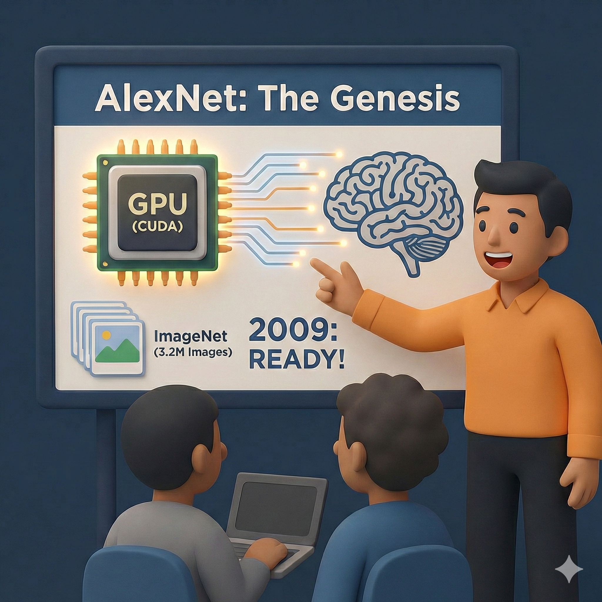

# 【AI】小白话系列——人工智能简史（五十三）

虽然看起来 Bill Dally 的理论解决了一切问题，但翻天覆地的架构变化，以及那个庞大的Crossbar 网络所带来的工程压力依然是恐怖和难以想象的。

G80 原计划推出在 2025年  推出，以便遵循黄仁勋 6 个月一个新产品，12月一款新架构的「铁律」，接上 NV40 的班。

但是，相比 NV 30，G80 的晶体管数量从 1.25 亿 暴增 5.8 倍，变成了 6.81 亿，面积从 198mm^2^ 变成了 484 mm^2^。而制程却只从 130nm 提升到了 90nm，一代半而已。

在这期间，Intel 秘密的 Larrabee 项目开始走漏风声，AMD 的 Fusion 计划如火如荼，正在对 ATI 展开收购。

其实 AMD 先找的黄仁勋，但不能容忍亲儿子英伟达落入他人掌控，黄仁勋要求做合并后的 CEO 。AMD 拒绝了。

两大巨头正在对整个 3D 图形显卡市场展开绞杀。

英伟达不得不用一边继续延用 NV40 的架构，在市场上厮杀，一边继续投资可能破局的 G80。

G80 最终一拖再拖，耗时四年，烧掉超过四亿美金才在 2006年 11月推出市场。

又过了一年，原本两个人的 Ian Buck 计算平台团队早已经变成了几十人的整编队伍，CUDA 正式问世。

这段关于 GPU 显卡的支线历史就这样回归了人工智能的主线。

2009 年，斯坦福的吴恩达和学生 Rajat Raina、Anand Madhavan  在ICML 大会上发表了题为 **[《使用图形处理器进行大规模深度无监督学习》(Large-scale Deep Unsupervised Learning using Graphics Processors)](https://robotics.stanford.edu/~ang/papers/icml09-LargeScaleUnsupervisedDeepLearningGPU.pdf)** 的论文。

同年同月，还在普林斯顿大学的李飞飞和他的学生邓嘉等等，在迈阿密举办的 CVPR 大会上，正式发表了改变计算机视觉历史的论文[《*ImageNet: A Large-Scale Hierarchical Image Database*》](https://image-net.org/static_files/papers/imagenet_cvpr09.pdf)，并向全球开源了当时包含 320 万张图片的初代 ImageNet 数据集。

[这就是AlexNet 诞生的前夜](20250903【AI】小白话系列——人工智能简史（二十二）.md)：

1. 支持 CUDA 的 GPU 显卡
2. 基于 GPU 跑通的机器学习训练法
3. 千万级海量人工标注的数据集
4. 蛰伏多年的神经网络

一切都准备好了！

<待续>