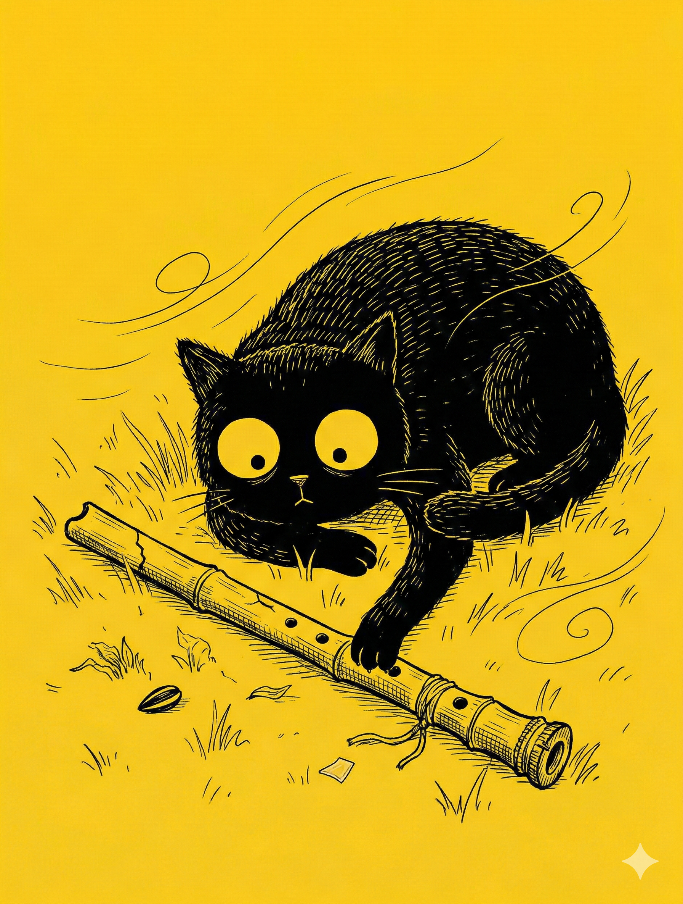

# 【随笔】吹不响的尺八

中午的天色依旧阴沉沉的，海边的风时大时小。

我一如既往地仔细在草坪上找了一片看起来平整的地方坐下。

坐下的瞬间，我留意到细碎的草叶其实有许多已经枯黄，中间还有一颗被清洁工遗漏的瓜子壳，一截清洁工难以发现的，笔尖大小半透明塑料。

不过，这些并不妨碍我找到一块搁脚的地方。

但我却发现自己下意识的掏出了手机，并且已经刷了一小会儿，留给自己吹尺八的时间已经不足二十分钟了。

> 已经努力地及时出门了，还是没剩下半小时！

内心里责备的声音再次响起，我皱了皱眉头，把手机塞进布包里，接着脱下运动鞋，把它们整齐地摆在布包旁边。

我换成正坐的姿势，整理了一下裤脚，确保小腿处没有什么小石子或大块的泥土硌着自己。便把眼镜也摘下来，放在布包上面。我把尺八拿了出来，把越来越松的接口紧了紧，又低头看了看——吹口处的崩裂越发明显。

我闭上眼睛，把尺八放到唇边。

头顶的无人机嗡嗡轰鸣着飞过，脑后的树上有一只小鸟大声地抗议着。三三俩俩的男女聊着天从身后的跑步道走过。

有些人经过时，估计距离我身边不太远，以至于我都能感受到土地被他们脚步带来的些微震动。

脚踝处传来一丝刺痛，也不知道是有蚂蚁还是什么小虫子把我当作入侵者咬了一口，还是自己皮肤里的触觉神经出现了虚假信号。

我忍住不去管所有这些，开始吹尺八。

用海山老师教的方法，只练长音，从最简单的筒音开始……

气流从嘴唇的缝隙吹出，撞击在尺八的吹口，发出嘶嘶的声音，却没有吹响。

我想起头一天晚上我也是吹不响尺八，但当时自己只用力地、愤怒地吹着，根本不想让尺八正常的出声。反而觉得那竭尽全力的吹气，那尖锐、刺耳、破碎的声音更能宣泄着自己莫名其妙的情绪。

直到最后，大宝让我停下来睡觉时，我握着尺八趴在床上许久，似乎累得动弹不得。

然而，此时为什么又吹不响了呢？

有人说，尺八难吹因为它最是敏感，心念一动声音就会中断。

我本想像头一天晚上那样，干脆再不管不顾地「狂」吹，却发现这时自己其实根本没有力气。

海风一时变得更大，迎面而来，把自己紧紧裹住。

我觉得自己整个胸腔，整个身体都被一种忧伤的裹住，泪水从里往外装满脑袋，却堵在最后一毫米，没法从眼睛里淌出来。只觉得，身体里似乎有一声长音想要直冲出去，和这裹住自己的忧伤应和。

但我只能轻轻的吹着气，然而嘴唇吹出的气流，还没走过那 0.5 厘米的距离到达吹口，就已经被海风吹散。

尺八继续嘶嘶地响着，只是偶尔轻轻的呜咽一声。

