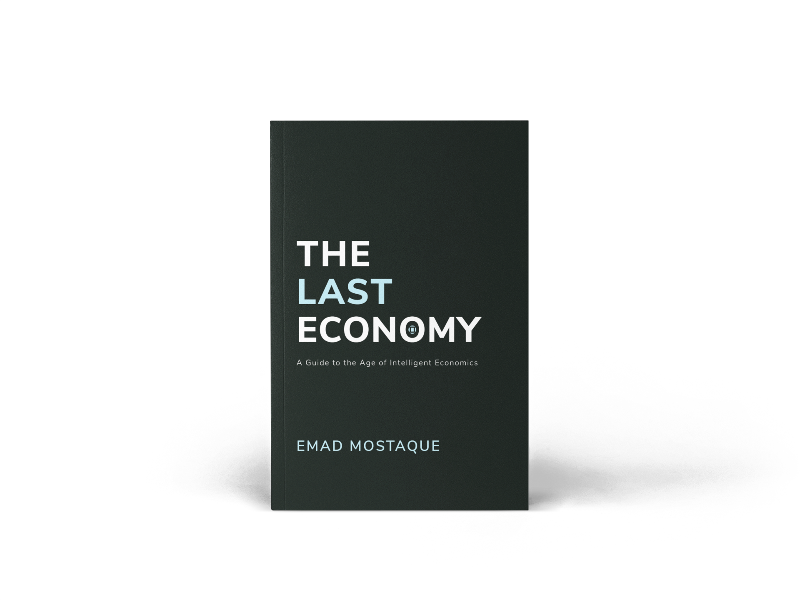
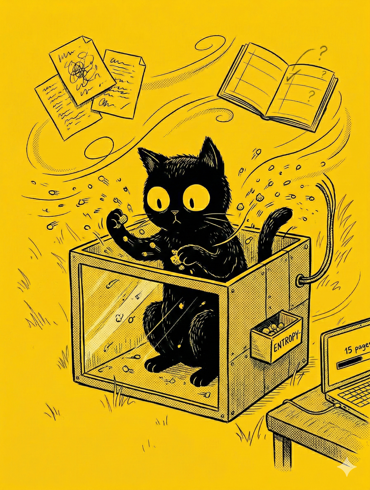

# 【随笔】推荐一本书《最后的经济》

那天是看 Citrini Research 点爆互联网的《[THE 2028 GLOBAL INTELLIGENCE CRISIS](https://www.citriniresearch.com/p/2028gic)》时，找到了[公众号《不懂经》的解读](https://mp.weixin.qq.com/s/Qx_i2Zo240LJM0m2dX7PRA)。

然后顺藤摸瓜，找到了总是和这篇报告一同被提起的另外两篇文章：

1. [前 Open AI 研究员 Daniel Kokotajlo 的 《AI 2027 》](https://ai-2027.com/ai-2027.pdf)
2. [Stable Diffusion 创始人 Emad Mostaque 的《最后的经济》](https://ii.inc/web/the-last-economy/zh)

我把这些文章和书的原文找到，然后扔到 Notebook LM，生成几个概要 PPT 翻看了一下。接着，对《最后的经济》这本书产生了兴趣。

毕竟这是一本书——哪怕是只有不到 200 页的小书，我对它的份量也不由得高看了几分。于是乎，我忍不住打开 PDF 文档，从前言部份开始看了起来。

全英文的短短一两页前言，花了我不少时间，但我已经被作者完全地抓住了。我一面庆幸自己开始阅读了原文，以至于没有漏掉 AI 总结中完全没有传递的那些文字细节，一面有些焦虑地扫了一眼屏幕右下角的时间，又转头看了看桌面那些写满混乱涂鸦的 A4 白纸和几乎空白的日程本。

> 如果照这个速度，读完这本书需要多久呢？

我迫不及待地想要读完它，又担心自己根本没有时间读完它。究竟还有多少想做的工作没有做，我已经越来越没有概念。这么想着，脑子有些疼，我随手就打开了 DeepSeek ，让它帮我把 PDF 一页一页地翻译成中文。

还是母语阅读速度快。

在憋到膀胱快要爆炸时，我忍无可忍地起身上厕所时。猫着腰离开电脑前，瞟了一眼页码和时间—— 15 页，过去了半小时。于是一边往洗手间小跑，一边盘算着——接下来，我每天花上一个小时就可以用一周读完这篇文章。

但结果自己从厕所回来后，眼睛再也没有离开过屏幕。

时间一晃而过，而我也越来越兴奋——曾经我一直相信古典经济学，对凯恩斯主义则不屑一顾——这几十页看完，我发现自己完全搞错了。

这是最近几个月来第二次，发现自己过去完全搞错了，然后还暗自高兴——上一次有这种感觉，是看见 Janna Levin 说，生命的存在可能只是熵增大河里的小小湍流。

这也是第二次，一本书还没读完，就兴奋地想要向所有人推荐——上次让我有这种感觉的书，是科勒的《跨越不可能》。当时书还没读完，我就发了好几次朋友圈。

回家的路上，我一面疯狂地踩着自行车，一面想着自己应该怎么向大宝描述自己的发现。对了，就这么说：

> 我可能发现 2008 年的比特币了！

……

我甚至起心动念，想要把这本书在 AI 的帮助下，一页一页翻译成中文。但很快，当我打开这本书的官网，我才惊讶地发现，原来中文版根本就是官方提供的版本之一。

我居然读了近一半才发现这个简单的事实。我居然在点开 PDF 的下载链接之后，就一直在 PDF 阅读器里这本书，我甚至把 PDF 上传到了微信读书，以防换了设备还能方便地继续阅读，却根本就没有再点击另外那个官网链接去看一眼！

在那里，各种版本的电子书，在线阅读，中文英文都有！

好吧，结论就是——强烈推荐！

如果你对人类社会经济的底层规律感兴趣，关注 AI 可能会给人类带来什么影响，建议你也读读这本书——至少可以先读读前几章感觉一下。

至于后面几章，容我下次再聊。

