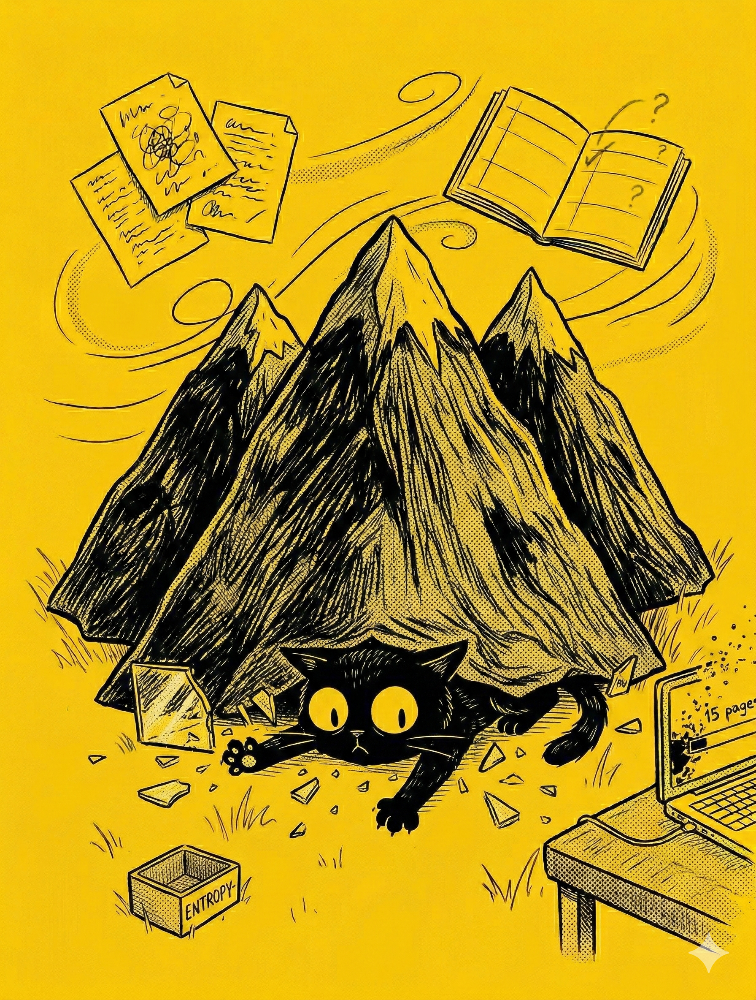

# 【随笔】有点想呕

继续聊聊那本《最后的经济》……

还没到家，想要告诉大宝「我发现了新比特币」的兴奋劲儿就被一通视频电话打断。

大宝告诉我，阿宝被爷爷打了，很是伤心。视频里的阿宝满眼是泪，委屈得说不出话来。

等这件事情彻底处理完，已经是深夜十一点过。

期间，在情绪风暴间歇的某个时候，我显然告诉过大宝那句话，她只是说：

> 那你快看完这本书，然后给我讲讲。

第二天，我果然没忍住，一口气把剩下的章节读完。

然而，前一天的那种发现新大陆的兴奋劲儿居然已经烟消云散。一整天，我都有点在恍惚中面对工作的煎熬。实在难受时，我会给大宝发一条消息吐槽：

> 完了，活干不完了！

> 愁……

> 都出现生理性反应，胃痛起来了……

过了下班时间许久，我依然还欠一份材料没有动工。我给大宝发消息：

> 我不想回来吃饭了。

过了一会儿，我又发了一条：

> 算了，我先回来了。

在这纠结中，我强忍着那种有些想呕的感觉，开始回家。回家的路上，我忽然想起一句话：

> 这是不是因为，我想把全人类的未来扛在自己身上啊？

记得有一次，我曾经试着想象——如果让我为中国当下的局面想一条出路，该怎么办——这个问题一开始思考，我就差点真的呕了出来。

Emad 的这本书从物理学角度，描绘了人类社会经济在 AI 冲击下的本质和最可能的走向。然后，又试图提出一个解决方案。

他抛出的问题紧紧抓住了我，提出的方案却粗糙得像是在浴室毛玻璃上随手画出的一个箭头。

明白自己为什么痛苦之后，心里稍微好受了一些。吃过晚饭，我告诉大宝我可能第二天需要加班。她说没问题，中午可以请我吃必胜客。

……

周日，我自己跑去办公室，把欠下的那份资料处理了个七七八八。到了午休，便去必胜客和大宝还有孩子们碰头。

<待续>