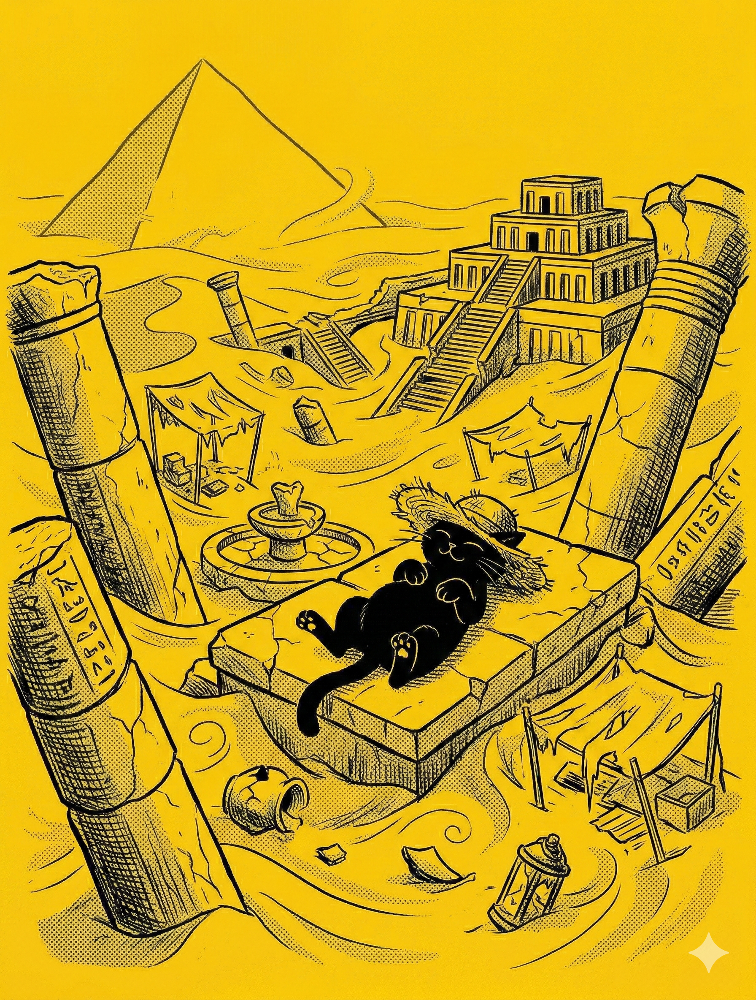

# 【随笔】归者复离

欠下的工作已经处理得七七八八，肚子咕咕叫了起来。

下楼后居然还找到一辆 2026 最新款带手机支架的美团单车。我把手机外放打开，插在支架上，导着航，听着歌，一路骑了过去。雨后的空气，清新极了。

他们已经提前到了必胜客，我在最里面的座位看到戴着遮阳帽的大宝，赶紧坐到她身边的空位上。

刚坐下，就被一股猛烈的空调风吹到后脑勺，我忍不住打了两个喷嚏，抬头一看，一个出风口正在头顶。难怪大宝把帽子戴得那么严实，我连忙把连帽衫的帽子也翻起来，把自己的脑袋藏得严严实实。

我建议大宝躲到对面去，于是她换到了阿宝和大鱼中间坐下，然后就开始吐槽：

> 本来我们可以吃两个大披萨，价值 59  块的大披萨。
>
> 可是她们非要把披萨换成意大利面，价值 29 块的意大利面。

我笑着说：

> 那怎么办？好像很不划算啊，还能换回来吗？

她说：

> 不行啊，我已经点好了！换不了……

我说：

> 那批评一下阿宝？

我转头对着阿宝：

> 那妈妈给你点你们爱的意大利面，你可不能说她讨厌呢！

阿宝尖叫一声，然后对我皱起眉头表示抗议，我只好闭嘴。

不一会儿，送餐的小机器人送来了意大利面，又送来了披萨，还有一个打卡就送的芝士蛋挞。

阿宝也想吃那个蛋挞，我好说歹说总算是答应可以分给我一口。然后我把手套递给大宝，说：

> 那，我们开始享受你想吃的披萨吧。

大宝嘟哝了一声：

> 披萨也是他们俩选的他们想吃的，不是我选的。

我自己也戴上一只手套，拿起一块披萨，小声说：

> 不管咋样，现在也只能好好享受这披萨吧。

静下心来细细咀嚼，披萨还挺香的，我吃完一块，又拿起一块，最后看见只剩下两块时，我停了下来。

这时，阿宝把剩下的半块蛋挞递给我，我张开大嘴一口吞掉，然后满意地对阿宝说：

> 真好吃！

阿宝问我：

> 你知道这个叫什么名字吗？

我赶紧看了一眼桌上那个打卡送蛋挞的宣传牌，告诉她说：

> XXX 芝士蛋挞啊～

阿宝嘴角轻轻往下动了一下，问：

> 你怎么知道的？

我指着牌子说：

> 在这里看到的呀。

阿宝不甘心，接着问：

> 要是你没看，你知道吗？

我摇摇头，说：

> 当然不知道了，这么奇怪又复杂的名字。

阿宝笑了起来，又开始拿起一块披萨吃起来。

过了一会儿，阿宝把手一摊，那是剩下的一块披萨边。她说：

> 我吃饱了！送给你了……

大宝笑着对我说：

> 诺，你女儿送给你的礼物。

我伸手接过了这块饼，细细咬下一点，慢慢地咀嚼着。

哪怕没有任何馅料，这块饼依然香喷喷的，嚼起来自然而然地口水四溢。我抬起头，认真地享受口中的麦香味，却被对面墙上的宣传海报吸引了。

画面上是残破的巨型石柱，被风沙掩埋的拱门，还有上面波斯风格的雕塑。断壁残垣在金色的夕阳下肃杀凄美。

大宝张嘴正要说话，到我耳边却自动变成了嗡嗡的背景音。我默默读着海报上的文字：

> 居尔城。
>
> 此处曾经是繁华的市集，
>
> 万千商旅云集于此，分享智慧与财富。
>
> 然而时光荏苒，归者复离。

大宝话说完了，我却一个字也没听见，我闪过神来赶紧问她：

> 你刚刚说什么？

她故意气哼哼地不理我。阿宝说：

> 妈妈说——
>
> 不得不说，他们家的这个饼，烤得还蛮好吃的。

我连连点头，把手上最后一点饼边塞进嘴里：

> 可不，你看我这块只有纯饼，依然很香。

大宝依然不理我，我赶紧解释：

> 刚才我看见这墙上的海报，入了神。

说着，我就开始读海报上的文字，阿宝也好奇地回头看自己背面墙上那幅画。忽然，她站起来，用手蒙住了海报上最后四个字，得意地看向我，想看我是不是不得不住嘴。

> 归者复离！

我没有丝毫停顿，甚至没管嘴里还有些碍事的披萨饼渣，直接说出了被她蒙住的那四个字。

她轻轻叹了一口气，松开了手，重新坐了回去。我笑着对她解释：

> 这四个字，我已经记住了。

大宝问我：

> 你吃饱了吗？

我喝了口水，发现肚子里早已满满当当：

> 完全饱了！你呢？要不要再点个披萨？

大宝说：

> 我早就吃饱了，就怕你没吃饱。那我们走吧……

说完，她就起身往外走。大鱼忙不迭地开始穿鞋，阿宝一个箭步就跟了出去。我赶紧又喝了两口水，环顾桌面。见没什么拉下点东西，就捡起自己放在地板上的布袋子，也跟了出去。

