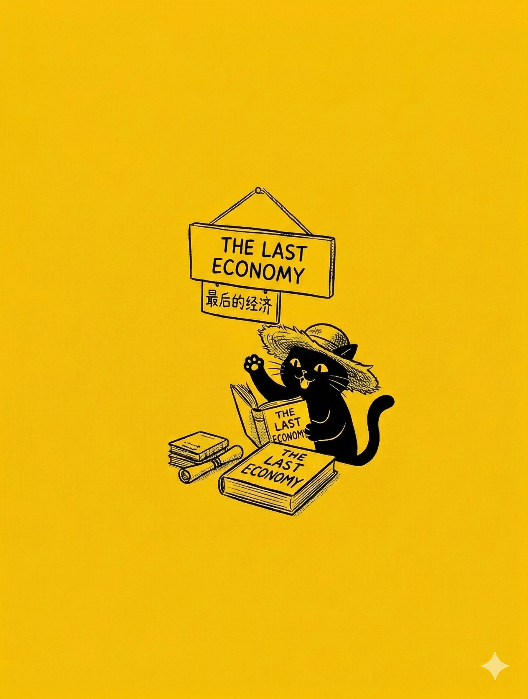

# 【随笔】AI 末日不完全手册——荐书《最后的经济》（完整版）

那天是看 Citrini Research 点爆互联网的《[THE 2028 GLOBAL INTELLIGENCE CRISIS](https://www.citriniresearch.com/p/2028gic)》时，找到了[公众号《不懂经》的解读](https://mp.weixin.qq.com/s/Qx_i2Zo240LJM0m2dX7PRA)。

然后顺藤摸瓜，找到了总是和这篇报告一同被提起的另外两篇文章：

1. [前 Open AI 研究员 Daniel Kokotajlo 的 《AI 2027 》](https://ai-2027.com/ai-2027.pdf)
2. [Stable Diffusion 创始人 Emad Mostaque 的《最后的经济》](https://ii.inc/web/the-last-economy/zh)

我把这些文章和书的原文找到，然后扔到 Notebook LM，生成几个概要 PPT 翻看了一下。接着，对《最后的经济》这本书产生了兴趣。

毕竟这是一本书——哪怕是只有不到 200 页的小书，我对它的份量也不由得高看了几分。于是乎，我忍不住打开 PDF 文档，从前言部份开始看了起来。

全英文的短短一两页前言，花了我不少时间，但我已经被作者完全地抓住了。我一面庆幸自己开始阅读了原文，以至于没有漏掉 AI 总结中完全没有传递的那些文字细节，一面有些焦虑地扫了一眼屏幕右下角的时间，又转头看了看桌面那些写满混乱涂鸦的 A4 白纸和几乎空白的日程本。

> 如果照这个速度，读完这本书需要多久呢？

我迫不及待地想要读完它，又担心自己根本没有时间读完它。究竟还有多少想做的工作没有做，我已经越来越没有概念。这么想着，脑子有些疼，我随手就打开了 DeepSeek ，让它帮我把 PDF 一页一页地翻译成中文。

还是母语阅读速度快。

在憋到膀胱快要爆炸时，我忍无可忍地起身上厕所时。猫着腰离开电脑前，瞟了一眼页码和时间—— 15 页，过去了半小时。于是一边往洗手间小跑，一边盘算着——接下来，我每天花上一个小时就可以用一周读完这篇文章。

但结果自己从厕所回来后，眼睛再也没有离开过屏幕。

时间一晃而过，而我也越来越兴奋——曾经我一直相信古典经济学，对凯恩斯主义则不屑一顾——这几十页看完，我发现自己完全搞错了。

这是最近几个月来第二次，发现自己过去完全搞错了，然后还暗自高兴——上一次有这种感觉，是看见 Janna Levin 说，生命的存在可能只是熵增大河里的小小湍流。

这也是第二次，一本书还没读完，就兴奋地想要向所有人推荐——上次让我有这种感觉的书，是科勒的《跨越不可能》。当时书还没读完，我就发了好几次朋友圈。

回家的路上，我一面疯狂地踩着自行车，一面想着自己应该怎么向大宝描述自己的发现。对了，就这么说：

> 我可能发现 2008 年的比特币了！

……

我甚至起心动念，想要把这本书在 AI 的帮助下，一页一页翻译成中文。但很快，当我打开这本书的官网，我才惊讶地发现，原来中文版根本就是官方提供的版本之一。

我居然读了近一半才发现这个简单的事实。我居然在点开 PDF 的下载链接之后，就一直在 PDF 阅读器里这本书，我甚至把 PDF 上传到了微信读书，以防换了设备还能方便地继续阅读，却根本就没有再点击另外那个官网链接去看一眼！

在那里，各种版本的电子书，在线阅读，中文英文都有！

……

关上电脑回家，但还没到家，想要告诉大宝「我发现了新比特币」的兴奋劲儿就被一通视频电话打断。

大宝告诉我，阿宝被爷爷打了，很是伤心。视频里的阿宝满眼是泪，委屈得说不出话来。

等这件事情彻底处理完，已经是深夜十一点过。

期间，在情绪风暴间歇的某个时候，我显然告诉过大宝那句话，她只是说：

> 那你快看完这本书，然后给我讲讲。

第二天，我果然没忍住，一口气把剩下的章节读完。

然而，前一天的那种发现新大陆的兴奋劲儿居然已经烟消云散。一整天，我都有点在恍惚中面对工作的煎熬。实在难受时，我会给大宝发一条消息吐槽：

> 完了，活干不完了！

> 愁……

> 都出现生理性反应，胃痛起来了……

过了下班时间许久，我依然还欠一份材料没有动工。我给大宝发消息：

> 我不想回来吃饭了。

过了一会儿，我又发了一条：

> 算了，我先回来了。

在这纠结中，我强忍着那种有些想呕的感觉，开始回家。回家的路上，我忽然想起一句话：

> 这是不是因为，我想把全人类的未来扛在自己身上啊？

记得有一次，我曾经试着想象——如果让我为中国当下的局面想一条出路，该怎么办——这个问题一开始思考，我就差点真的呕了出来。

Emad 的这本书从物理学角度，描绘了人类社会经济在 AI 冲击下的本质和最可能的走向。然后，又试图提出一个解决方案。

他抛出的问题紧紧抓住了我，提出的方案却粗糙得像是在浴室毛玻璃上随手画出的一个箭头。

明白自己为什么痛苦之后，心里稍微好受了一些。吃过晚饭，我告诉大宝我可能第二天需要加班。她说没问题，中午可以请我吃必胜客。

……

周日，我自己跑去办公室，把欠下的那份资料处理了个七七八八，肚子已经咕咕叫了起来，我便动身去必胜客和大宝还有孩子们碰头。

下楼后居然还找到一辆 2026 最新款带手机支架的美团单车。我把手机外放打开，插在支架上，导着航，听着歌，一路骑了过去。雨后的空气，清新极了。

他们已经提前到了必胜客，我在最里面的座位看到戴着遮阳帽的大宝，赶紧坐到她身边的空位上。

刚坐下，就被一股猛烈的空调风吹到后脑勺，我忍不住打了两个喷嚏，抬头一看，一个出风口正在头顶。难怪大宝把帽子戴得那么严实，我连忙把连帽衫的帽子也翻起来，把自己的脑袋藏得严严实实。

我建议大宝躲到对面去，于是她换到了阿宝和大鱼中间坐下，然后就开始吐槽：

> 本来我们可以吃两个大披萨，价值 59  块的大披萨。
>
> 可是她们非要把披萨换成意大利面，价值 29 块的意大利面。

我笑着说：

> 那怎么办？好像很不划算啊，还能换回来吗？

她说：

> 不行啊，我已经点好了！换不了……

我说：

> 那批评一下阿宝？

我转头对着阿宝：

> 那妈妈给你点你们爱的意大利面，你可不能说她讨厌呢！

阿宝尖叫一声，然后对我皱起眉头表示抗议，我只好闭嘴。

不一会儿，送餐的小机器人送来了意大利面，又送来了披萨，还有一个打卡就送的芝士蛋挞。

阿宝也想吃那个蛋挞，我好说歹说总算是答应可以分给我一口。然后我把手套递给大宝，说：

> 那，我们开始享受你想吃的披萨吧。

大宝嘟哝了一声：

> 披萨也是他们俩选的他们想吃的，不是我选的。

我自己也戴上一只手套，拿起一块披萨，小声说：

> 不管咋样，现在也只能好好享受这披萨吧。

静下心来细细咀嚼，披萨还挺香的，我吃完一块，又拿起一块，最后看见只剩下两块时，我停了下来。

这时，阿宝把剩下的半块蛋挞递给我，我张开大嘴一口吞掉，然后满意地对阿宝说：

> 真好吃！

阿宝问我：

> 你知道这个叫什么名字吗？

我赶紧看了一眼桌上那个打卡送蛋挞的宣传牌，告诉她说：

> XXX 芝士蛋挞啊～

阿宝嘴角轻轻往下动了一下，问：

> 你怎么知道的？

我指着牌子说：

> 在这里看到的呀。

阿宝不甘心，接着问：

> 要是你没看，你知道吗？

我摇摇头，说：

> 当然不知道了，这么奇怪又复杂的名字。

阿宝笑了起来，又开始拿起一块披萨吃起来。

过了一会儿，阿宝把手一摊，那是剩下的一块披萨边。她说：

> 我吃饱了！送给你了……

大宝笑着对我说：

> 诺，你女儿送给你的礼物。

我伸手接过了这块饼，细细咬下一点，慢慢地咀嚼着。

哪怕没有任何馅料，这块饼依然香喷喷的，嚼起来自然而然地口水四溢。我抬起头，认真地享受口中的麦香味，却被对面墙上的宣传海报吸引了。

画面上是残破的巨型石柱，被风沙掩埋的拱门，还有上面波斯风格的雕塑。断壁残垣在金色的夕阳下肃杀凄美。

大宝张嘴正要说话，到我耳边却自动变成了嗡嗡的背景音。我默默读着海报上的文字：

> 居尔城。
>
> 此处曾经是繁华的市集，
>
> 万千商旅云集于此，分享智慧与财富。
>
> 然而时光荏苒，归者复离。

大宝话说完了，我却一个字也没听见，我闪过神来赶紧问她：

> 你刚刚说什么？

她故意气哼哼地不理我。阿宝说：

> 妈妈说——
>
> 不得不说，他们家的这个饼，烤得还蛮好吃的。

我连连点头，把手上最后一点饼边塞进嘴里：

> 可不，你看我这块只有纯饼，依然很香。

大宝依然不理我，我赶紧解释：

> 刚才我看见这墙上的海报，入了神。

说着，我就开始读海报上的文字，阿宝也好奇地回头看自己背面墙上那幅画。忽然，她站起来，用手蒙住了海报上最后四个字，得意地看向我，想看我是不是不得不住嘴。

> 归者复离！

我没有丝毫停顿，甚至没管嘴里还有些碍事的披萨饼渣，直接说出了被她蒙住的那四个字。

她轻轻叹了一口气，松开了手，重新坐了回去。我笑着对她解释：

> 这四个字，我已经记住了。

大宝问我：

> 你吃饱了吗？

我喝了口水，发现肚子里早已满满当当：

> 完全饱了！你呢？要不要再点个披萨？

大宝说：

> 我早就吃饱了，就怕你没吃饱。那我们走吧……

说完，她就起身往外走。大鱼忙不迭地开始穿鞋，阿宝一个箭步就跟了出去。我赶紧又喝了两口水，环顾桌面。见没什么拉下点东西，就捡起自己放在地板上的布袋子，也跟了出去。

追上大宝，我对她说：

> 你发现没有，同一件事，你从不同的时间节点切进去看感受完全不同。你可以说，是归者复离，也可以说繁华重现。
>
> 文明自己只是建了又毁，毁了又建，生生不息！

大宝问我：

> 那你还推荐我看那本书吗？它还是你的另一个比特币吗？

我说：

> 当然！
>
> 至于是不是另一个比特币，还得观察！

……

说回这本《最后的经济》，

#### 启发：🌟🌟🌟🌟四颗星，你会看到用物理学统一经济学理论的假说，也许这里会藏着一个将来可以获得诺贝尔奖的思想理论。

#### 好看：🌟🌟🌟三颗星，前半部份好看。后半部份解决方案略显粗糙。也许只是因为我自己期望太高，期望作者拿出一个完美的路线图。但 Emad 只是努力地指了指方向。

未来会怎样，我个人感觉，人类不是在三种结构做出选择，而是在混乱和博弈中走向每个文明的必然终局。

小小寰球已经开始从春秋滑向战国，新的生产关系和技术都在高速萌芽和发展。最大的未知是：这 AI 不知道是将被大秦帝国善用的铁器与郡县军功制度，还是大秦帝国它本尊。

强烈推荐读读这本书。[Emad Mostaque 的整个项目](https://ii.inc/)也值得关注！

