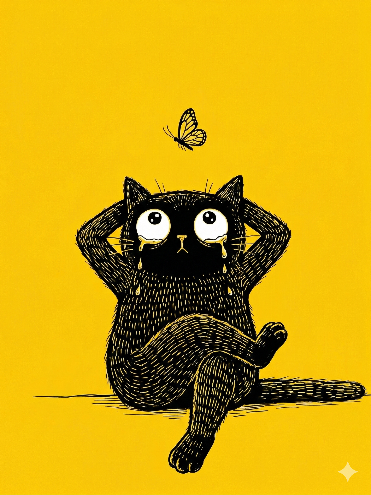

# 【生命⋅修行】为什么伤心

从沉睡中醒来时，天还只是微微亮。我在昏昏沉沉中仔细听着窗外的动静，想听外面是不是鸟儿已经开始唱歌了。

终于，听到远处传来两声「喔哦」-「喔哦」的声音。

我想起床，却终究只是翻了个身。

我深深吸了一口气，又把它们沉沉地全部吐出来，然后又一次。结果还没到第三次，我就完全忘记了深呼吸这件事情。

于是，我决定再来三次深呼吸……

忽然间，我发现，天已经大亮了。我又做了几次深呼吸，终于爬了起来，拿了件薄羽绒服悄悄走出卧室。一转头，大宝出了卧室。她问我：

> 好些了吗？

我摇了摇头，努力对着她用嘴角挤出一个笑容，但我知道，自己的整个胸腔依然被一种伤感的雾气笼罩着，往哪个方向都走不出来。

……

前一天晚上，我给大宝推荐脱不花的「长谈」，一期和学习有关的节目。然后我们俩坐在客厅的沙发上一起看了十分钟。我发现她不喜欢这个节目，于是我在一边一直纠缠着大宝发问：

> 你为什么还没开始看就不喜欢呢？
>
> 你为什么还不知道她的观点是什么，就反对她的观点呢？

大宝打开自己的手机，不时低头看一个她正在追的视频。我又说：

> 你是不看了吗？

她关掉手机，起身，在我另一边重新坐下，抱着胳膊，皱着眉头继续看起来。我留意到她的身体语言：

> 我感觉，你从一开始就在一个「战斗」状态中。

大宝终于爆发了，大声说：

> 那是你的感觉！

我重复着：

> 对啊，我感觉&#¥#@¥@¥……

我完全没有觉察到，自己当时沉浸在维护「我感觉的是对的」辩论中，一句接着一句，就这样，终于惹恼了大宝。她敏锐地找到了终结战斗的一句话：

> 我觉得你的教育理念有问题！

我安静了下来，心里默念了一遍这句话：

> 你觉得我的教育理念有问题？

我扭头看了一眼大宝，她依旧抱着胳膊，皱着眉头，但眼睛没有再看电视。

心脏周围冷冰冰的，我不再说话，任悲伤的情绪迅速把整个身体吞没。紧接着，我又开始一边在家里团团转，一边默默地对自己念叨：

> 这么难过，肯定哪儿不对？
>
> 所有情绪上的痛苦，都预示着某个与事实相悖的信念。
>
> 但是，哪里不对呢？

我检查了一圈，不明就里，于是更加悲伤和沉默了。

在当时，我并没有意识到，自己之前和大宝对话中的「辩论行为」是那么的明显，但我一整晚上，都再也没能开心起来。

到早上也没有。

……

又到了晚上回家，我发现这一整天，自己从不开心到略略好些，然后又因为另一件事情变得不开心起来。

是的，依旧不开心，却是因为其它事情。

鞋柜上放着几本书还没拆封，我拿起来看了看，是打算送给大宝的三本书——

《世界上最快乐的人》、《世界上最幸运的人》和《歸零、遇見真實》。

写完赠言，我翻开了第一本：

> 我们必须经历这个过程，那就是真的坐下来检视自心，检视自己的经验，才能看清楚到底是怎么一回事。
>
> ——卡路仁波切（Kalu Rinpoche），《口传宝集》

……

到睡觉前，这本书已经读了一半。

大宝问我：

> 你还伤心吗？

我摇了摇头。

她问：

> 为什么？

我举起手中那本《世界上最快乐的人》：

> 喏……

她惊讶了一声：

> 哎呀，这么管用？

我笑了笑，把书放在书柜上，摘下眼睛，说：

> 小爱同学，关灯！

