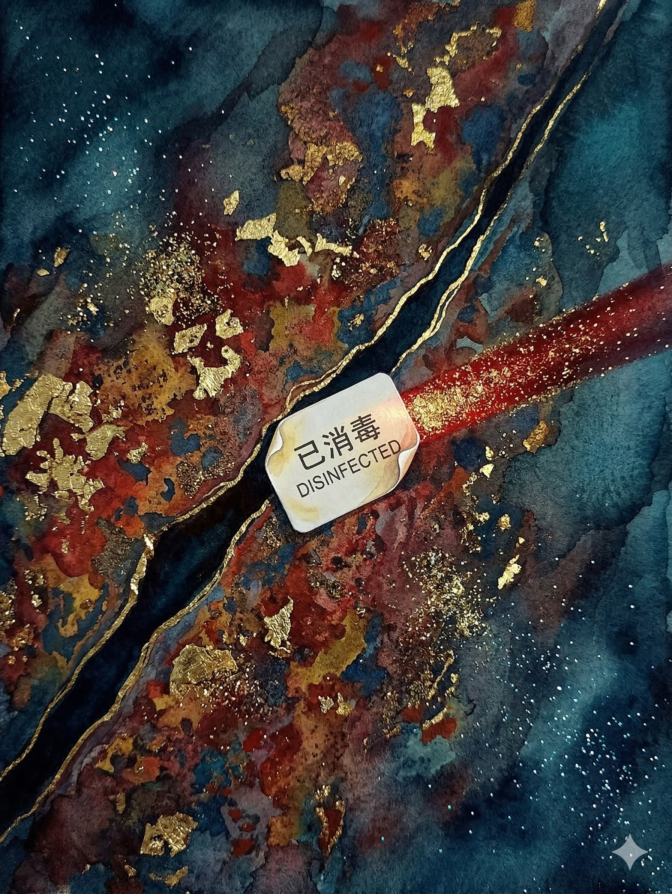

# 【方舟】沉重的泡沫

「砰」的一声巨响，一个黑黄、粗壮的机械臂把一个巨大的全尺寸集装箱砸到了圆形的金属检查台上中央。

台面上的铁锈与灰尘被震得腾空而起，在夕阳的照耀下飞舞着。

一个穿着铁锈蓝牛仔裤，白色 T 恤的年轻人扯起自己的衣服，擦了一把脖子上的混着灰泥的汗水，扭头冲着旁边阴影处喊了一声：

> 师傅！最后一箱了吧？

阴影中，坐着一位胡子拉碴，头发凌乱的中年男子，冲着年轻人的方向点了点头。

年轻人看了一眼出现在眼前的信息窗：

> 货物交运人：X 旅行社
>
> 货物类别：旅客托运行李物品
>
> ……

忍不住啧了一声：

> 又是他们家的！

巨大的金属检查台旋转起来，三道呈 90 度交叉的强光照在集装箱上，小伙子把原本架在头顶的墨镜戴好，眯缝着眼盯着在光柱下颜色从红色变成紫色，又从紫色变成红色的集装箱。只有那一角的 X 标志，始终泛着乌黑的金属光泽。

小伙子的声音已经有点略略沙哑，他冲着在阴影处休息的师傅说：

> 箱子没问题，我再开箱抽查一下。

师傅心不在焉地打着哈欠「嗯」了一声。

检查台停止了旋转，小伙子一个箭步跳了上去，走到集装箱旁。两只银色的，像章鱼触手一样的机械臂也几乎在同一时间伸到了集装箱门前，一只接上了集装箱的开锁装置，另一只则停在小伙子面前，让他核对指纹、视网膜以及植入在手腕外侧的鉴权芯片。

随着一阵金属锁扣滑动的咔咔声，集装箱门轰然开启。

里面整整齐齐，码放着各种小尺寸的箱子，以及整箱整箱、大量的饮用水。小伙子看了看手持检查仪上的信息，所有的标签都显示前两次安检一切正常。他又用手指关节敲了敲那几箱水桶，水面沉闷地晃动着。

小伙子感觉胃部抽搐了一下，回头望向坐在阴影中的师傅，却发现他早已站了起来，略略弓着腰，一脸陪笑地站在几个人身旁。那几个人都穿着黑衣，为首的人身材高大壮硕，正微微低着头，听自己师傅说话。另一个精瘦的高个，正四处打量着这里的环境。他的目光扫过集装箱这边，却丝毫没有停留。

看见瘦高个旁边那个娇小的身影，他心跳猛的加速起来。她穿着一身黑色的皮质紧身衣，高挽着头发，背对着集装箱，根本没有往这边看。但小伙子还是一眼认出，这就是前两天早上在咖啡厅遇到的那个女孩。

小伙子做了个深呼吸，转头继续检查集装箱里的货物。

他发现，在许多箱子间隙里，塞满了同一种塑料袋，看起来是常见的那种填充空隙固定货物用的泡沫袋。他拿起其中一袋，掂了掂，比常用的泡沫袋略略沉手。轻轻捏了一下，里面似乎装着一种粉末状的东西。

他换了一袋拿起来仔细检查，发现有这个袋子的一处边缘沾着一点点白色泡沫，看起来就像是洗手液一样的那种细腻而柔软的泡泡。他伸手抹了抹，却发现这泡沫已经凝固了，根本擦不掉。

他放下小塑料袋，离开集装箱，皱着眉头往自己师傅那边走。

瘦高个的男人看见他走过来，微微张开了嘴，正要说话。为首高大的男人却稍稍侧过头，厚重的颌骨在夕阳下形成棱角分明的阴影，正好罩在瘦高个的脸上。

小伙子听到瘦高个的喉结滑动了一下，刚刚张开的嘴唇重新紧紧的闭上。他不自觉地打了一个冷战，擦了擦手心的汗，走回到了师傅身边。

中年男人揉了揉脑袋，把一头凌乱的头发抓得更乱，然后伸了个懒腰，一如既往的笑着看着小伙子，眼角的皱纹把眼睛挤成了一条线。

小伙子盯着眼前弹出的信息窗，故意不去看那个女孩。

过了好一会儿，他终于决定在「安全已确认」那里打了个勾，然后在伸过来的银色章鱼触手那里核对了自己的身份。

信息窗显示着最终的信息：

> 登船安全检查：李尘

中年男子毫不犹豫地跟着完成了确认：

> 登船安全稽核：赵孟昶

黑黄、粗壮的机械臂再次伸了过来，像拿积木一样一把抓起集装箱，轻巧地转向另一方向。

就要落入海平面的太阳发出红彤彤的光芒，掠过港口一排排机械臂，照射在金属检查台上。

在太阳落下的那一瞬间，咸腥的海风猛然吹起，把地上的尘埃和铁锈再次掀起来。谁都没有留意到，有一张从集装箱里掉落出来的小小贴纸，被这风卷落到了金属检查台边缘的缝隙上。

贴纸上用中英文写着几个字——「已消毒」。

