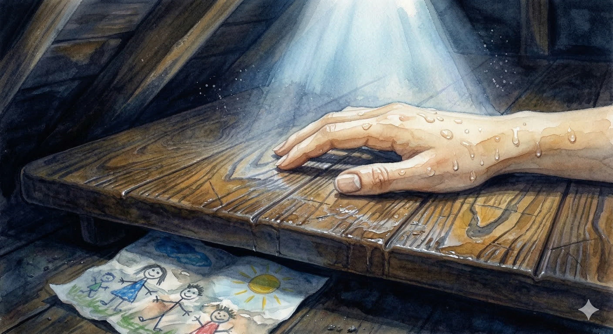

# 【方舟】淹没的阁楼

李尘把气垫摩托停在一处礁石凹陷的阴影里，四下看了看，从另一处礁石缝隙边拖了一些枯枝落叶过来，把摩托车简单地盖上。

他脱下外衣和鞋子，把它们塞进一个小袋子里，再压成一个紧实的小球，然后斜挎在肩上。他弯下腰，摸着礁石，小心地向着海面爬下去。

很快，他来到一个小小的水坑边，把脚放进水里，用手浇着海水打湿自己的身体。早春的夜里，海水冰冷刺骨，他胳膊上起了一层细密的鸡皮疙瘩。他咬住呼吸器，用手一撑，无声地滑入水中，水面泛起几朵水花，然后重新平静下来。

礁石边的椰子树被夜风吹得沙沙作响，月亮升得更高了，海水轻轻摇晃着，闪耀着像星星一样的光芒。

……

几分钟后，他游到一段爬满藤壶和水藻的坑道前，他打直身子，用最小的幅度轻轻摆动着小腿，以免碰到坑壁那些锋利的藤壶，几乎是飘着穿过那段窄小坑道，潜入一个小房间门口。

在这里，他稍停了一下，眯着眼，借着头灯的光亮，打量了一下这间屋子。

门已经脱落了，斜靠在门边，屋子里左手边是一个古老而破烂的沙发，已经被小鱼们占领做了巢穴。屋子正中央有一张翻倒的圆桌，长满了水草。几条橙色的小丑鱼从桌边的长方形的门洞里游过去，然后又从另一个正方形的窗洞里钻出来。窗洞上还残留着半扇帘子，玻璃珠串成的那种，在头灯的照射下，有几颗玻璃珠子，忽闪忽闪地，亮了几下。

右手边有一个看起来极为结实的金属储物柜，柜子旁边就是一段楼梯，李尘顺着楼梯往上游去，呼啦啦一声钻出了水面。

李尘站直身子，伸手摘掉头灯取掉，一不小蹭掉了一小块屋顶破旧的墙纸。屋顶是倾斜的，也就这里能够站直身子。

他吐出嘴里的呼吸器扔到一边，蹲下来扶着膝盖，大口喘着气，嘴里满是苦涩的橡胶味和海水的咸腥。过了一会儿，他站起身来，解下装衣服的挎包，和腰间的储物袋，然后一头栽到在左手边的单人硬板床上。

没趴到两分钟，他又坐起身来，把头换到更高的那一边重新躺下。

他瞪大眼睛，看着贴在顶上那些伴随自己长大，已经发黄而斑驳的墙纸，呼吸稍微平静了一些。汗水从毛孔里喷涌而出，混杂着身上的海水，变成一滴又一滴的水珠，从金色的肌肤上滚过，然后吧嗒吧嗒地滴落在床板上，在他身下汇成一大滩湿漉漉的水渍。

回想起下午时，那个领头黑衣人在夕阳下阴影中的身影轮廓，他发现自己的手止不住的又抖了起来。

