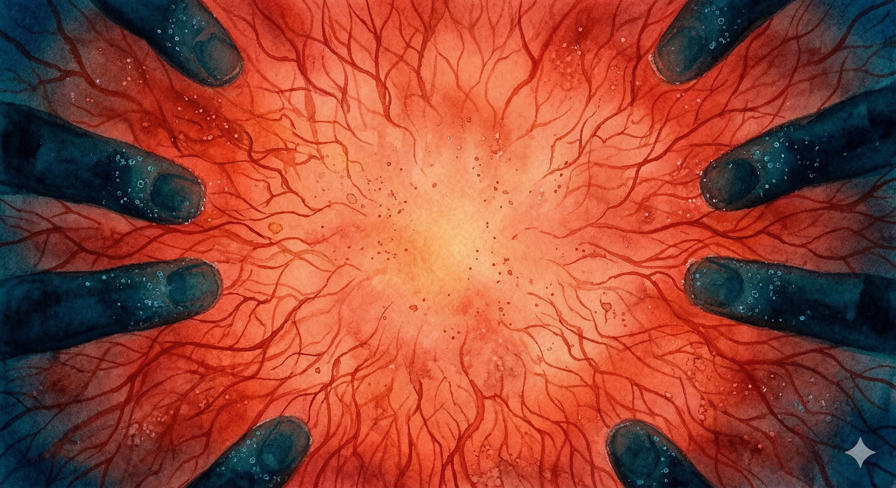

# 【方舟】溺水的阳光

李尘一骨碌翻身坐起，捡起扔在地上的储物袋，把里面的几个电池模组，氧气胶囊，还有几条能量棒拿出来，小心的把它们放进床头书桌下的小柜子里。

他停了停，又从柜子里拿出一条能量棒来，才关上柜门。他剥开包装纸，咔嚓咬了一口。香甜的味道萦绕在舌尖，薄荷的凉气从喉咙、鼻腔直冲到后脑，顿时清醒了不少。

他把剩下的半截能量棒咬在嘴里，再次打开储物袋，从里面的夹层里拿出半颗米粒大小的白色固体泡沫，那是下午时，他悄悄从集装箱里那奇怪塑料袋的缝隙边抠下来的。

他把那一小粒泡沫放在桌面，拉开抽屉在里面翻找着。抽屉里都是些古老而无用的小物件，一叠小时候收集的能量棒包装纸，一些各种形状的小零件，有些已经锈了，有些还是闪闪发亮。

他找到一把合金切割刀，一块金属垫板，屏住呼吸，小心地把泡沫切下一块碎片来，然后又把那块碎片切成更小的薄片。

他转身从另一个抽屉里拿出一个巴掌大的仪器，把薄片放了进去。仪器上显示器滴滴滴地出现几行闪烁的文字：

> 元素成分：碳（C）、氢（H）、氧（O）、氮（N）、硅（Si）……
>
> 未知成分检测中……
>
> 分子结构：检测中……

又过了一会儿，显示器上出现这样的字样：

> 存在未知成分，未知结构。
>
> 是否联网更新数据库？

李尘叹了口气，点了下屏幕上的小叉，然后把检测仪收了起来，四仰八叉地重新躺回床上。

……

哗地一声水响，一个黑影从水中猛然窜起，向着躺在床上的李尘直扑过去。李尘急忙翻身，肩膀却还是被一只铁钳般的手牢牢捏住，一把拉翻，摔到床下。

李尘用双手掰住对方的手指，想要掰开，却不太管用。便抬起脚来猛蹬对方藏在自己身后的脑袋，还是蹬了空。就这么扭打了一小会儿，对方抓住机会熟练地从身后勒住了他的脖子。

李尘抓住对方的小臂，拼命地往右侧晃动，想要把自己的咽喉挪到对方肘关节的空隙处，但是没能成功。对方反而用另一只手成功地从后面扣了过来，形成一个死锁的三角形，牢牢地绞住他的脖子。

李尘无法呼吸，大脑也供不上血来。他松开一只手，无助地拍打着地板。却听到对方只是「哼」地冷笑了一声。

恍惚间，他听见母亲在对面哭喊着：

> 傻瓜，你过去干嘛，你爸爸想要掐死你啊！

他抓住那双勒住自己脖子的手，粗壮，有力，青筋暴露，此时却有些冰凉。

就是这双手，曾经高高地把自己抛举在夏日的阳光中，又稳稳地接住。摸着自己的头，戳着自己的嘎吱窝，让自己笑得满地打滚。

此时，这双手却收得越来越紧，李尘开始有点透不过气来。他恐惧地想用自己的小手掰开父亲的手，却没有成功。他感觉到自己的脉搏和父亲的脉搏剧烈地共振着，在耳膜深处像大鼓一样越来越响：

> 爸爸，你真的要掐死我吗？

疼痛与窒息感忽然消失了，阳光从屋顶的亮瓦处照射下来，直射着李尘的眼睛。灰尘在光柱中轻轻地舞蹈着。他安静地闭上眼，让阳光晒在眼皮上，温暖、明亮、猩红。

他甚至闻到棉被暴晒后阳光的味道，妈妈一定是今天刚晒过所有的被褥吧。

……

李尘最后瞪了两下腿，停止了挣扎，再也一动不动……

