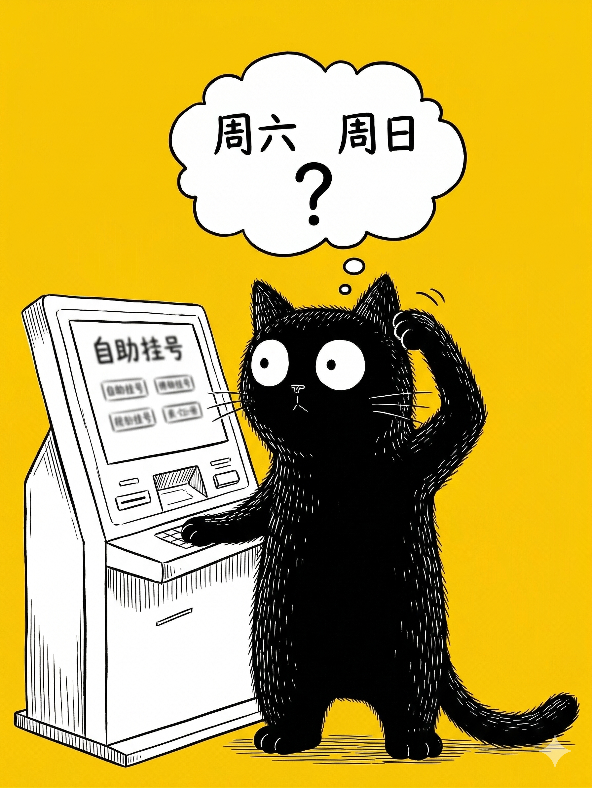

# 【生命⋅修行】功夫到没到

早上 6 点 半，小爱同学开始温柔地播放音乐——闹钟响了。

这次，我没有关掉闹钟，因为不管是阿宝还是大鱼，都需要起床。我们得早早赶去儿童医院给他们看牙齿，和牙医约好的时间是上午第一个。

结果还是我落在后面，背着包到地铁站时，大宝带着两个孩子已经过了安检。我气喘吁吁地说：

> 充电宝还是没找到，阿宝的地铁卡也没有找到……

> 找不到也没办法，医保卡带了就行。

……

下了地铁，我们扫了两辆共享单车，呼哧呼哧带着孩子们赶到医院，我带着包过安检，大宝则拿着医保卡赶紧冲到自助服务机前去取号。

然而，等我背着包走过去时，大宝依旧一脸问号地站在一台机器前，阿宝站在另一台机器前。见我过来，大宝奇怪地问：

> 为什么要输密码呢？

我伸手，重新操作了一遍阿宝面前的机器，选「取号」，用「社保卡」——然后，也出现了输入密码的界面。我凑过去，看着大宝手机上挂号确认的短信，上面果然有验证密码，我一边输入，一边嘀咕：

> 这什么软件设计，怎么变成需要输入密码了呢？以前都不用的呀……

我低着头，仔细记住了另一条确认短信的密码，心想自己可能把大鱼和阿宝的挂号预约搞混了。

一扭头，却发现阿宝面前机器的屏幕退回了起始界面。我问阿宝：

> 咦？怎么回事？

旁边一位妈妈连忙接话，说：

> 我退出来了……

大宝一看，淡定地伸手把医保卡从阿宝面前的机器里抽了出来。那位妈妈这才发现阿宝也是在「挂号」，不是在「玩」，连忙道歉：

> 哎呀，对不起，我以为是小孩子在玩。

说着，绕开我们，去了另外一台自助机器面前。于是，我把社保卡重新插进去，继续尝试了一次。大宝也在另一台机器上开始不知是第几次「取号」。这次，我仔细地核对着确认短信上的文字，一边看一边说：

> 肯定是这条，3月22日的。

听到我们这么说，一位穿着红背心的工作人员还是志愿者的女士凑了上来，说：

> 是不是日期不对啊？今天是3月21日。

……

我们恍然大悟，这个号挂了俩星期了，我们一直以为是周六，从来没想过看错了时间。

我们一边往出走，大宝一边对我说：

> 我中途还查过日历，看到 3 月 22 日是周日，但是竟然还是认定我们约的周六给孩子们看牙！

……

干脆，我们直接跑去医院的早餐部，吃起美味河粉来。大宝笑着说：

> 我们是不是很厉害啊，虽然搞错时间，但还是一点没有生气，直接就开始享受早餐了？

我说：

> 本来孩子们看牙就是勉强不得不干的事情，然后就期待着这里的早餐和一会儿去玩耍。
>
> 现在不用看牙，直接吃早餐，他们显然更开心呀！

……

<待续>