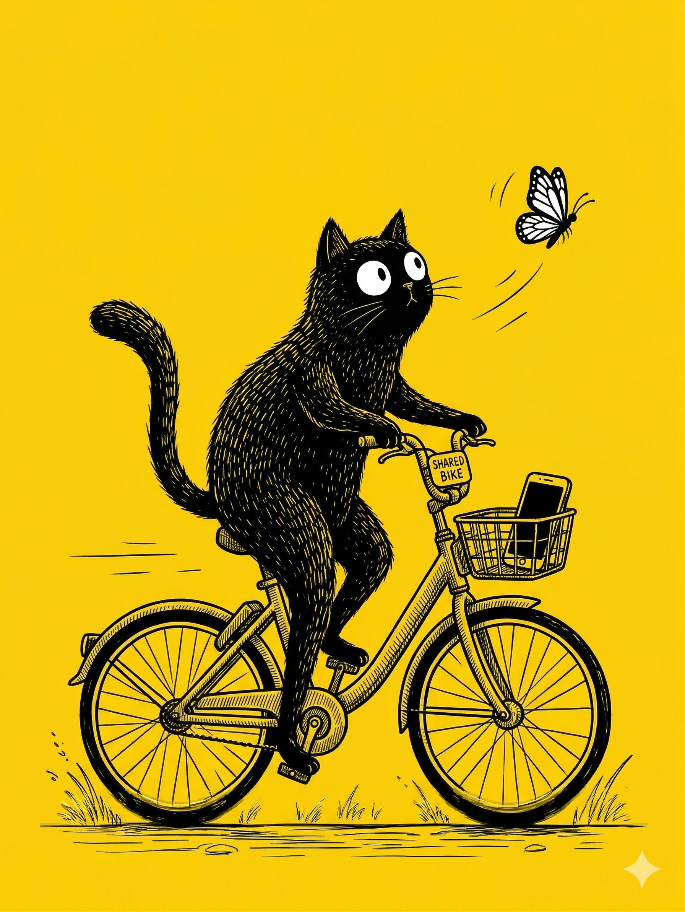

# 【生命⋅修行】功夫到没到（续）

吃过早饭，我们决定还是去莲花山公园转转。

凭空多出来一个上午，孩子们念叨着说今天要爬两座山——莲花山和燕晗山。

我看准了，那里正好有一辆 26 款的新美团和新青桔，都带手机支架那种。连忙掏出手机。只敲入一个「M」，我就发现输入法手感不太对，但美团 APP 还是自己从快捷方式里蹦了出来。

我扫了码，手机又弹出来一个授权的确认窗口，事情就是有点古怪。但我来不及细想，赶紧点了确认，让大宝带着阿宝先骑这辆车走。

大鱼不乐意了，大声哭喊着：

> 我就要骑美团，青桔太挤了！

我努力地屏蔽掉他的噪音，把手机上的美团窗口扔到后台，开始寻找微信。

但是，微信哪去了呢？

我只好再次搜索，还是觉得手感不对。切换了一下输入法，竟然出现繁体中文的双拼输入法。不管是繁体还是简体，微信到底蹦了出来。我扫码解锁了那辆青桔。接着又想找汽水音乐给大鱼放歌。

按「Q」，备选 APP 里根本没有汽水音乐。

我暗自琢磨，难道繁体搜索不到？于是，我停在那里，点开输入法设置，居然两个拼音输入法，只有一个繁体双拼。我赶紧把平时用不到的九宫格拼音删掉，又安装上了简体双拼。心想：

> 这下应该好找了吧。

再次按「Q」，还是没有汽水音乐。

大宝喊我：

> 你磨蹭啥呢？怎么还不走？

我说：

> 这输入法不对，只有繁体双拼。我刚刚重新安装了一下，但还是找不到放歌的软件。

大宝说：

> 你不会是拿的我的手机吧？

我连忙翻过手机一看，果然是大宝的手机！

心中不由得大怒——

> 完了，本来我的账号有月卡和年卡，骑车不用另外收费的。这下要扣钱了。

我叫大宝：

> 你别走，等我把车还了用我的卡重新扫一遍。

我赶紧把两辆单车全部还上，但都过了一分钟，一个扣了 1.5 ，另一个扣了 1.8。

大宝有点纳闷：

> 扫都扫了，你干嘛要还呢？

我还在气哼哼的：

> 气死了！全都扣钱了。

说着，我又从背包里找出我的手机，重新扫码解锁了这两辆车。解锁青桔时，我看见屏幕提示，让我确认支付上一笔自行车的订单—— 1.8 元！我大叫起来：

> 这个滴滴，太欺人了。刚才那笔订单，不是赶着去医院吗？还车后我没点确认支付，没想到也要我付 1.8 元！
>
> 这下子，凭空亏了 5 块钱！

……

大鱼还在闹着非要骑新美团，但我们早就答应了两个小家伙一人坐一次新美团。我强忍着怒火，终于说服他，让他独自坐在青桔的座椅上推他走，然后给他放「乌蒙山连着山外山」。

到了莲花山公园门口，大宝和阿宝推着车停在那里等我。我也停好了车，这才发现青桔虽然提示我要支付 1.8 元，但实际上还是用年卡抵扣并未额外花钱，心里稍微好受了些。

大宝笑着对我说：

> 刚刚我们还自夸不会受意外影响，能继续享受生活。
>
> 现在打脸来得真快！

我诺诺地辩解：

> 这个是因为浪费了 2 元 3 角钱啊！

但我心里在想：

> 或许，这其实是因为我自己的错误？
>
> 如果我更清醒一点，输入第一个 「M」时，就应该意识到拿错了手机。
>
> 再或者，我不要执着于重新安装简体双拼输入法，也能在 1 分钟内发现错误，及时还车避免扣款。
>
> 或者，根本就是我对自己太苛刻了？

大宝说：

> 为 2 块 3 毛钱生气，也还是不值得啊？
>
> 我们还是享受一下春天吧？

说着，她带着大鱼就跑开了。阿宝也要过了我的手机，要去拍各种花朵。我掏出尺八，在公园路边的石阶上坐了下来。说：

> 好，等我用尺八抒发一下怨气先。

……

不开心的那些气息，尺八总是能帮我用低音呜呜地表达出来。上午的阳光穿过树影，照在我身上，暖暖的。我闭上眼睛，轻轻的风从侧面吹来，音调被气息扰动，忽高忽低。头顶的好几只鸟儿喳喳叫着，拼命想要压过公园里奔跑呼叫的小孩和游客，更不管不远处的公路上，汽车还在轰鸣。

我略略加了些力气，让音调升高了八度，试着想要应和头顶的小鸟，但却还是跟不上他们的音调和节奏。

我摇了摇头，笑着把尺八收起了，背上背包。

回头对还在花丛中奔跑的大宝和孩子们喊道：

> 我们现在去哪里？

