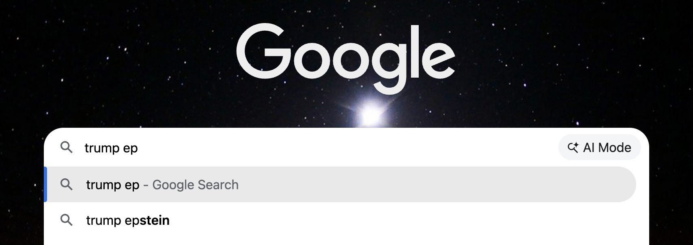

# 【随笔】霍尔木兹海峡的史诗狂怒

传说特朗普发动《史诗行动》的主要原因，是因为在Google 搜索框输入Trump ep 之后，就会自动补全「川普 爱泼斯坦」—— 于是，川普期待着将来的某一天，「Trump Epic Fury 川普 史诗狂怒」会替代「Trump epstein 川普 爱泼斯坦」成为自动补全的关键词。

遗憾的是，30 天了，付出了无数生命代价，他的这个「战略目标」依然还未达成。

一朝「英雄」拔剑起，又是苍生十年劫！

……

虽然和各个机构的分析师聊，他们大多觉得这件事对 AI / IT 投资的影响，只是一个短期事件的冲击，甚至远不如Open Claw 小龙虾。

然而，在我看来，这件事的引诱还是蛮大的。

### 第一层冲击

20% 以上的石油和 20% 的天然气都从这个小小的海峡经过。卡塔尔的 Ras Laffan 工业城被袭击后，造成了 17% 的永久产能损失（3～5后才可能恢复）——全球天然气 3%～4%的供应就这样消失了。

而石油运输被掐断造成的油田暂时关停机，想要再次恢复也至少是3、5个月之后。

现代工业基础整个建立在石油和天然气之上，其中不老少都直接在海湾地区：

占全球供应 34% 的尿素，23% 的氨，22% 的铝都因此遭受威胁——这意味着立刻被影响到的不仅仅是农业，还包括航空航天、国防以及 IT 产业（机箱和数据中心散热所需的热交换器都需要铝）。

### 第二层冲击

全球供应链被影响后，首当其冲就是全球通胀效应。能源价格飙升，很可能再次触发猛烈的通胀，甚至是滞涨。

霍尔木兹海峡的船运保险已经几乎实质上被停掉了。

所有的保险、债券等等金融领域都面临所谓的信心受损后的「次级效应」。

美国国债崩溃的概率是否也因此进一步增加呢？

### 第三层冲击

整个亚洲的石油，80% 都仰仗霍尔木兹海峡。虽然韩国、日本有超过 200 天的战略石油储备，还能撑一阵子。

但东南亚的越南、印尼、巴基斯坦储备已经被耗空。

台湾也一样，30% 的液化天然气通过霍尔木兹海峡，这对耗电量占全台湾 9% 的台积电（TSMC）来说，简直是一个危若累卵的局面。

就算是能源供应看起来完全不受影响的美国，社会底层也可能因为能源价格飙涨造成的生活成本上升造成更严重的问题。

### 第四层冲击

现在，美国的经济几乎完全依赖于美股七姐妹在 AI 领域的持续投资。现在五大科技巨头占了大盘股超过 20% 的权重。

而他们的投资也已经接近或超过自己营收的 20% ，并且开始依赖各种表外投资等非常规融资手段。

一旦金融债务危机爆发，而故事中的 AI 经济正循环还没达成，就会进一步影响这五大巨头的融资环境，然后影响到他们的投资。

这个发动机一熄火，或者哪怕只是关小火，都很可能会造成 2000 年时互联网泡沫破裂同样惨烈的局面。

### 第五层冲击

半导体产业链中，有几个关键链条受制于中东：

1. 氦气（Helium）——卡塔尔产量占全球 1 / 3。半导体晶圆极高温制造步骤中的温度控制、等离子刻蚀、检漏以及高级冷却环境的构建都依赖这个。

2. 铝 (Aluminum) ——中东国家合计占全球 8% - 22% 产量，数据中心服务器机

   箱、热交换系统、电机外壳、电解电容及基础电子封装都需要它。

3. 溴 (Bromine) ——韩国半导体产业链的溴进口 90% 依赖以色列，印刷电路板（PCB）的成型工艺以及高规格硬件的阻燃剂涂层就靠这个。
4. 硫磺 (Sulfur) ——沙特、阿联酋和卡塔尔合计占全球 25% - 33%，用于制造高纯度硫酸，硫酸作为终极清洁剂用于晶圆制造过程中以彻底消除微观污染物 。

 战争如果失控，半导体产业链遭受的冲击也会跟着失控。

……

真有点担心，自己正在写的科幻小说一语成谶啊！