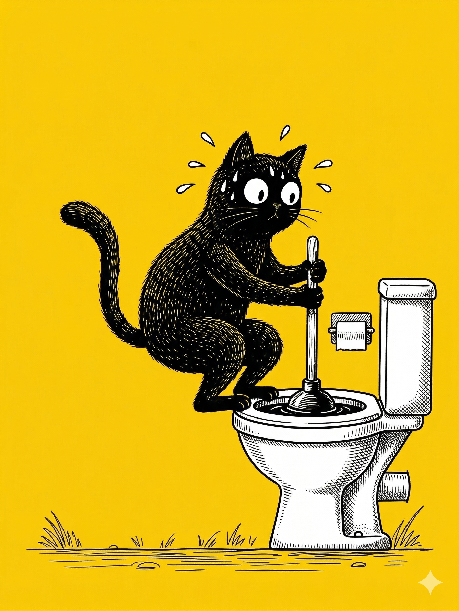

# 【生命⋅修行】只管重启

我一如既往地拿起花洒，在马桶上方冲洗着铲猫砂的铁铲，却发现马桶里的积水迅速地上升到了边缘。我慌乱地赶紧把花洒从马桶上方拿开，却把水冲进了正放在一边的猫砂盆，等我再手忙脚乱地关掉水龙头，猫砂盆里也已经接了小半盆水。

脖子都硬了，我深深吸了一口气，强忍住要爆炸的冲动。想了想，把猫砂盆端起来，小心控制着把表面的水倒进马桶里。

马桶里的水更高了，几乎要从边缘漫出来。

> 明明铲了两铲就冲过一次水的，怎么还是堵上了！

我愤怒地想着。

> 也许是剩余的猫砂里细碎的粉末太多了？

但这时再琢磨原因于事无补，马桶堵了就是堵了。

我把卫生间门外的垃圾桶拿进来，把猫砂盆里已经湿漉漉的猫砂全铲进那个刚刚更换的垃圾袋。

> 早知道，就不要省这个垃圾袋了。

想也没有用，我冲洗干净猫砂盆，以及被弄得乌七八糟的卫生间。不禁想起自己的原计划——抓紧在 9 点前洗完澡，然后或许还有点时间看书或者吹吹尺八。

也不知是计划泡汤，还是自己的愚蠢，让我整个人都变得气鼓鼓的。

我拿起马桶刷，试着捅了一下马桶，感觉下面结结实实的都是猫砂。拿起来，马桶的水面没有一丝一毫的下降，只不过因为被搅动，变成了更恶心的黑色。白色的马桶刷上沾满了黑乎乎、灰扑扑的猫砂灰，我赶紧再次拿起花洒，把它冲洗干净。

……

只能用「通马桶神器」了，我到客厅开始寻找打气筒。大宝开始叫孩子们：

> 快去刷牙洗脸洗澡准备睡觉了！

我赶忙回应，声音明显高了几分：

> 现在还用不了卫生间，马桶被我堵了。

大宝自己跑到卫生间看了看，开始夸我：

> 我老公怎么今天像田螺姑娘一样呢，自己找这么多家务干？

我讪笑着：

> 我刚刚把垃圾袋换掉，想省个垃圾袋，没想到又堵了。

大宝有点乐：

> 你居然可以一次又一次地因为同样地原因，做同样地事情来堵马桶。看来，你真是一个非常坚定的人啊！

大宝努力地夸我，让我心情好受了那么一点点。但是找不到打气筒，鼓鼓的「气」很快又窜上头来，我决定先放一放，洗个澡，没准儿猫砂被泡一泡，就自己溶解然后通了呢？

大宝又跑来宽慰我：

> 打气筒平时每天就在那里，等到要用时就找不着了。

我说：

> 是啊，我平时放在茶几下面的，想着要用时好找。
>
> 估计老婆终于有一天，忍不住把它收拾了一下。

话刚出口，我就意识到不好——自己把那鼓鼓的怨气，撒给老婆了。

果然，本来一直温言软语的大宝勃然大怒：

> 那我以后再也不收拾东西了，什么也不收拾了！！！

……

我灰溜溜地洗完澡，自己心情并没有好转。但是，大宝好了一些，她让我试着把一个废旧衣架拉直，再次捅了捅马桶。

马桶里的水依旧没有下去一分。

她给大鱼接了一大盆水，吩咐我给大鱼先洗澡。

……

我找到了打气筒，就在大宝通常收拾它的玩具抽屉里面，藏在那个废打气筒后面。我之前找过哪里，却并没有发现。

我开始给「通马桶神器」打气，却打不进去。

我把气咀拔下来，又插下去。阿宝好奇地跑过来问：

> 这个怎么用呢？

我没吭声。她观察了一会儿，又问：

> 是按那个黑色按钮吗？

我憋住火，用尽可能平静的语气回答：

> 是的。

小打气筒已经滚烫起来，我身上也开始出汗，一只手扶着滚烫的打气筒，一只手把它压得嘎吱乱响，大有把刚刚换上的 T-恤全都打湿的趋势。

我停下了看了看气压表，只有不到两个大气压，这行不行呢？

……

我把「神器」塞进马桶浑浊的水下，试探着找到下水口，把它紧紧塞住，然后扣动了「扳机」。只感到轻轻的震动，水面松动了一下，开始下降。

大宝跑来看了看：

> 还要再来一次吗？

我说：

> 好了，一次就行。

大宝笑着说：

> 心里的气，也像马桶里堵住的水一样，刷的就通畅了吗？

我说：

> 好了一点点，但是并没有像马桶一样，刷的就通了。

大宝说：

> 那就睡觉吧，就是累了！

……

这一晚，睡得特别累，梦中的辛苦情绪是那么的真实，紧张得让我透不过气来。

天还没亮，我就醒了。

我试着调整了几次呼吸，然后爬起来开始打坐。是的，自从看了《世界上最快乐的人》和《世界上最幸运的人》之后，我从每天随时冥想开始，不久就又开始在刚起床后打坐了。

我发现，最终能做的，面对任何痛苦和麻烦的唯一办法，就是和静坐时走神一样，回来，轻轻地，一次又一次地重新开始。

只管重启。

闹钟响了，门响了，我睁眼，看见阿宝走了过来。我打开双手，她靠过来钻到我怀里，让我好好抱了一会儿。然后又从我怀里挣脱出来，跑去自己的书桌边，打开灯开始写作业。

我下床来到卫生间，按了一下马桶的冲水按钮，哗啦啦，清澈的水流形成一个完美的漩涡。

我拧开洗脸池的水龙头，把水浇到脸上，仔细地享受那清澈与冰凉。

新的一天，新的开始。