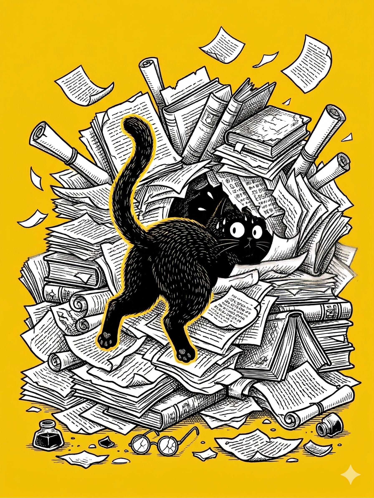

# 【随笔】愚人

昨天，想搜搜看自己有没有写过「重启」这个题目，却翻到了一些 2019 年 3 月的文字。发现当时的自己正在盘算着——有没有可能每天练习写 3000 字呢？

7 年一晃眼就过去了，李笑来总是念叨着 7 年就是「一辈子」，从最早看他在得到的专栏《财富自由之路》，过了将近两个 7 年。若是以最初接触芒格文章的时间算起来，则 3 个 7 年都不止。自己走上《财富自由之路》了吗？

自己重新开启的写作练习，在经过这超过「一辈子」的时间之后，又要何去何从呢？

小时候最开始写日记，是用铅笔字写在一个红色塑料白求恩封面的日记本里书写的。本子的一半是妈妈用过的，被她用胶水粘了起来，至今也不知道被粘住的都是些什么。但我写下的第一篇日记，只要闭上眼睛就能想起那些文字，拼音。

> 今天，爸爸说我是猴子，我说爸爸也是猴子。以后我再也不这样了……

那时候的我，比现在的阿宝小些，比现在的大鱼大些。

……

在 2018 年 11 月，自己写下《开始一次新的尝试》之后，第二篇文章就是感慨——《修行好像画了一个圈》。现在回头再看，竟然是一个圈又一个圈。

写作——从经常需要提醒自己坚持不懈，每天日更，到现在一边挤不出牙膏，一边念叨着许多想写的主；一边想要坚持「古法手工」，一边抓着 AI 给我当教练，给自己修改意见，一边还讨厌 AI 的严厉和古板不时偷偷地逃掉。

投资——从做「波段」，每天看市场写下对行情的预测，再到自以为是的「价值投资」，再到发现自己「其实没入门」，「还是没入门」，尝试入门很多次后，老老实实地退到大宝身后打辅助。

太极——从每天练上一小会儿，到每天练上几小时，再到如今练完金刚功后，几乎没空捡起练一趟十三式。

静坐——从偶尔静坐，到每天早晚各一小时，再到几乎放弃，然后重新捡起，一次又一次。

……

有人说，人的一生有三次开悟：

第一次，发现自己的父母只是普通人；

第二次，发现自己只是普通人；

第三次，发现自己的孩子只是普通人。

……

我或许正处在第二次吧，当我翻看着过去写下的文字，立下的宏愿时，感觉自己是一个真正愚蠢的人——用了几十年的时间，在「智慧」的大门前徘徊，最终发现自己依然还在门边。

……

在公园锻炼时，我一边看着在朝阳的照耀下闪闪发光的大海，一边做着师傅教的「倒转河车」的动作，一边长长地吁出胸中的那口气。

大宝听我说自己蠢，没有反驳，却开始说她自己：

> 你说，我现在听见段永平说哪个股票好，就跟在他屁股后面，想要买这个，想要买那个，是不是也很蠢？
>
> 那你说，在那之前。我甚至连段永平都没听说过，冲进股市随手就买，涨了一点就卖。连手续费都没赚回来，那又是怎样的蠢？
>
> 你现在觉得自己的愚蠢，是不出其实，也是类似的情况呢？

安心做个愚人吧，正好今天给自己过节！

