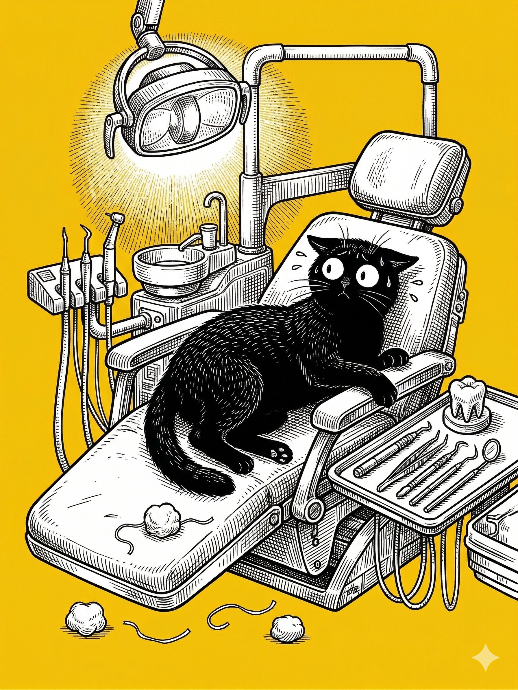

# 【随笔】拔牙

在医院等电梯等时候，我发现自己心脏噗噗跳得厉害，然而手脚却冰凉，而且不知道往哪里放才好。我掏出手机，给大宝发了一条消息：

> 我发现我居然也有点害怕。

……

然而，这点小小的害怕，只是不必要的前奏。预约的医生处理不了这颗烂牙，她说：

> 去年 5 月份就让你来做治疗，你这一耽误就是一年！
>
> 我可啥都给你建议了，是你不听。

我说：

> 你知道，心里总是有点害怕的，所以很容易就拖拉了。

她说：

> 我懂！

一副见多了的无奈表情。于是乎，这一趟只是补好了门牙上的小洞，而那个让我开始有点痛苦和困扰的烂牙根，还得另行处理。

坐在医院平台的椅子上，我沮丧地又不想动。大宝问我：

> 你打算怎么办？

我说：

> 按医生的说法，那颗牙只能拔掉了。

她说：

> 那你决定了吗？

我说：

> 那也只好先拔掉再说了。

大宝帮我挂上了另一个医院的另外一个号，那是一个小时车程之外，另一个区的医院，只能拔牙的号，有点搞不懂，现在为什么牙科分到这么细致了。

……

其实天气真的很不错，预报中的雷暴并没有出现，天空中堆着厚厚的运动，太阳偶尔才能钻出来撒一下阳光。树上大部份枝叶，都是嫩绿嫩绿在春天刚发的新叶，风不大，颇为凉爽，鸟儿们叽叽喳喳，在树间飞来飞去。

不过，我没太多时间停下来欣赏春光。这个医院有点大，我几乎是一路小跑，好不容易才找到了牙科们所在的门诊大楼，找到了医生所在的诊室。

那是一个戴眼镜的年轻小伙子，他指着屏幕上的 X 光片给我讲解：

> 你看这牙根在这里，距离上面的空腔还有点距离，拔起来没什么危险。

他又想起什么，问：

> 你拔过智齿吧？

我说：

> 拔过，四颗都拔了。

他问：

> 最近一颗什么时候？

我想了许久，说：

> 记不清了，至少好几年了吧。

他说：

> 那拔牙的风险我就不多说了，和拔智齿一样，你看看就签字吧。

……

我躺到牙科的诊疗床上，听见他对我说：

> 打麻药时会有点疼。

针刺到牙龈的感觉，让我的背部本能的紧缩起来。然而，那疼痛只是一瞬间。我努力地再放松下来，听见隔壁诊室的女医生也正在轻柔地说着同样的这句话：

> 打麻药时会有点疼。

等了一会儿，医生让我张开嘴开始操作。麻药显然已经开始起作用，那些钳子在我嘴里吱吱嘎嘎地摸索着，我却只能感受到它们的运动，却一点疼痛的感觉都没有。除了偶尔，一根尖尖的针扎到旁边的牙龈，会让我稍微哆嗦一下。

我听见医生哎呀了一下，开始让护士准备更多的工具。

然后，猛烈的刺痛，让我不得不再一次缩紧了身子。医生赶紧吩咐护士准备加麻药。这次的麻药针格外痛，不知是因为针头更粗还是这个部位的牙龈更敏感。我瞥一眼护士，感觉她有那么一点新手的木纳，总是不能及时地清理干净我口腔里流出的血。

医生也嘀咕着，似乎血有点多。他让护士再去拿其他工具，自己用那根吸管来清理。

等待麻药再次生效的间隙，我问他：

> 是不好弄吗？牙碎掉了？

他说：

> 嗯，牙根是嵌在牙槽骨里的，要是在外面多一点，早就弄出来了。
>
> 我需要把骨头也弄掉一点。

我惊讶的啊了一声。

他淡定的说：

> 又不会疼，怕什么？

我想想也是，就放松下来继续由着医生折腾。能感觉到各种刀斧锯锉在自己牙槽骨上一顿操作，那震动和声响有时直接传遍头骨。但正如他所说，确实不疼。

> 低头，再低一点，再低一点， 好了！
>
> 拔出来了，你要看看吗？
>
> 算了，等会儿再看吧，我先处理一下你的伤口。

他让护士找了线来，开始缝合。那线明明白白地穿过自己口腔的血肉，再把它们紧紧地绑在一起，因为不疼，说不上来是什么感觉，只是怪怪的。

……

终于处理完后，我坐起来，在医生的盘子里寻找我的牙。

> 这是我的牙吗？

我指着一块绿豆大小，三角形，白色的固体问他。

> 是的，那是你的牙根。

我又指着另一块，不规则，血糊糊的小石头一样的东西问他：

> 这个呢？是碎掉的牙吗？

他说：

> 是的，牙齿的碎片。不过，你看，你的牙根是完整的。

我看过去，牙根的表面确实光滑，甚至说得上光洁。我脑子里动了个念头：

>  要不把它们洗干净带走？

但是，牙根上沾着的一小团红色玩意儿打消了我这个念头。

> 那应该是我的血肉吧？

我放弃了带走它们的想法。

虽然，算上去，它们是跟随了我几十年的身体一部分。就在几分钟前，它们还是「我」的一份子。

但现在，「我」是「我」，「它们」是「它们」了。

