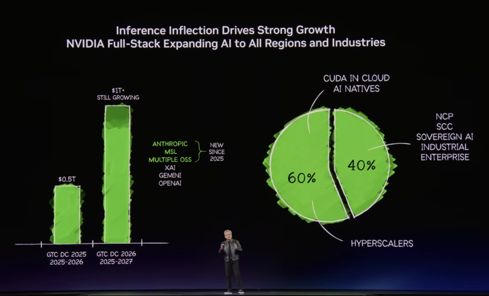
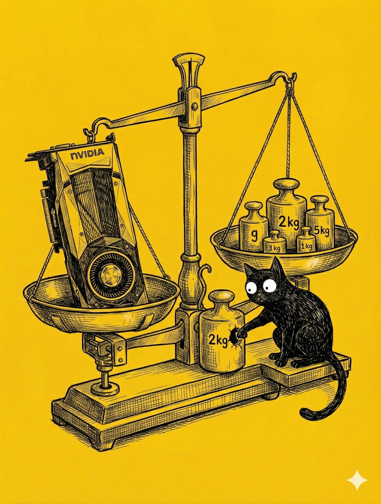

# 【教程】继续优化财富公式及对英伟达的估值

因为前段时间段永平说他看懂了英伟达然后开仓大举买入，大宝敦促着我好好研究一下英伟达的价值。结果，这件事情一拖再拖——只因为我脑子里有一个宏大的构想，想从 AI 格局，需求，半导体产业链的完整角度来做一次价值分析——终于不可避免地，陷入了分析到瘫痪的局面动弹不得。

2026 年 GTC上，黄仁勋更是抛出了到2027年销售完成万亿美金销售的概念，但显然这是一个精心设计的营销概念。

万亿美金乍一听，噱头十足。但仔细算算，从2025到2026，Blackwell 的销售已经过了 5000 亿美金，到 2027 再加上 5000 亿一点也不稀奇。这么精巧计算过的叙事结构，确实给人一种意料之外，情理之中，最后自然而然会感叹：

英伟达真的厉害！

那么，英伟达现在到底值多少钱呢？

如果要做这个算术题，那就不能只看到 2027 年了。

[2023年10月，我头一次用现金流折现法对英伟达进行估值](20231014【教程】怎么用现金流折现法与凯利公式梳理股票投资策略.md)，那时候，英伟达的股票价格在 \$450 美金左右（拆股后相当于 \$45），我给他当时的估值也是差不多这个数字。然后根据凯利公式，我应该用 1 / 3 的仓位，在这个价格购买英伟达的股票。

[2024年3月，我再一次刷新了对英伟达的估值](20240316【教程】再谈现金流折现法与凯利公式，顺便聊聊英伟达.md)，那时候，英伟达的股票已经涨到了 \$880 美金左右（拆股后相当于 \$ 88），我当时给他的估值差不多是 \$ 1280 美金。然后根据凯利公式，我应该用 40% 的仓位，在这个价格购买英伟达的股票。

然而，今天，英伟达的股票价格已经到了 \$180 美金左右，远超我当时的估值。究竟是我太保守了，还是市场太疯狂？这个问题让我困惑不已，更加上，为什么段永平在此时出手？他看懂了什么？他又是怎么「毛估估」英伟达未来现金流的呢？

让我来把自己过去的现金流估算表格放一起对比一下，这是 2023 年版本的：

| 年份     | 经营现金流（亿USD） | 每股现金流   | 每股价值       |
| -------- | ------------------- | ------------ | -------------- |
| 2021     | US$ 58.22           | US$ 1.53     | US$ 396.97     |
| 2022     | US$ 91.08           | US$ 3.25     | US$ 423.23     |
| **2023** | **US$ 56.41**       | **US$ 1.90** | **US$ 449.61** |
| 2024     | US$ 68.20           | US$ 2.30     | US$ 479.18     |
| 2025     | US$ 82.45           | US$ 2.78     | US$ 510.42     |
| 2026     | US$ 99.69           | US$ 3.36     | US$ 543.37     |
| 2027     | US$ 120.52          | US$ 4.07     | US$ 578.04     |
| 2028     | US$ 145.71          | US$ 4.92     | US$ 614.44     |
| 2029     | US$ 176.16          | US$ 5.94     | US$ 652.53     |
| 2030     | US$ 212.98          | US$ 7.19     | US$ 692.26     |
| 2031     | US$ 257.49          | US$ 8.69     | US$ 733.53     |
| 2032     | US$ 311.31          | US$ 10.50    | US$ 776.19     |
| 2033     | US$ 376.37          | US$ 12.70    | US$ 820.02     |
| 2034     | US$ 455.04          | US$ 15.35    | US$ 864.72     |
| 2035     | US$ 550.14          | US$ 18.56    | US$ 909.90     |
| 2036     | US$ 665.12          | US$ 22.44    | US$ 955.03     |
| 2037     | US$ 804.13          | US$ 27.13    | US$ 999.44     |
| 2038     | US$ 972.19          | US$ 32.81    | US$ 1,042.26   |
| 2039     | US$ 1,069.41        | US$ 36.09    | US$ 1,082.42   |
| 2040     | US$ 1,176.35        | US$ 39.69    | US$ 1,122.10   |
| 2041     | US$ 1,293.98        | US$ 43.66    | US$ 1,160.95   |
| 2042     | US$ 1,423.38        | US$ 48.03    | US$ 1,198.55   |
| 2043     | US$ 35,584.54       | US$ 1,320.83 | US$ 1,234.42   |

下面这个是 2024 年版的

| 年份     | 杠杆自由现金流（亿USD） | 每股现金流    | 每股价值         |
| -------- | ----------------------- | ------------- | ---------------- |
| 2021     | US$ 46.94               | US$ 1.53      | US$ 396.97       |
| 2022     | US$ 81.32               | US$ 3.25      | US$ 423.23       |
| **2023** | **US$ 38.08**           | **US$ 1.90**  | **US$ 449.61**   |
| **2024** | **US$ 270.21**          | **US$ 10.97** | **US$ 1,284.31** |

这两次最不一样的地方在于，我试着想把营业收入，拆解为经营现金流。但依然还是对未来的预测，其实还是基于下面这样的拍脑袋假设：

1. 他会在 AI 潮流中，继续 10 年 10 倍的增长，成为一家经营现金流 1000 亿美金，苹果级别的巨无霸。
2. 然后放缓速度，再以20% 左右的高速度，增长个10年左右。
3. 回归 3% ，和全球 GDP 相匹配的长期增长率

只不过，2023年时，我预测它要用15年，也就是差不多 2038 年达到这个水平；到了 2024 年，我预测是 2031 年。

事实却是——2026财年，英伟达的经营现金流就正式超过了 1000 亿美元：

> FY26 营业额：**2153.8 亿美元**
>
> FY26 经营现金流：**1027.18 亿美元**
>
> FY26 自由现金流：**965.75 亿美元**

至此，美股七子除了特斯拉，全都加入了千亿美金俱乐部。

但是，未来会怎样呢？

这一琢磨可不得了，我发现自己过去基于现金流贴现法和财富公式（凯利公式）的估值投资体系充满了 BUG！！！

<待续>

