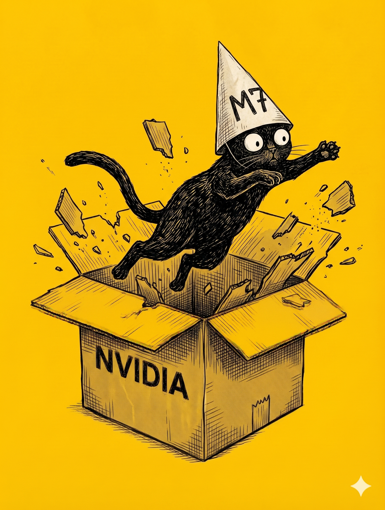

# 【教程】继续优化财富公式及对英伟达的估值（续）

首先，我过去的这个拍脑袋假设非常简单粗暴：

1. 他会在 AI 潮流中，继续 10 年 10 倍的增长，成为一家经营现金流 1000 亿美金，苹果级别的巨无霸。
2. 然后放缓速度，再以20% 左右的高速度，增长10年左右。
3. 回归 3% ，和全球 GDP 相匹配的长期增长率

最大的问题在于它的线性——当然，我用 10 年 10 倍 + 10 年 5 倍弱化了 AI 带来的爆发性增长的指数效应。但问题在于：

> **当英伟达只用了 2 年就实现了我预测中未来 20 年的增长后，它还可能这样继续线性增长率吗？**

另外，3% 的永续增长率，其实是一个非常强大的定位——意味着一家公司达到了「喜诗糖果」的水平，能够持续维持某个细分领域的垄断地位，拥有定价权——可以轻松追上全球 GDP 的增长。

英伟达的收入，很大程度上仰仗于美股七子中的另外几个伙伴——亚马逊（AMZN）、Alphabet 也就是谷歌 Google（GOOGL）、微软（MSFT）、Meta 也就是 Facebook （META）疯狂的 AI 基建投资，而且苹果（AAPL）和特斯拉（TSLA）也正在加速这方面的投入，尤其是特斯拉。

英伟达这个硬引擎、加上OpenAI，Anthropic、Gemini等为代表的大模型软引擎，正装在亚马逊、谷歌这些战车上隆隆向前高歌猛进。

所以，有了它们锁定的订单，黄仁勋可以大胆地宣布 26 年这个日历年再实现 5000 亿美金营收，其实是一个非常保守的估计。

27 财年的营收，如果延续一季度的数字，可以轻松突破 3000 亿美金。

只不过？27 年之后呢？怎么可能还继续这样的指数增长呢？哪怕只是线性增长，也很难吧？

[任何看起来会永远继续下去的指数级增长](20240831【随笔】虚幻的无限增长.md)，终究会撞上某一个盖在上方的物理天花板，那么，这场 AI 叙事的物理天花板在哪里呢？

<待续>