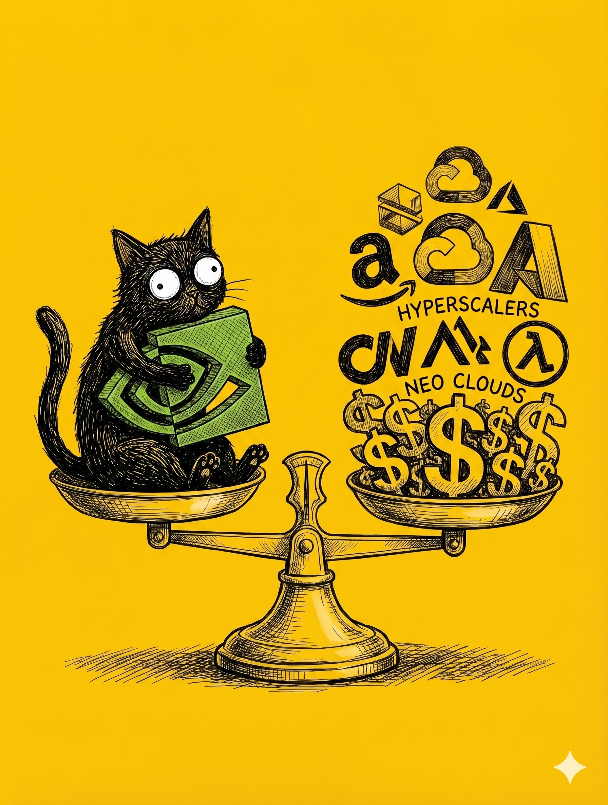

# 【教程】继续优化财富公式及对英伟达的估值（续三）

| 公司名称 (类型)                   | 2025年 实际/预估 Capex | 2026年及未来 Capex 计划                  | 2025年 营收 (Revenue)           | 2026年/未来 营收预测                        | 2025年 Capex占营收比例       | 2026年 Capex占营收预估比例         |
| --------------------------------- | ---------------------- | ---------------------------------------- | ------------------------------- | ------------------------------------------- | ---------------------------- | ---------------------------------- |
| **Amazon AWS** (CSP)              | 约 \$1250亿 - \$1318亿 | **约 $2000亿**                           | 7169亿(总) 1287亿 (AWS)      | 维持双位数增长                              | **17.4% - 18.3%** (占总营收) | **极高** (将大幅拉低自由现金流)    |
| **Alphabet / Google Cloud** (CSP) | $914亿                 | **\$1750亿 - \$1850亿**                  | 4028亿(总) 587亿 (Cloud)     | 强劲增长                                    | **22.7%**                    | **超 35%** (假设总营收维持15%增长) |
| **Microsoft Azure** (CSP)         | $557亿 (FY25)          | **超 \$1200亿** (Q1>300亿, Q2=375亿)     | 2817亿(*F**Y*25) 1689亿 (云) | FY26实现双位数增长                          | **19.8%**                    | **大幅上升** (受限但持续增长)      |
| **Meta** (内部AI/大厂)            | \$700亿 - \$722亿      | **\$1150亿 - \$1350亿**                  | $2009亿                         | 继续保持强劲增长                            | **35.9%**                    | **可能超 45%**                     |
| **Oracle** (CSP)                  | $212亿 (FY25)          | **$500亿** (FY26)                        | $574亿 (FY25)                   | FY26: 670亿∗∗<*b**r*>*F**Y*27:∗∗**900亿**   | **37.0%**                    | **约 74.6%** (500亿/670亿)         |
| **CoreWeave** (NeoCloud)          | $149亿                 | **\$300亿 - \$350亿**                    | $51.3亿                         | 2026: 120亿−**130亿** 2027: **超$300亿** | **290%**                     | **约 260%** (中位数325亿/125亿)    |
| **Lambda Labs** (NeoCloud)        | 未披露具体总额         | 获 **\$15亿**融资建设堪萨斯24MW AI工厂等 | \$5.2亿 - \$12亿                | 未披露确切数字                              | **>100%** (推测)             | **极高** (重资产扩张)              |
| **Crusoe** (NeoCloud)             | 未披露具体总额         | 获 **\$150亿**融资建设德州1.2GW数据中心  | $2.76亿 (2024年)                | 未披露确切数字                              | **>100%** (推测)             | **极高**                           |

CSP 与 NeoCloud 资本支出（CapEx）及营收预测汇总表

*注：部分公司的年份为财年（FY），如微软FY26对应自然年2025下半年至2026上半年，甲骨文FY26对应2025年中至2026年中。*

把各家 CSP 以及算力黄牛（所谓 NeoCloud）的财报信息丢进 NotebookLM 里，就得到了这么一张表。2026 年，北美 AI 数据中心的总 Capex 进入了 \$5000 ~ \$7000 亿美元的深水区。

以微软为例，Q2 FY2026 375 亿Capex中 67% 都是砸在 GPU、芯片等等「短寿命」IT 设备上。那么 McKinsey 对于数据中心 Capex 投资结构的估算大致上是正确的：

60% tech硬件、25%电力冷却、15%土地

所以，我们可以认为，2026年，这 \$7000 亿美金有 60% 左右是 GPU 机柜，考虑英伟达当下在全球超高的市场占有率（约莫 70% - 80%），折算下来，有至少 \$3500 亿美金的投资，会被英伟达收入囊中。

这么看来，英伟达财报里，关于2027 年的 Q1 的营收预计 **780亿美元**，大致乘 4，基本符合我对它 FY27 的营收预测。毛利率应该还能保持 75% 左右，那么业主自由现金流也应可以维持在 41.6% 上下——也就是下表这最后一行。

| 年份 | 经营现金流（亿USD） | 业主自由现金流（亿USD） | 总股份（亿） | 每股现金流 | 每股价值 |
| ---- | ------------------- | ----------------------- | ------------ | ---------- | -------- |
| 2026 | US$ 2,159.00        | US$ 900.00              | 246.00       | US$ 3.66   | TBD      |
| 2027 | US$ 3,120.00        | US$ 1,300.60            | 246.00       | US$ 5.29   | TBD      |

但要估算每股价值，我们还得继续推演接下来几年事情会怎么发展演变。

<待续>