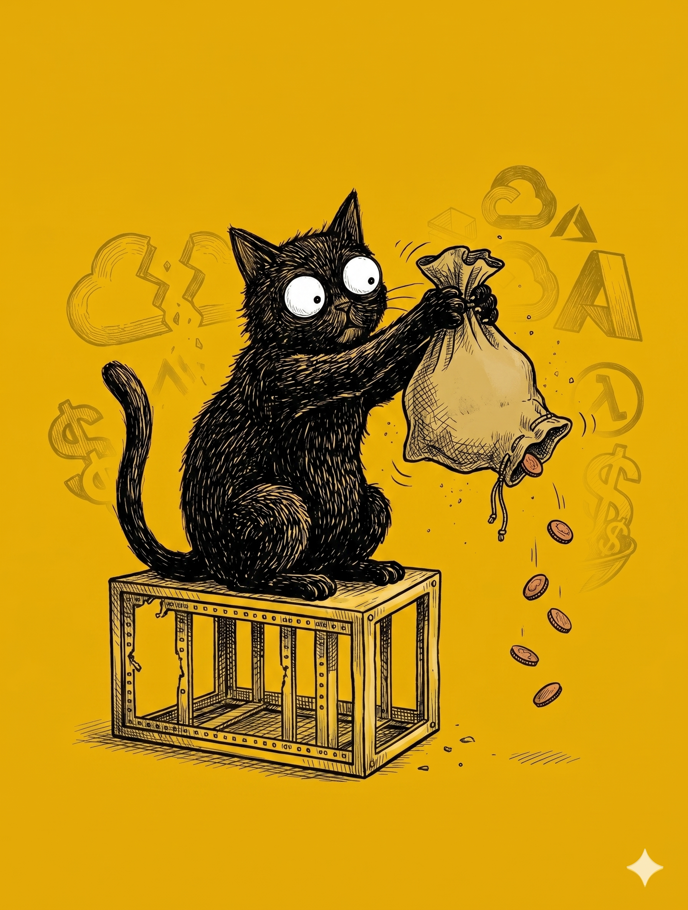

# 【教程】继续优化财富公式及对英伟达的估值（续四）

高盛（Goldman Sachs）的预测是，2025 - 2027 期前，超大规模云服务商（Hyperscalers）的总资本支出将达到 1.15 万亿美元。麦肯锡（McKinsey）则预测从 2025 - 2030 年，全球数据中心的总投资会达到惊人的 6.7 万亿美元。

可以收到的信号是，不管是稳健的超大规模云服务商，比如亚马逊，Google， 微软，还是激进进行 AI 转型的 Meta、Oracle，或者那些新兴的 AI 专有云供应商 Coreweave、Lambda、Crusoe等等，2026 之后的计划依然是高歌猛进，大兴土木。

然而，即便是当前最最受益于 AI，营收和经营现金流大幅度增长的 Meta（经营现金流 2024 年 913 亿美金，2025 年 1158 亿美金，增长 26.8%），随着年年翻番的 Capex，自由现金流已经从 2024 年的521 亿美金，降到了 2025 年的 436 亿。而2026 年如果它的 Capex 达到预计的 1350 亿的话，就直接占到了总营收的 55% - 67%。

也就是说，它经营现金流的增速只要小于 16.58%，自由现金流就很可能被击穿变成负数。

换句话说，只要 Meta 坚定地执行它到 2028 年6000亿美金的**人工智能军备竞赛计划**，那看似在 Hyperscaler 中最为丰厚的自由现金流很快就岌岌可危。

AWS 也一样，根据它 $2000亿的 Capex 计划，2026年的自由现金流就会变成负的 450 亿。而 Google 和 微软会暴跌，但是大致维持在一个略微的正数上。 

中国也类似，大厂中利润最好的字节，在放出日均 Token 调用超 120 万亿新闻的同时，也传出消息来，去年净利润下滑 75%——据说也是因为在 AI 上的超大规模战略投入所致。

为什么出现 CoreWeave 这样的算力黄牛，很大程度上也是因为这些 Hyperscaler 为了降低财报中 Capex 在总营收的比例，以投资、租赁的方式，把数据中心建设的钱从 Capex 变成了 Opex 或者其他投资。

为了让财务报表好看，GPU 的折旧年限被强行拉到了 5 - 6 年。然而，根据技术人员的分析，高强度训练下使用的 GPU，2 年后故障率就会急剧上升。再加上英伟达每年坚定地推出比上一代至少强 3 倍的新产品。实际上，3 年后旧 GPU 的残值就大概归零了。

这就像一场胆小鬼游戏，大家都在赌其他人会顶不住先松油门。

华尔街认为，他们的盈利会继续以 20% 的复利增长，而只是在 2026 -2028 年的基建狂飙期会面临现金流归零甚至变负数的阵痛。一旦不再需要大规模投入大 AI 基建，那么他们就会迅速回血。

也就是说，如果他们的营收、盈利不能以更大的指数复利增长。现在这种巨量的 AI 基建投资最多也就维持到 2028 或 2029 年。

<待续>