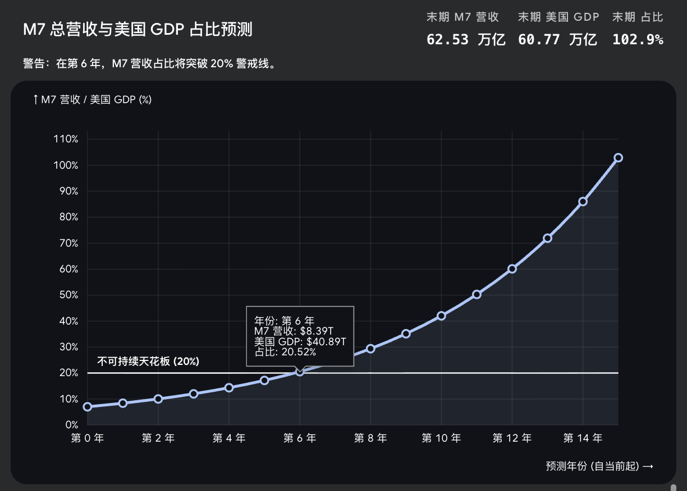

# 【教程】继续优化财富公式及对英伟达的估值（续五）

根据收集到的宏观与财报数据（截止2025年度及2026年第一季度），美股七姐妹（苹果、微软、谷歌、亚马逊、英伟达、Meta、特斯拉）的年度总营收规模大约 2.2 万亿美元，预期 2027 年能达到 2.8 万亿美元，增速超过 25%。

同期，美国名义 GDP 31.4 万亿美元，27年预计落在 33 万亿 和 34 万亿之间。名义 GDP 的增速 = 实际增速 + 通胀因子。因此，美国宏观经济的增长速度应该能够维持在 4% - 4.9% 之间。

我们按 25% 和 4.5% 的增长率画一条线，会发现到了第六年，也就是 2032 年，美股七姐妹的年度总营收规模将超过美国名义 GDP 的 20%。

这是什么概念？

让我们来对比一下前三次技术革命——铁路、电气化和信息化时代的数据：

* 1887 年的建设高峰期，美国铁路单年的资本支出达到了美国GNP 的3% - 4%。到19世纪末，铁路板块的市值占到美国股市总市值的 60%以上。然后在 1893 年崩盘了，直到 J.P. 摩根出手。
* 1920年的电气化时代，当年美国名义 GDP 大约 1046 亿美元。全美电力行业营收大约 19.4 亿美金，占比 1.85%，投资大约 8.5 亿美金，占比大约 0.81%。但是，塞缪尔·英萨尔通过眼花缭乱的 7 -  8 层金字塔式控股，发行大量股票和债卷，把这不到 2% 的营收在金融市场放大了几十倍。以至于崩盘后，美国政府出手，强行拆分了这些横跨全美的电力帝国。
* 2000 年的互联网泡沫，当年千禧科技七剑客（微软、英特尔、思科、IBM、戴尔、朗讯、世通）总营收合计大约 2680 亿美元。当时美国名义 GDP 大约 10.25 万亿美元。占比大约 2.6%，然后就崩盘了。亚马逊、雅虎、美国在线这三家典型互联网企业，总营收加起来大约才 106亿美元。再算上当时如日中天的 Sun Microsoft，也不过再加大约 150 亿美元。——不过，从投资维度看，当时的基建投资也占了美国 GDP 的大约 1.5%，许多光纤铺下去了，却从未点亮过。

现在和历史很像，但又完全不一样，对吗？

接近 8% 的比例前所未有，但基建投入规模却远不如铁路时代，也不像互联网泡沫时期基建远超需求和营收，铺满点不亮的暗光纤。

但几家公司的营收疯狂吸血整个经济体，逼近全美 GDP 的 20%，一定会一头碰上政府权力的天花板。

<待续>
