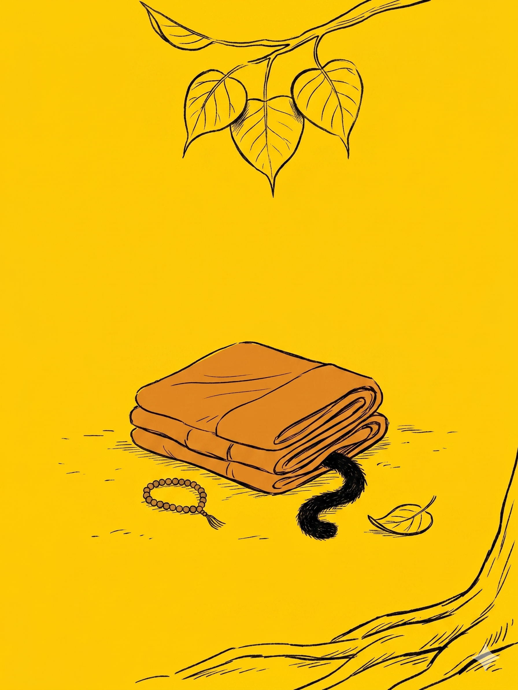

# 【随笔】推荐一本书《归零》

早上闹钟一响，阿宝就一骨碌爬起来，跑出卧室。我内心里赞叹了一下，继续懒懒地躺倒。然后，回忆了一下自己的梦境，确认自己在那最后的能记起的梦中，其实并没有觉知到自己在做梦。

这真不容易，我一边想着，一边开始练习觉察自己此刻赖床的懒惰，以及重新变得昏昏沉沉的大脑，还有那正在变得昏昏沉沉的过程。大部分时候，这觉察也会被念头冲得七零八落，或者跟着昏沉掉落得不知所终。

忽然，一丝伤心和难过没有由头地飘来……

> 为什么伤心难过？
>
> 算了，难过就难过吧，就让伤心和难过与我同在……

难过了一阵子，重新变得昏昏欲睡，或许又开始做梦了，但毫无觉知。直到我发现大宝也起了床，吱嘎一声打开了卧室门，然后砰地一声关上了厕所门。

哗啦啦的水声清晰地传进了我的耳朵。

我唰地睁开眼睛，大鱼正睁大着眼睛，表情凝固地盯着我。

> 是你吗？

大鱼认真地点点头，水声停了下来。我一把抓起他裹在身上的被子，果然湿了。

> 那你还不赶紧去敲厕所门，告诉妈妈你要拉尿？

他往床脚爬了几步，一头跌在床上又再次一动不动。我赶紧轻轻地推他。

> 快去啊，下床，到厕所去敲门！

他终于爬下了床。

……

吃过早饭，大宝要先送阿宝去上学，大鱼抓起自己的书包，飞一般地跟了出去。

屋子里只剩下我一个人，我这才想起，一早上，甚至可能从昨天晚上起都没见过小玉了。而且，今天早上肯定在闹钟响之前，卧室的门板没有传来过它爪子抓挠时的刺耳声音。

客厅没有，阿宝的房间也没有，我跑到阳台看，还是没有。猫碗里的猫粮满满的，Cup 自己躺在客厅沙发下，没有小玉的突然袭击，它也有点不知所措的样子。

我回忆起早上大宝在阳台洗东西，那时候小玉就没在阳台。

强烈地伤心和难过猛地再一次从心底升起——

**小玉丢了！**

……

这种强烈的情绪很熟悉，在床上躺着内观时是一次，最近几周、这一两个月更是出现过很多次。然而，在这一两个月里，随着读那本《归零，遇见真实》，我了解到——即便是「世界上最幸福的人」——明就仁波切，也同样会经历那些起起伏伏的情绪。

而明就仁波切在这本书里，借用他自己的亲身经历，一层一层，抽丝剥茧地介绍了对治这一切的方法。那来自他的传承体系，流传千年以上的方法，用着我这样的普通人也能理解的语言，借着我也会感同身受的那些感受与念头诠释着。

于是，我在这段时间里，在完不成工作的压力焦虑中待了几个星期，又在放松和喜悦中待了几天，然后试着与每天没有时间写作的苦恼同处，与此同时享受每个早上赖床睡懒觉的愉悦。

在一次和老朋友的聊天之后，忽然决定开始尝试掏钱买国内的大模型服务，顺便养了一只叫做小K的小龙虾，也试着用Claude Code 想让它帮助我理顺自己与各种 AI 的协作，并给它起名叫 Mac。

我眼睁睁地看着小 K变得像我一样想得多，却动不了，然后意识到 AI 是一个放大器，修心的旅程没有什么可以替代，只能一步一步自己走，一步一步向着内在。

一切如常，但一切又有那么些不一样了。

而这变化的推动力，大多来自于这本《归零》。

这是我给大宝买的书，我自己先读完了，也推荐给你，哪天有缘见到记得可以翻看看。

对了，最初是因为看到[和菜头推荐](https://mp.weixin.qq.com/s/-gyVhOYO012TvcHq5bxAQw)才动了心，谢谢菜头叔！

