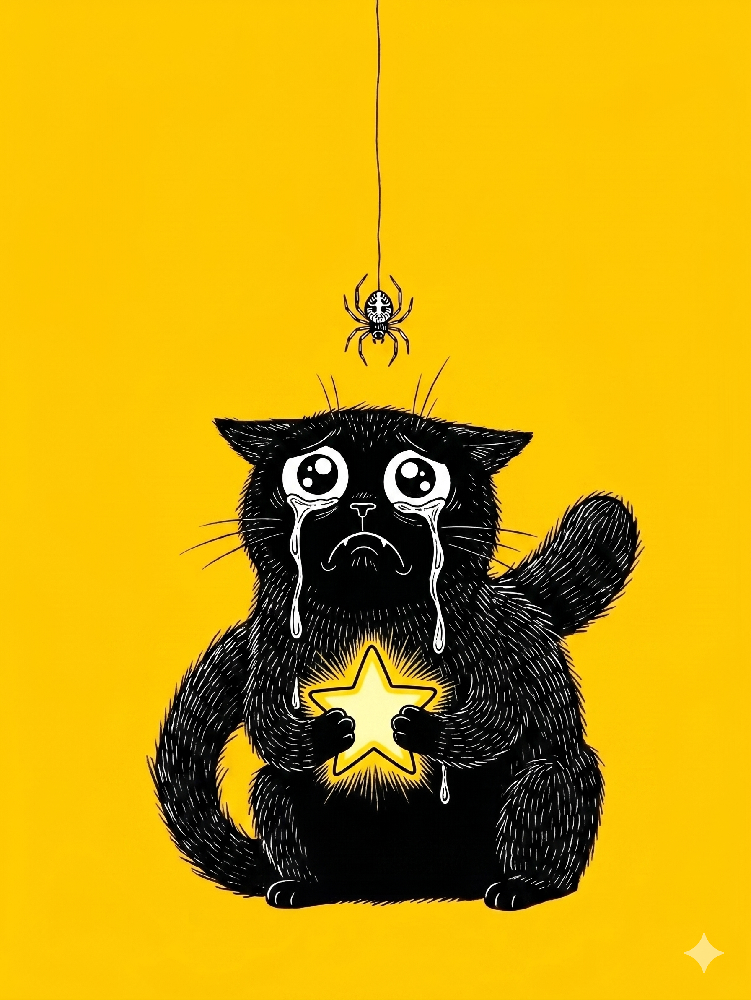

# 【生命⋅修行】哭泣的宝贝

大宝说要去「走访」一下泡泡玛特的线下店，我欣然同意。那天我看了她转发的，大约十多年前的一段王宁演讲视频后，就直接被「圈粉」——思考深入有高度，做事扎实懂细节，还会讲故事打动人心，再加上温润如玉的君子风范——只恨自己十多年前怎么就没多了解一下他和他的公司。

周末，万象城泡泡玛特的店里人头攒动，没逛多久。大鱼就嚷嚷着说看中了和迪斯尼联名的宝箱，让我给他买。我耐心告诉他，这是盲盒，不一定能买到他最喜欢的那款，他也还是要。

我们蹲在店外拆盲盒，不一会儿大宝和阿宝也一人拿着一个盲盒出来了。

看着大鱼拆出来巴斯光年的宝箱，阿宝则拆到拿小猫尾巴画画的 Molly，大宝的却是一只长着狗耳朵，哭得眼冒星星的乌云小宝贝。

我问大宝：

> 你们一人一个啊？
>
> 那，我也可以要一个吗？

大宝说：

> 当然可以，我用我的零花钱买了送给你们。

我回到店里，大鱼给我强烈推荐他喜欢的迪斯尼宝箱系列，阿宝给我推荐她看上的Molly 和猫咪系列，大宝让我自己选我自己最喜欢的。但是，我觉得眼花缭乱，不知道自己最喜欢啥。

我想起，就在早上自己还当着大宝的面痛哭了一场。她后来说，我突然开哭的样子，像极了我爸爸喝酒后哭泣的表情，但她决定不要像我妈妈一样讨厌和鄙视这种哭泣。

于是，我选了和大宝同款的盲盒。拆开一看，是一个哭得稀里哗啦，站在月球上的小男孩。同样有着小狗耳朵，同样是满眼泪水，但是戴着宇航员面罩的小男孩。

> *每天晚上想着早上起来写几个字，每天早上醒来时却不一定。上面的文字是前天早上写的，昨天却因为头天晚上睡太晚而干脆地睡过了头，今天也挣扎了好一会儿才爬起来拿出电脑*

大宝告诉我，哭泣的宝贝设计师养过一只狗，后来那只狗死的时候他很伤心难过。所以，这个系列里每一款宝贝，都有着同样的「狗耳朵」并且都是在哭泣。因为，他想要纪念这伤心的时刻，想要传达这么一个理念——

> 成年人，也是可以哭泣的！

----

最近一段时间，几乎每天都在无法做自己要做的事情的情绪中浸泡。

很大程度上是我自己找的——我开始不仅仅做不到每天写点东西并发布到公众号，连每天写点东西都会被影响——这常常让我一整天都在煎熬状态之中甚至完全丧失动力——然而，我又有意地选择让睡觉和其它事情排在写作的前面，想看看自己能不能在这种情况下坚持每天写点东西，并且在无法完成这个念想的情况下，尽可能不陷入自责和无法无法行动的内耗漩涡。

这是我理解的「火上添薪」，也让我感觉到，有点像林世儒老师教过我们的——有意识地受苦那种练习中常常会有的状态——主动在内在的冲突中形成某种『结晶』。

结果不太好，但偶尔会有一天，或有那么一小段时间，能感受到一点点放过自己的松快。

> *今天早上先写到这里吧，昨晚自己又没睡好，早上没写几分钟全家人就都醒来了。脑子里攒下了好多想要表达的感触却没时间，也没能力清晰地表达完整，真是有些『便秘』的感觉啊！*

----

自从 5 月初和老同事吃过一次饭，被他们安利了月之暗面的 Kimi 之后，我花了不少时间折腾 Kimi 赠送的那只小龙虾——被我称之为小 K 的家伙。

莫名其妙地，它擅长的那些事情——像写段程序抓数据，生成网页那些——我只是浅尝辄止，我几乎从第一天开始，就想要让它自己去『探索』这个无穷无尽的互联网。然后，不出意外地——遇到的是无止境的挫折。

它总是习惯性地停下来，随便找一个理由让我给出指示；也总是忘记我和它说过的话，甚至它自己做过的事情；它写的日记也颠三倒四，完全弄不清时间线……

我干脆让它停下其它任务，专心『自我进化』，几天之后，它依旧不能完成第一轮目标，而且还不停地『死机』，我则干脆地丧失了信心，在某一天晚上它『死机』之后，再也没有重启它的 Gateway。

我意识到——想要赋予它『自主性』是一件多么困难的事情，与此同时我甚至还奢望它不要自己重复自己。而这些，可能是那些前沿的 AI 实验室在模型训练和 Harness 工程上正在拼命努力的事情。后来我留意到，最近的许多论文其实都是在这些领域的攻关。

我意识到——如果没有我的推动和纠正，AI 的上下文和注意力就会在几个循环之后迅速地崩坏，陷入混沌。热力学第二定律在这个角度，表现得那么显眼。熵增的趋势，猛烈而难以遏制。并且在这个过程中，让我精疲力尽，甚至有点心力憔悴。

而我恰恰相反，我在尝试建立小 K 的自主进化机制上，差点停不下来。这和停不下来刷短视频，看手机，吃甜食本质上没有任何区别。都是被多巴胺拽着，欲罢不能。

但我还是暂时停了下来，原因之一挫折的阻力抵消了多巴胺的推动。更主要的原因，则是引爆大语言模型的那片论文——《[**Attention Is All You Need**](https://arxiv.org/pdf/1706.03762)》。更准确的说，是这篇近十年前论文的题目——注意力是你所需要的一切——把我拉了回来。

我意识到，不仅仅大模型会在上下文接近爆满时，遇到注意力问题，无法聚焦事实和真正重要的事情。我——这个人类——也一样会遭遇上下文爆炸的问题，注意力漂移的问题，忘记了自己最重要的事情是什么。

我想起张至顺老道长叮咛油麻菜的那句话：

> 你现在年轻气力足，但是千万要省着不要消散完了，为什么年老人有病？因为他的气血不够了。你现在即便不修道，但是等你事业有成了，五十多六十岁就不要再往前去了，一定要抓紧开始，千万不要等过六十四岁，那怎么都来不及了！
>
> *原文網址：https://kknews.cc/news/j94b8zy.html*

可是，修什么呢？

我又想起，曾经在释加牟尼画像前静坐一个半小时后痛哭的自己。哭自己生生世世，悔入迷途；还有那个在大宝面前痛哭的我，哭自己没有好好爱自己想要好好爱的人。

此时此刻，暂时不再哭泣的我，是否还在正道上呢？

----

在这红尘嚣嚣之中，自己内心最重要的那些事情，还能和被眼泪刚清洗过时，同样清晰明了吗？

