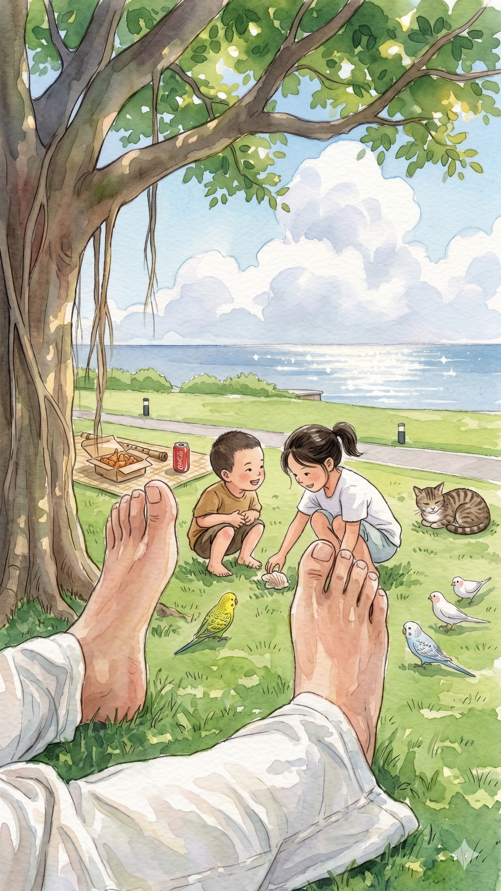

# 【随笔】夏天到了

正好中午前会议准时结束不必加班，孩子们也放 6.1 的假期，大宝便让我到人才公园去等他们。 

这才 6 月的第一天，太阳已经是非常暴烈了。到处都明晃晃的，以至于我总是怀疑自己的变色眼镜其实根本没有变色。海边的草地绿油油的，有些地方那绿色深得，让人感觉能一用力就掐出水来。

我仔细找了一处既有树荫，又干爽平整的地方坐下。然后脱掉鞋子，一面整理坐姿，一面观察着自己身前这块草地。远看着只是一片如绿毯般的草坪，俯下身才知道，那完全是一个大世界。生机勃勃、细细的绿色草叶撑起一整块蓬松的空间，在绿草下面还有些许已经枯黄的草叶，散落的草籽和榕树的种子。小蚂蚁们在草叶上忙不迭地爬来爬去，也有小小的蜘蛛匍匐在草叶的背面守候着自己的猎物。虽然前两天有过暴雨，但这一处的土已经干了。只有一小团又一小团湿湿软软的蚯蚓粪便，藏在草根处，散发着新鲜的泥土气息。

我不由得想到，如果此时掀开这团湿土，是不是能抓住小蚯蚓的尾巴呢？我小时候就干过这事儿，不过此时此刻，我决定放过它们。有一些比芝麻粒还小的小黄花，在草叶间兀自绽放着，如果不是趴下来仔细瞅，根本看不见它们。

海水泛着白光，银蓝色，蓝天则好像洗过一样，衬着大朵大朵的白云。我闭上眼睛，风迎面吹来，忽大忽小，带着阳光照射过的海面蒸腾上来的热气，也带着树荫下湿润的凉意。我试着对着尺八的吹口，轻轻吹了吹。尺八发出轻轻的「呜～」声应和着。头顶一只鸟儿啾啾的叫着，蒲扇着翅膀飞落到身后的树梢中。

真是完美，既有凉爽清风散去身上的臭汗，又不影响我吹尺八。

过了好一会儿，风大了起来。吹出嘴唇的气息，终于还没来得及振动尺八，就被风吹散。我拿起披巾，裹在头上，把脑袋藏起来继续吹。却远远好像听见了大宝和阿宝说话的声音。

我故意继续正坐在那里纹丝不动，耳朵却搜索和分辨着，想确定那是不是大宝带着孩子们已经来了。

果然，我听见一声熟悉的「爸爸」在耳边炸响。扔掉披巾，大鱼已经蹦到了我的身边。我一把将他抱过来亲了一下，然后摸了摸他猕猴桃一般的小毛头。他忽闪着黑葡萄一样明亮的大眼睛，问我：

> 爸爸，你是不是被吓了一跳？

我笑着说：

> 没被吓到，但是你突然来了，我很吃惊啊。

……

大宝招呼我到更靠近树干的阴凉下坐着，拿出一盒炸鸡。我看见旁边有一罐可口可乐，拿起来问：

> 这是给我的吗？

大宝点点头：

> 当然咯！

……

阿宝有些不舒服，趴在我的披巾上，看她的珍珠鸟和鹦鹉们愉快地在草丛上蹦跶着。小鸟们开始在草丛里寻寻觅觅，如同回家了一样自在。我和大宝坐在树边，吃着炸鸡和汽水，看着蓝天、白云和银光闪闪大海。大鱼则在我腿上爬来爬去，玩得不亦乐乎。不一会儿，阿宝也加入了进来，两个小人坐在我腿上，用各种手段给我挠痒。

海风阵阵吹来，带着那从小就熟悉的，夏天的味道。

