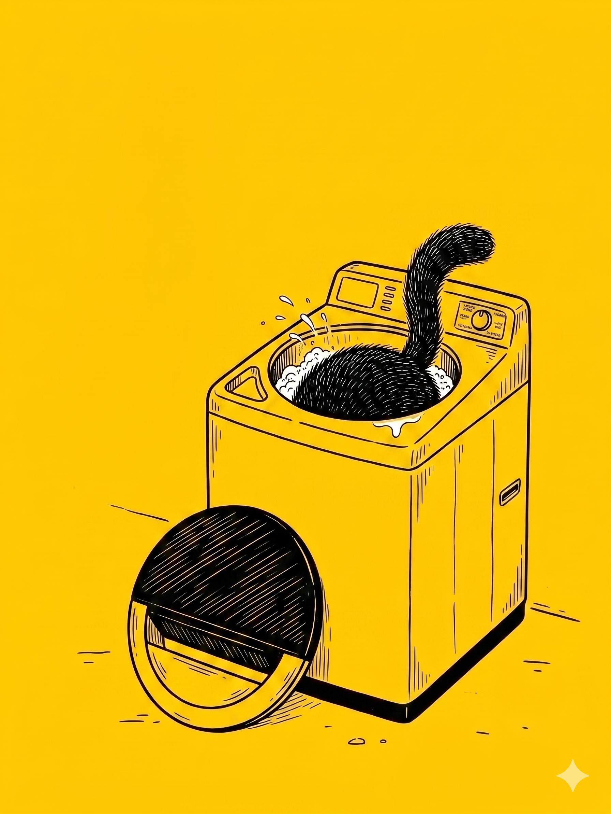

# 【随笔】修了个寂寞

洗衣机坏了一星期了，脏衣服渐渐堆成了山。大宝实在忍不住了，把本来想中午再多睡会儿的我从床上叫起来：

> 你别睡了，快去修洗衣机！

[上次折腾这台洗衣机已经是一年前的事情](20250526【随笔】从软件工程师到硬件维修工.md)。这次的问题不一样，错误代码「E3」。一开始还是洗一会儿变成这个，现在是开机就是「E3」。网上说，这是感应关门的控制器坏了，需要拆换。刚坏的那天，我简单研究了一下，没找到螺钉就放弃了。

看起来，这次是必须把它修好才行。

我拍了张照片问豆包，她言之凿凿，说微动开关就在右边的轴后。但是那里没有任何螺丝钉。好在微信里搜到一个视频，是和我们这个一样的小天鹅水魔方波轮式洗衣机，指出洗衣机后面有两颗螺钉，前面控制面板旁也有两颗螺钉。

拆掉这几颗螺钉，整个上盖就能掀开了。但是右边有粗粗的一把电缆和一根缠绕在电缆上的细软管限制住了上盖掀开的幅度。左边轴旁，有一根长长的白色塑料杆。刚刚看过的那个视频里说，那是检查洗衣桶平衡用的传感器。

我再次拍照问豆包，她继续信心满满地指导着：

> 这个XXX 颜色的就是传感器，
>
> 你在这后面就能看到一个 XXX 的凸起，
>
> ……

她说的那些，我根本看不到。再拍，再问，她又改口，说左边那个白色塑料杆就是开关门的传感器。我有些愤怒地质问，那不是感应桶平衡的吗？她再次淡定地认错，然后一口咬定传感器在右边，我拆掉某个方块后不存在的螺钉就能找到。过了一会儿又说，那有个黄色标记的地方就是，伸手摸到微动开关，但那里明明安装得结结实实，没有任何可以触动的地方。

正在和豆包吵架，我却发现那个软管，本来插在某个地方的，现在被扯下来了。我连忙问，这个软管是干嘛的，应该插在哪里？

豆包说，这是水位传感器用的。但应该插回哪里，她嘟嘟囔囔半天也没给我说清楚。

我愤怒地冲她嚷嚷了一句：

> 你就是个蠢货！

关掉了手机，自己琢磨起来。那里有个圆形，被别人画了一个黄色的标记，还用黑色记号笔抹了一道，接着一排细电缆的设备，被几枚螺钉固定着，但是没看到软管插口。我把螺钉拧开，这果然就是一个可以拆卸下来的水位传感器，软管接口在它的背面。

我把软管插了回去，但这个空间实在紧张，勉强重新装上时感觉软管随时可能被扯开。

但不管怎么说，开关门的传感器肯定不可能在这里了。

……

 

大宝跑出来看我，我愤愤地和她吐槽不靠谱的豆包。她说：

> 你别问豆包呀，可以到微信和小红书找一下那些修理工的视频试试？

我一想，也是，便又重新打开了手机。尝试若干不同的关键字之后，我终于发现有人指出另外一个位置可能是问题的关键——就在洗衣机门边，按个触摸屏电路板下面，有一个非接触式的开关。

我把手机放到一边，看了看我们家洗衣机同样的位置，那固定用的两枚螺钉早就锈完了。大宝用透明胶把缝隙处粘得牢牢实实的——我知道原因，这款洗衣机最愚蠢的设计就是这个触控屏非常容易漏水后失灵。拆开透明胶，触控板轻松就能抬起，下面的空间里，果然有一个长方形，被两枚螺钉固定在门边的小电子器件，接着两根从触控板连出来的电线。

> 唔！没错，就是这个叫「干簧管」的玩意儿。

我找了一块磁铁来，想看看是不是这个器件失灵。但这个小玩意儿对磁铁没有任何反应，怎么弄都还是 E1。

> 要不，干脆像视频说的那样，把这个「坏掉」的干簧管，直接短接了账？

我这么琢磨着，又觉得不放心。趁着吃饭，告诉大宝我的最新发现，然后对她强调：

> 我感觉我快要修好了，但是以后门一开就自动停机的安全保护就没了，你千万要记得洗衣机旋转时不要把手放进去。也不能让孩子们碰！

大宝告诉我没事儿的，她不会把手放进去，孩子们也不会碰洗衣机。于是乎，我吃完饭，就找来剪刀和胶布，咔嚓一声把干簧管剪了下来，然后把那两根线短接了。

装好洗衣机，开机测试——没有任何改变，洗衣机依然一边显示着「E1」的错误编码，一边「滴」地蜂鸣着报警。

我抓了抓头发，掀开触控板左右看了看，电路板之外主要就这么一个通往干簧管的线路，已经被我短接了。其它是一整块被防水胶密封的主控电路板，还有些线是从上盖接过来的。

我重新打开上盖，发现那根软管又脱落了。难道是水位传感器的问题？我只好再次拧螺丝，拆传感器，插软管，拧螺丝，正想把盖子装回去，然后停了下来。

>  为什么不在装回去之前测试一下呢？

我插上电，开机。哗地一声，水从洗衣机上盖的缝隙直接涌来出来，一部分冲进洗衣机桶里，另部分则冲在敞开的盖子边缘，猝不及防地溅了我一脸。

> 千万别把那些电气线路打湿了！

这么想着，我赶紧把湿漉漉的手在身后胡乱一擦，一把关掉了电源。眼镜上还滴着水，我却不由自主开始哼起了小曲儿。小心翼翼地装回上盖后，再开机，却还是「E1」。

> 又把水位传感器的软管碰掉了？

打开一看，果然。我只好再度拆装一次，然后小心地在最后安装前打算再开机试一下，但这次直接 「E1」。我低头往软管处看了看，水位传感器的软管装得好好的。

> 奇怪？

我一边自言自语，一边继续看这盖子里还有什么端倪。哦，那个长长的检查筒平衡的白色塑料杆被压住了。我移动了一下盖子，让那根塑料杆挪到空处，水再次「哗」地一声放了出来。

> 这次肯定行了！

我赶紧拔电，再慢慢地盖上洗衣机上盖，确保软管没有被弄掉，也没有卡住任何其它器件。然后加电，还是「E1」。

我再次打开盖子，这次，我终于确定，是这平衡感应器的问题。

我翻了翻视频，有些修理工直接把这个感应器也是短接了事。但我总觉得，这操作，也未免太草菅人命了。

这时，我才想起，最初洗衣机不干活时，使劲拍几下，也能继续工作。而且，这次出问题，是因为洗了一床太重的棉被造成的。

所以，莫非，其实，现在洗衣机的洗衣筒，根本就不在平衡位置上？

这么一想，我赶紧把洗衣机四个角的砖块重新挪动了一下，特意把传感器所在的那个角垫得更高了一点。一切稳当之后，再次开机。

> Binggo!

洗衣机终于开始正常放起水来。不过，这次放水一直不停，我怀疑水位传感器出了问题。于是打开上盖又重新接了一次水位传感器，然后再试，依旧是水快满了，也不会停。

强行终止了一次，然后单脱水——正常。我再试一次洗衣，这次完全正常了！看来，只是拆装过程中，破坏了软管里的空气压力，装满水又放水就自己好了。

也就是说，我拖了一两周，又拆装这么久，只是洗衣机歪了，垫平就好。

不过，视频上那些短路这个安全设施，短路那个安全设施的修理建议，确实值得商榷！我思来想去，实在无法忍受那被短路的「安全措施」，便又打开触控板，把那干簧管重新装了回去。

这下，一切终于恢复了正常。完整测试，也没有任何问题。可以洗衣、干衣一个程序跑到底，打开门也会应急停止。只不过，我手里多了一把拆下来后，没有装上去的螺丝钉。

不管怎么说，这次维修告一段落，我一通折腾，却只是修好了一个本来无需折腾的故障——真是修了个寂寞。

----

#### 附录：小天鹅水魔方波轮洗衣机 E1/E3 故障排雷指南

1. 检查洗衣机门是否关好。
2. 检查洗衣机是否放稳放平，打开洗衣机门，看洗衣机筒是否挂稳，是否平衡（没有触碰到那白色长杆）。
3. 然后再考虑拆上盖：看水位传感器是否正常（检查那根软管是否接好 ，是否通畅）；
4. 拆电路板，看开关门传感器是否工作正常（有些洗衣机是接触式的，而我这款是非接触式的）；

前两步，根本不需要动螺丝刀！
