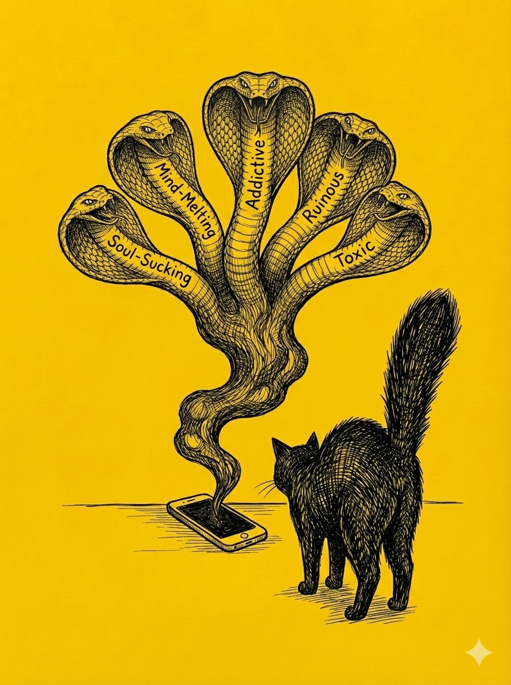

# 【生命⋅修行】时惑

前两天和妈妈通视频，她说自己晚上越来越睡不好，连一两个小时都睡不到。她说，很可能是看手机的缘故——睡不着就看手机，看了手机就更睡不着。我问她：

> 你要不要试试，晚上醒了坚决不拿手机看呢？或者把手机放到远一点，伸手拿不到的地方？

她叹了口气说，根本忍不住啊！我不由得跟着叹了口气，说：

> 确实，真的很难！

有时候，一想到自己被这么几英寸的小方块困得动弹不得，就怒火中烧。然后转头就拿起手机，打开DeepSeek，让它帮我想一组单词，分别以 S.M.A.R.T 开头，好表达我对智能手机这个吸魂之物的愤怒！

它倒是想出了好几组让我觉得解气的词汇，但这个吊诡的场景更让我觉得可笑又可怕——我居然拿着手机找词来骂手机。

……

这几个星期，大宝带着孩子们回了老家。想象中，我每天至少能多出两三个小时，可以做许多孩子们在时没空做的那些事情——那些积压在 To Do List 上，持续给我压力或者诱惑的各种事情。但实际上，这几周过去，我不仅没有捡起其中任何一件事儿，反而把早上的运动时间给弄丢了；对了，这么说并不准确，我其实在这些天给自己艾灸、给自己煮姜枣茶；前面那种说法，实际是自己的一种不太好的惯性——总是盯着那些没完成的，未拥有的东西看。

那么换个角度思考，这几周是有收获的。最大的收获是——熬了几次夜，刷完了几部不好看的 AI 短剧，和一部制作很不错的 AI 短剧《万妖图录传》，还追完了《一人之下》最新的第六季。

尤其是在刷那几部不好看的 AI 短剧时，让我有一种充分的抽离感，一面看着制作人用那些低级的手段撩拨、勾引自己的欲望，骂他们手段真是低级；一面又看着自己不由自主地被这些简单的勾子钓着，一下一下滑动着手指，转不开眼睛，感叹自己真是愚蠢。

关掉手机。我会意识到，这些短剧所用的，牵引着我亦步亦趋的绳索，和这尘世上其它那些牵动我的——功名利禄等等机关本质上都是一回事儿。

能怎么办呢？

我记得自己寻找过很多方法，视图断绝「手机」对我的影响，前几年独自在中东出差时，更是深受其扰，还[搬出 AI 帮我设计了一整套系统对治佞臣的法子](20240727【随笔】请AI出招帮我管控佞臣.md)。

然而，此时此刻，我想起[《传习录》](https://ctext.org/wiki.pl?if=en&chapter=144242&remap=gb)里的一段话。

----

*九川问：*

> *自省念虑，或涉邪妄，或预料理天下事，思到极处，井井有味，便缱绻难屏，觉得早则易觉迟则难，用力克治，愈觉捍格，惟稍迁念他事，则随两忘。如此廓清，亦似无害。*

*先生曰：*

> *何须如此，只要在良知上著功夫。*

*九川曰：*

> *正谓那一时不知。*

*先生曰：*

> *我这裹自有功夫，何缘得他来：只为尔功夫断了，便蔽其知。既断了，则纆续旧功便是，何必如此？*

*九川曰：*

> *直是难鏖，虽知丢他不去。*

*先生曰：*

> *须是勇；用功久，自有勇。故曰：『是集义所生者；』胜得容易，便是大贾。*

----

我那些零零碎碎的方法，大多和九川对治自己「思虑不止」的方法如出一辙，基本上是用一个念头压另一个念头。然而，最根本、最简单的功夫，我却下得不够。

觉察、行动——如此而已。

孔老夫子说「三十而立、四十不惑」，于是乎我总是忍不住拿这个标尺来量自己。

至今，常常还是会因为日常的问题，困惑和怀疑是不是没找到正确的方法。然后每每困惑之后，终于还是要回到那条路上。

然后，不免还要摇头叹息一番——自己离孔老夫子这标杆可真差得太远了。