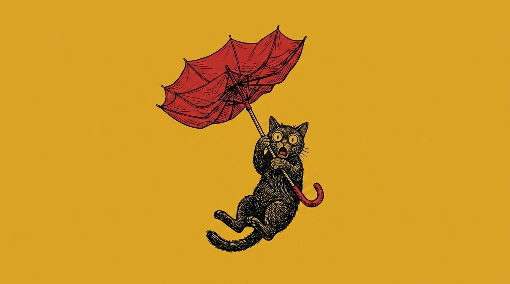

# 【随笔】突如其来的台风

周末早上躺床上还没爬起来时，就想象着一会儿要出门暴走一段。后来和大宝一起研究了两个多小时的旅行行程，又睡了个午觉。爬起来肚子饿了，给自己煮了俩鸡蛋，感觉不太够又接着煮了一碗面条。

面条得煮一会儿，火开着，厨房里水汽蒸腾，热烘烘的。我打开抽油烟机，关上厨房门，躲到客厅里。也不知大宝有没有给我发消息，就走到窗边去看手机，却感觉到一股凉风呼地从窗外袭来。这么凉的风，是要下雨么？我一面暗自嘀咕，一面朝窗外望去。

路边的树刚开始猛力摇晃，早上还晃眼的阳光消失不见了，西边还有点亮色，东方的天空中则已经积满了厚厚的深灰色云层。我向大宝吐槽：

> 还没来得及出门呢，结果看起来要下大雨了！

面还没吃完，雨点就劈里啪啦地砸了下来。看那扯天扯地的架势，慌得我赶紧冲到阳台，把衣服、床单不管三七二十一地全拽下，卷成一团胡乱地扔在床上。好不容易两天太阳晒干的衣物，可不能就这么白瞎了。

大宝劝我，既然下雨就别出门了，正好在家里做卫生。但我还是有点不甘心，一面念叨着：

> 飘风不终朝，暴雨不终日……

一面寻找、收拾需要还到图书馆的那几本书。盘算着，等这段大雨一停，我就去还书。然后看具体情况，到底要不要坚持在外面走上一走。

和我期待的一样，疯狂的暴雨并未持续太久。我还完书，撑着雨伞走到路边，天色忽明忽暗，我看看时间下午五点还没到。

> 要不还是往海边走走吧？

刚刚这么一想，风又猛了起来。眼看着大片大片的雨滴，成群结队地从天空中迅猛砸下，眨眼之间就又变成雨雾蒙蒙了。我拍了两段视频，觉得大腿凉飕飕的，低头一看，自己穿的短裤居然也已经全部被浇透。这可是打着伞站在屋檐下呢。

我听见马路上有人惊呼一声，看过去，却不知道是谁发出的声音。只看见一把被吹翻了的雨伞在空中飞舞着，越过十字路口，一直飞进绿化带里。

我想起那次在深圳湾公园徒步，暴雨来时根本分不清哪边是大海，哪边是陆地的恐怖场景。心里忍不住打了个哆嗦。

不自觉地转身就往回走。

大宝估计是看见我发的视频，给我发了个视频通话的请求。我接通后和她聊了一会儿，告诉她我决定不往海边走了。她嘱咐我买点给路上备着的藿香正气液就回家，我答应着，然后往小区门口绕过去。

但是，雨又小了。

我再度不甘心起来：

> 要不还是稍微转一圈吧？

我终于还是坚持多绕了一大圈，走到麦当劳用掉了前几天获得的冰淇淋优惠券。等嘴里塞满心心念的甜滋滋和冰爽，湿漉漉的衣裤也都不觉得碍事了。满意地掉头，路过药店正好买了藿香正气液回家。

刚好天黑，刚好又一波大雨袭来。

再看新闻才知道，原来是台风红霞，绕道惠州登陆了！