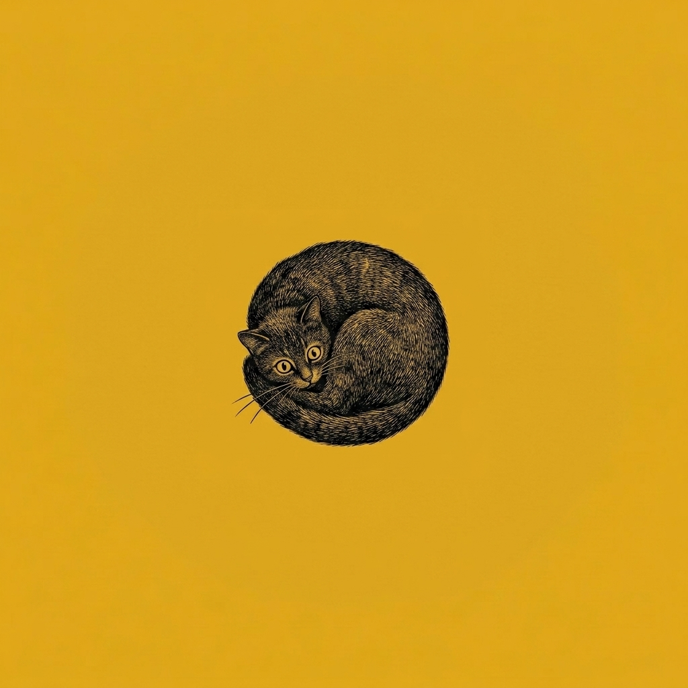

# 【生命⋅修行】一些恐惧与焦虑的碎片

请 Gemini 给我写的[前一篇文章](20260726【生命⋅修行】时惑.md)提意见时，他一口气戳中了我两个习惯性逃避而不自知的地方：

一个是当我觉察到自己的「无能为力」时，立即习惯性地在脑海里搜索出王阳明《传习录》中的片段，用我崇拜的古人、圣人的理论，给自己找一个快速的补丁，借此把心安顿下来。

另一个则是拿孔夫子的「四十不惑」作为标杆，进行精神和道德上的自我鞭笞，用自责替代自省——既然自己都已经批评过自己了，这事儿就可以过去了——这种惯性做法，在面对别人，尤其是大宝可能的批评时，我常常会不自觉地使出来，先提前弄得自己难受极了，好逃避直面批评时的那种难过，特别面对是自己在乎、重要的人批评时那种难过。

面对大宝的批评时那种做派自己常常还有所察觉，写文章时那些许微妙的逃避则更隐秘——只是悄悄地把自省和改正替换成了更为简易的自责，强行完成精神上的闭环。

Gemini 戳的这两下，让我想起最近觉察到的一些恐惧片段。我一直记录下来，因为觉得这恐惧背后必然要想要逃避的东西。然而，此时此刻，在我脑海里印象深刻的只剩下那一个瞬间：

那时，我应该是躺在床上，练习在入睡过程中或醒来过程中保持觉知。然后，一个圈出现了，那个圈里什么都没有。那种绝对的空无感，把我吓坏了。我明知自己应该保持平常心，继续面对这个圈和圈中的「空」，但我迅速地逃了，带着对那种恐惧情绪的记忆。

这种恐惧感给我留下第一次印象，是在高中时。当时暑假和同学 C 一起去桂林旅行，在正午时分，我们爬上了一座山顶。山顶上没有树，只是一小片平地，光秃秃的岩石，阳光当头照下，明晃晃地、无处可逃。我不由自主地感觉到恐惧，连忙转身下山。 C 虽然莫名其妙，也只好跟着离开了那里。

这两个恐惧情绪，似乎是一模一样。

……

前几天夜里，我们一家人在酒店。阿宝已经睡着，大鱼忽然哭泣起来。大宝从睡梦中醒来，安慰了一会儿，又叫我过去一起安慰他。好一会儿，我们才从断断续续的哭泣声中听清他说的几个字：

> 我不想死！

我们问，是不是做恶梦了。他说：

> 不是，是真的。
>
> 人都是会死的对吗？
>
> 我不想死！

刹那间，我不知道该怎么说才好 —— 要怎么安慰一个正在害怕死亡的 5 岁小男孩呢？

我只能告诉他，死亡是什么样，谁也不知道。但是现在、此时此刻，爸爸、妈妈、姐姐和他都在一起，这是真的，这是最重要的事情。

大宝曾经一度很讨厌我在孩子们面前流露出我对生死问题的那种情绪，就是怕我影响到孩子。她小时候没有过这种害怕死亡的时刻。然而，我记得自己小时候也有过。我还为此稍微修改了自己的「理想」—— 小时候，我和许多小男孩一样，想要当兵，但是我非常怕死，所以我决定当坦克兵（那时候，我觉得如果躲在坚硬的坦克里，是肯定不会死的）。

大鱼哭了一会儿，问：

> 我死了后，就又能回到妈妈的肚子里了吗？

不知是我们的安慰起了作用，还是这个念头缓解了他的恐惧，大鱼慢慢不再哭泣了。他问我姐姐在哪里，我说睡在旁边的床上，他就让我把他抱到姐姐身边。

我把他抱过去，姐姐睡得呼呼的，压根不知道我们这边哭得翻天覆地。大鱼静静地挨着姐姐躺了一会儿，和我说：

> 好了，现在我要去妈妈那里。

我又把他抱起来，放到妈妈身边。他钻进妈妈怀里，让妈妈紧紧抱着他。这一次，他再次安心地睡着了。

究竟是做梦，还是他只是被「每个人都会死」这个念头吓到，这成了一个谜。

……

关于生死，小时候我们不敢面对，如今长大了，终究难逃。