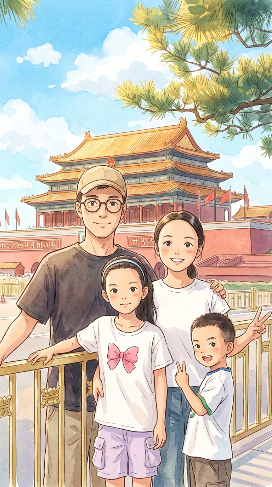

# 【随笔】旅行的意义

这次旅行，比想象中顺利，也比想象中更快结束。算上周末整整九天，我们曾经犹豫过是不是要趁此机会重游十年前牵动姻缘红线的大马，但最终还是选择带着孩子们国内游。以几乎一天一个城市的节奏，在湖南、山东、天津、北京玩了一大圈，然后飞回广东深圳。

离开深圳那天去火车站的路上，我脑子里一直在给自己播放那首网络神曲——「本来该从从容容游刃有余，结果却慌慌张张连滚带爬」。本来给自己出门留了两三个小时的余量，但是我非要给自己做晚饭（用光冰箱里所有的青菜）、洗衣服、收拾厨房、收拾垃圾……

当我在小区垃圾站洗完手后，拿起手机一看时间，发现按照高德估算，等我到火车站时火车刚好已经停止检票了。可巧这时还是高峰期，打车只能更慢。没办法，我只好选择飞奔进地铁站，然后拿着豆包和高德反复确认在哪一节车厢下车换乘可以走最少的路，提前走到距离换乘电梯最近的车厢门口。就这样，慌慌张张，一秒一秒地抢时间，最后硬是卡着点冲进了车厢。

我抹着满脸的汗水，心有余悸地向大宝汇报成果。然后默默地想：

> 如果是和大宝一起，一定都是从从容容的吧。

离开深圳的那天，还是湿漉漉的台风天。列车里的空调风冷极了，和大宝汇报完，我就趴在上铺，裹着棉被，把范仲淹大人的《岳阳楼记》抄写了一遍，但第二天能不能用上呢？谁也不知道。这天半夜，我头疼得好像生病了一样，醒来发现空调冰冷的寒风，隔着厚棉都刺骨不已。我把枕头从脑后抽出来，用它把能看见的风口尽可能全堵上，再用厚外套裹住头，只露出鼻孔透气。

在岳阳等待大宝和孩子们的时候，我安装了一个[王建硕大大写的软件 VoiceDrop](https://voicedrop.cn/i/7D7F20)，心想回头路上想记录点什么，就试试这个用语音就能写文章的玩意儿吧。但我并不习惯这种输入方式，后来也只试用了一次，做记录可以，但拿来写文章却总是觉得不太对劲儿。

岳阳的太阳火辣辣的，看着湛蓝的天空和大朵大朵的白云，我忍不住拍了许多照片。大宝笑我，是不是在深圳太久没见太阳了，她们在老家，每天都是这样的蓝天白云。

孩子们怕热，总是叫着要去酒店，我们却坚持至少要逛一逛每个城市的招牌景点。于是岳阳楼、大明湖、趵突泉、八大关都留下了我们的身影。我们还在乳山待了一天，找机会我给爸爸揉了揉肚子，按了按足三里。爷爷奶奶很开心能见到热闹的孩子们，并接下了阿宝的实验任务——用毛豆喂他们留下的两只蝈蝈儿，看到底会不会拉绿色的屎。我们仔细参观了梁启超纪念馆和饮冰室，过袁世凯故居的门而不入，然后坐船游了海河，买了许多十八街的麻花。

约不到天安门城楼、故宫、国家博物馆等等暑期热门景点，我们好歹冒着中暑的风险，排队进入了天安门广场，留下了几张旅游观光照。

我最想要带大宝去看的是中山公园（社稷坛）的古树群，那里 300 岁的树都只能算是年轻辈儿。我总是忍不住想象，这些 600 多年前明朝种下的古树，若是树上有灵，眼见着身边的人类来来往往，纷纷扰扰，打打杀杀，改朝换代，忙忙碌碌，不知它会是怎样的感想。

古树上大多有些树瘤，被游人摸得锃光瓦亮。孩子们学我的样子，每棵树都去摸一摸，仰望着参天古木，试图感受一下那穿越数百年的生命气息。但他们最念叨的，却是太庙里的那群太喵……

还没来得及细看每一棵古树，风就把乌云吹来了。我们赶在暴雨倾盆的那一瞬间，冲进了地铁站，不由得庆幸不已。

最后一晚，我们排了三个小时的队，终于在全聚德前门店，让大宝和孩子们吃上了我曾经吃过的北京烤鸭。

这一路，完成了一些执念，也放下了一些执念；见了一些风景，也错过了一些风景；享受了泉水的冰凉，也挺过酷暑下排队的煎熬；或许，这就是所谓旅行的意义吧……

等回到深圳，虽然已立秋，但竟然也晴朗得好像夏日一般了！