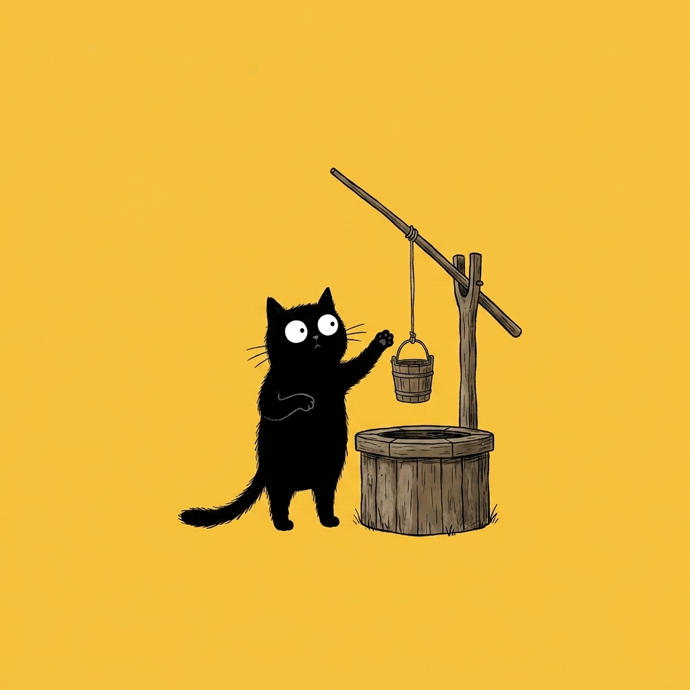

# 【随笔】AI 时代的困扰

那天在一个前同事组织的「AI」群里看见有人提到了「红果」。然后有人说：

> 红果没看过，但我决定要去看看了，[呲牙]

我连忙出声「警告」：

> 我下载过，然后发现自己那点自制力根本不是字节的对手。终于在某一次熬夜后把它删了[捂脸]

于是乎，大家跟着我感慨了一番，这魔戒带上容易，摘下来可就难了。

只有我自己记得。在那个凌晨，我疲倦地扔掉手机，倒在床上，眼睛胀痛却撇见卧室窗帘已经漏出晨曦微光时，那从胃部直冲脑海的愤怒。我强忍着想要砸掉手机的冲动，狠狠地戳着屏幕，恶狠狠地在那个图标上点下一下「减号」。

现如今，在这个【AI时代】——技术与智能越来越强大、越来越普及的时代，我们真正的自由变得越来越稀缺了。以前，还能因为自己不是主流用户，入不了那些大厂品牌营销、产品经理和模型算法工程师的法眼，侥幸躲在镰刀的边缘。可如今，他们只需要用 AI 就能快速制造出一网打尽各种差异化用户注意力的大杀器。

我们自以为的那些「自由」、「自主」，却只是基于生物学、脑科学算法之下，被私欲驱动的精密算计。

能否指望精英们的自觉呢，比如像 Anthropic 那样坚持所谓价值对齐和「AI 宪法」的实践？比如马化腾、张一鸣们的克制和所谓「算法向善」？

我觉得不能太作指望。

这些企业和机构，一种是强大的 KPI 导向文化——比如豆包，早期是拿用户量当作首要 KPI，所以谄媚用户比真正有用更重要；现在豆包要给她推荐的酒店 / 商品抽成了，天知道在这种 KPI 导向下，豆包接下来又会把自己演化成什么样的玩意儿。

另一种 —— 比如 Anthropic，那种强烈的意识形态氛围，自作主张就敢代表全人类价值观的做派，让我非常担心一旦他们成为事实上的「主宰」， 他们的「Claude」会不会变成「AI 界」的希特勒？

一想到那些正在训练、调教这些 AI 的研究员和工程师，有意识、无意识地为大模型提供数据、进行标注的用户们，还有那些布置KPI的管理者、企业家、资本家，其实都不过是和我们一样有血有肉，充满了弱点、内化了人性之恶的普通人类。

而这些被训练和部署的大模型们，又正在一步又一步地接管我的日常工作、生活中的一切。

我就感觉手脚冰凉，不由得停下打字，任手指停在键盘上方，不知道本来要被敲击的那个字母究竟是源自我的本意，还是来自未知远方的某个图谋。

如果说，充斥在微信公众号里的那些 AI 味儿十足的 AI 泔水文章还能触发生理性厌恶、提醒我远离的话，和 AI 对话、使用 Agent 完成日常任务时那种欲罢不能则和 AI 生成的、重复拿捏我成瘾机制的短视频一样，简直是一种无色无味的毒药。

对，都不能说是无色无味，而是像可口可乐一样，考虑了人类生理机制，甚至主动设计反-反胃机制的科技狠活！

举个例子，本来自动化发表文章这个过程，是我过去想要做，却一直难以完成的一件事儿。曾经费老大劲儿也只不过大致完成了自动生成目录索引，往 GitHub 主页提交这个流程。可现在，我参考了一下[王建硕自用发微信的Skill](https://mp.weixin.qq.com/s/6BGxh12jFZG14mrrzxCdOQ)，就轻轻松松把一键发 GitHub 和同步微信草稿箱的功能完成了。甚至还可以直接参考 [Doocs Markdown编辑器](https://md.doocs.org/)里的漂亮格式，并且连写拷贝、粘贴那一步也不需要，写完后直接让 Agent 给我检查错别字、给出修改意见，然后一句话它就把剩下的事情都干了。

但是，自主思考和写作的时间并没有因此变多。实际上，我每天都会冒出更多想法，零零碎碎地想要让 AI 帮我完成。而每一个零碎想法，一旦开头，就可能坐在电脑前半天、一天——因为距离完成总是差最后一步修改。比如，一开始只是Antigravity生成的 HTML 版本 PPT 配置不好看，我便扔给它一个 Bento 项目的链接参考，接着就变成了重构整个 Skill，最后死活走不通，又启用另一个OpenClaw 版本的 Agent 尝试了一下，发现有戏，但是有 Bug，然后在改 Bug 的过程中，费劲地把它从擅自修改 Bento 引擎的弯路上拉回来。终于帮助它定位了 Bug ，修改完毕并落实到Skill。忍不住试着让它教会 Antigravity，接着又为 Antigravity 糟糕的审美挣扎不已……

我以为的一分钟「顺手」，终于变成了「6个小时的挠头」。

我甚至想过，可以用 AI 写一个自己专用的工具，优化自己收集信息的过程，以便把自己从 AI 泔水和各大厂 APP 的注意力鱼钩、罗网中拯救出来。

但，这会不会也是一个想用技术工具来拯救一切的妄想，并且可能把自己深陷其中的另一个陷阱呢？

说句实在话，真的不知道。

