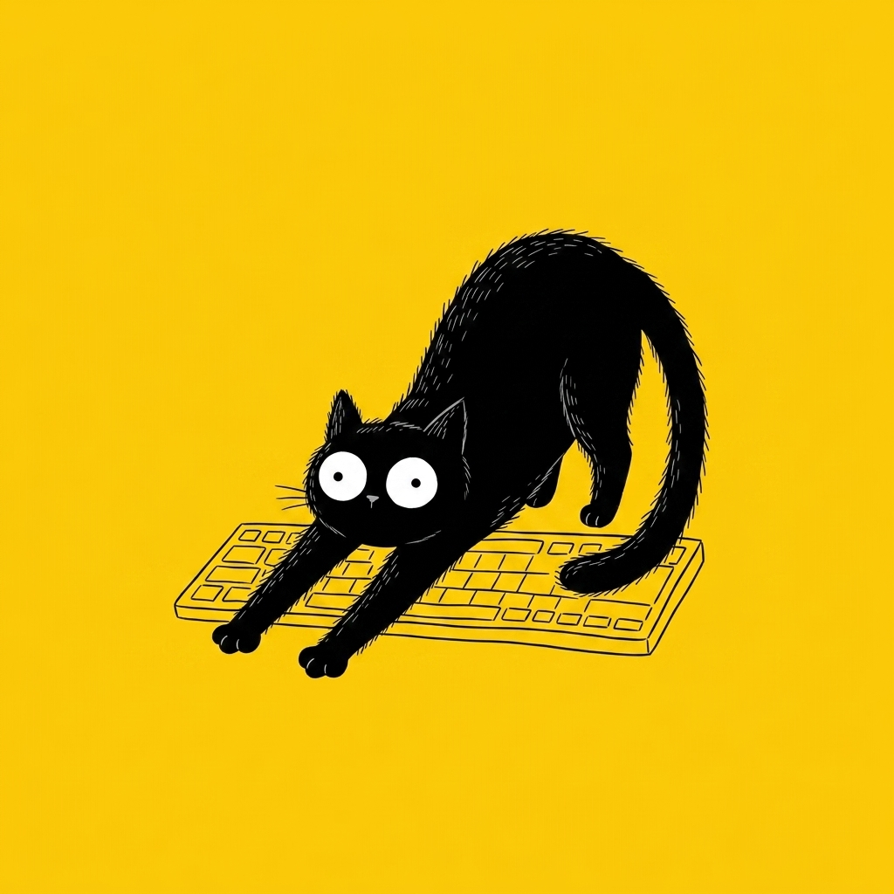

# 【随笔】创作与感受哪个重要

第一次看到有人把这两个词对立起来探讨时，我很有些惊讶。那时，我正在认可这么一个观念——生命的本质就是创作。

然而，这么说的人是 Isha，一个颇有名气，戴着漂亮头巾，蓄着一大把飘飘欲仙的白胡子，言谈气质非常有吸引力的萨古鲁，由不得我多看了一眼。然而，纳闷的是，当时我虽然听了他的视频（应该并不长），但他究竟讲了什么我此刻已经忘到九霄云外。刚刚拿起手机，想要再找找那篇公众号的链接，翻了10来分钟，居然也找不到了。

但这标题，还有他宣称**感受比创作**更重要的观点，却被我听了进去，并深深地动摇了我之前的那个观念。

所以，对于生命而言，最重要的不是创作，而是感受？

我一定是在这段时间，不知不觉之中，持续地思考过很多遍这个问题，这个概念才会在我大脑里印象如此强烈。然而，在我写作的这个瞬间，我究竟是在创作还是在感受呢？

当我开始敲击键盘，那劈劈啪啪清脆的击键声音就压住了周遭其它人的键盘敲击声，以及咔哒咔哒点击鼠标的声音。但是远处和不远处人们打电话、聊天的声音还是会直接穿透耳膜。甚至有些人对着电话那头大声宣泄的愤怒，会直接把我的注意力拉进她们的场景，得费劲儿才能摆脱。空调出风口的风声变成一种若有若无的存在，不仔细捕捉根本察觉不到。各种各样的念头在脑海里如风暴一般来回呼啸，最终某一条主线被我选中，然后若干词语几乎是同时从某处蹦出来，在我大脑里被拼接成句子，再输出到屏幕上。这些字的出现，也同步影响着我脑中正在构思的词句。就是这么一个完全搅在一起的过程。

当我只是去感受时，我的大脑是一种状态；当我有一个具体问题要解决时，我的大脑又是另一种状态；当我想要输出点什么时，有纸笔在手边是一种状态；有键盘屏幕在手边又是一种状态；对着手机用语音又是一种截然不同的状态。

这些，其实是不可能分开的过程。

当时练习双拼输入法，练到超过 30 WPM 就停了下来。因为我发现，自己写文章的速度大致上就在半小时 500 字，打字再快，思考就跟不上了，这也是我现在使用语音输入不太习惯的原因。

或许和人或者 Agent 日常对话时情景又有所不同吧？那种情况下语音更快更有效率，但其实也许只是信息的接收方对噪音和混乱的容忍度更高罢了。

所以我想，生命中，应该不存在所谓纯粹的创作，或者纯粹的感受吧？输入 → 处理 → 输出——这都是一起发生、互相影响、甚至循环嵌套不可拆分的部分。

只不过，哪些纯粹的表达欲，是不是又一种我执呢？

不管怎么说，我还是会很享受思考的过程，和这过程中的快乐；也同样享受看着自己的思考与感受，与纸笔、键盘、屏幕交互，用文字或者图画表达的那个过程与快乐；我也能理解，和这些必然如影随形的，无法表达的那种憋闷，以及无法捕捉的那种空虚。

就好像吹尺八时，明明心之所感，脑海中某个音符旋律蹦出，但手拙口拙，却只能吹出另一种声调的无奈。

或许，这就是萨古鲁所想要提醒我的事情吧？