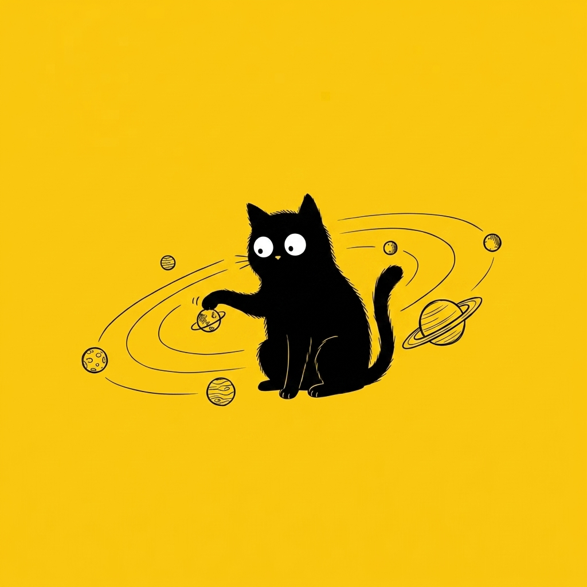

# 【随笔】秋雨之后

或许昨晚和大宝聊天聊到太晚，早上有些不想起床。可是 Cup 在门外开始小声，又有点着急的喵喵着，不时还挠挠门。这和小玉挠门的动静完全不同，我不由得腾地一下清醒过来——猫咪想必是有什么事儿要告诉我吧。

打开门，Cup 果然蹲在卧室门口，它不再出声，任我摸了摸它的头之后，就缓缓走开。倒是小玉蹦跳着从客厅跑了过来，在我腿边蹭了又蹭。

我看了看时间，距离 9 点只有 20 分钟了，足够我慢条斯理洗漱并且不迟到，但是不可能吃早饭了。大宝昨晚可和孩子们商量好了，今天要去吃肠粉的，看样子我是赶不上了。

昨晚一夜闪电，但雨却到此时此刻才猛扑下来。大宝连忙把阳台上的衣服取下来，扔到床上。我拿了几件还带着太阳气味的 T 恤，一件穿身上，两件塞进包里就准备出门了。

> 饭拿了没？

> 拿了！

> 剩两根麻花，我们一人一半。

我又把两根半截的麻花装到电脑包里，拿上垃圾就出门了。

……

没想到刚刚铺天盖地的大雨，此刻已经完全停了。我决定不坐地铁，还是扫了一辆路边的黄色美团通勤。

路口还有不少积水，自行车冲过去，漾开一层层泡沫和水花。沿中心河的大道上，并没有多少车。宽敞的行人通道，可以任我肆意地猛踩踏板，让黄色的共享单车向前猛冲、嘎吱作响。

我留意到，前两天路边停过的一辆高空作业车不见了，而路边的商铺则出现了一个新的金光闪闪的大招牌，好像是什么泰、什么按摩之类。前几天我还以为是在维修什么呢？原来是开新店了。正这么想，发现那辆高空作业车又出现在前方，两个戴着黄色安全帽的工人，正在某个商铺上方，本来是安置招牌的空旷墙壁边忙碌着。

> 这经济是好了？还是差了呢？

我这么想着，脚下却没停。路边的大树浓荫茂密，地面却堆满了黄色的落叶，有时汽车驶过，黄色的叶片就被卷起飞舞一阵子。这雨中的落叶一路延伸直到远方，平添许多秋天的气息。年少时在江城的秋雨后骑车，似乎也是这般景象。只不过，那时满路的落叶尽是大巴掌一般的梧桐叶，一样的金黄灿烂，被秋后的雨水糊在人行道上。有时，会正好落下，粘在单车的挡泥板上，车轮每转一圈就发出啪啪的轻响。

……

到公司后，忽然发现有些意外的工作需要处理。我转头不看屏幕，把本子从抽屉里拿出了，重重地砸在办公桌上。又惊觉自己其实有些多想，便停下来，跑去冲了一杯苦咖啡，就着它把甜滋滋近乎发腻的麻花塞进嘴里。

还是先把这件影响我心情的事情先处理完吧……

干完活，我打开邮箱里躺着的那封来自 Janna Levin 的 newsletter，看着看着，不由得逐字逐句读出声来，残留在胸中的那团闷气，竟然不知不觉消失了。

文章最后，是 Janna 附上的，来自她《黑洞生存指南》的文字：

> The Solar System motion is something of a spectacle, something to provoke the imagination. The Sun and plasma winds and planets and the multifarious, ample moons and straited rings and Jupiter's red-raw stormy eye and all the human-made satellites -- flicked, shiny, lost coins forever falling in the harsh quiet -- and Pluto -- champion of the hundreds of dwarf planets -- and those planets that shattered into neurotic asteroids and interplanetary ice, rocks, fog, magnetic lines... all traveling together at a daunting speed exceeding two hundred kilometers every second -- every breath -- in the pinwheel spin of our galaxy around and emptiness more massive than 4 million suns. All the elements of our solar system spinning and orbiting, the original orrery, in mechanical glory like an arcane, wildly ambitious timepiece while we stagger around on one rough gear, oblivious.
>
> -- Janna

> 太阳系的运动堪称一种奇观，一种能够激发想象力的景象。太阳、等离子体风、行星、那些繁多而充足的卫星、带有条纹的光环、木星那血红的暴风眼、所有人类制造的卫星——那些被弹射出去的、闪闪发光的、失落的硬币，永远在严酷的寂静中坠落——还有冥王星——数百颗矮行星中的冠军——以及那些碎裂成神经质小行星的行星，还有行星际的冰、岩石、雾霭、磁力线……所有这一切，都以超过两百公里每秒——每呼吸——的惊人速度，在我们星系的旋转星盘中，围绕着一个比四百万个太阳质量还大的空洞运行。我们太阳系的所有元素，都在旋转和公转，这个原始的太阳系仪器，以其机械版的辉煌，如同一个神秘而雄心勃勃的计时器，而我们却在这其中一个粗糙的齿轮上蹒跚而行，浑然不觉。
>
> ——詹娜

原来，就在昨晚我和大宝聊着天的那一次又一次闪电之际，英仙座的流星正如雨般坠落于地球的天幕啊……

