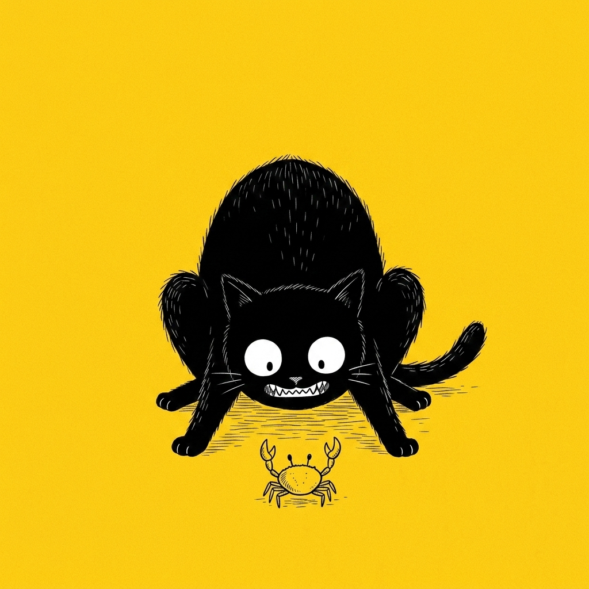

# 【随笔】深圳湾的螃蟹们

一直念叨着要背上各人新买的背包出门徒步，但真出门时太阳已经快落山，徒步也就变成散步了。

阿宝留在公园里和她的朋友遛鸟，大鱼跟着我们沿着中心河一路往海边走。阳光已经变成金黄色，从楼房、树枝的间隙斜洒下来，刚好只能照到马路边，河岸边的步道已经完全藏在了阴影里。

> 喵！

大鱼忽然停下来，大宝也跟着停下来，说：

> 真有猫，还有两只呢！

路边的草坪上，有一只黑背的狸花背对着我们、安静地蜷在草丛中，全然不管来来往往的行人。但我只看见一只，正困惑着往前迈了半步才发现：一只纯白色的小猫，正趴在小狸花一米开外，静静地瞪着黄色的眼睛看着我们。刚刚只是正好被路边的电线杆挡住了我的视线。

我这么一说，大鱼赶紧走到我的身边，仔细验证了一下我的说法。然后说：

> 确实被挡住只看见一只，但是只要晃一晃头，就能看见另一只了。

……

到海边时，天色还亮着，一些云朵变成了漂亮的粉红色，在大海的正上方飘啊飘啊！大鱼问：

> 香港在哪里？

> 对面那几座山就是。

我们在海边的石阶坐下，大宝和大鱼都掏出了自己包里的坚果。我想着大鱼之前说要吃我那包坚果来着，便只是看着她俩吃。大宝却说：

> 你为什么不吃呢？
>
> 每个人都有一包，每个人都可以享受美食和美景呀！

于是，我也打开背包翻找起来，终于在夹层里找到了那一小袋坚果。撕开塑料袋，把里面的果干和坚果仁混合到一起，然后挑了一枚塞到嘴里。喀嚓喀嚓，香气随着嚼碎的坚果弥漫开来，果然美味。

我回头看了一眼，背后没有高楼，刚好西沉的太阳落到了地平面，如同一个金灿灿的大灯一般，光线略过树梢，树影婆娑。眼见着两辆山地自行车嗖地从眼前掠过，后面又有一位顶着一头乱发的年轻人，昂首挺胸、摇摇晃晃地踩着美团跟了过来。我转回头看大海，天上的云朵变得更粉了。

> 螃蟹！

大鱼欢呼着，想要冲上岸边的礁石。大宝看我依旧有些闷闷的，便说：

> 快去帮他抓螃蟹，抓着抓着就开心了。

我想想也是，起身跟着大鱼，小心翼翼地来到礁石滩上。螃蟹很多，但是我们一靠近，它们就嗖地藏到石缝里。大鱼带着我继续往海岸的另一边跑去，告诉我那边还有很多。于是我们一路走过去，螃蟹们也一路都藏起来。有一处礁石上留着一洼积水，本来有十多只大大小小的螃蟹趴在上面，等我们靠近，它们却全都躲到了石头缝里。最搞笑的是，它们还不肯放弃这块领地，一面仔细观察着突如其来的阴影，一面不停地用大钳子往嘴里塞着什么东西。它们身子是青黑色的，大钳子却泛着白光，眼睛咕噜噜地四处转动着。见我这个大块头阴影没怎么移动，它们又悄悄地从石缝里爬出来，让我惊讶的是，它们不止是横着爬，也能竖着爬。一边爬，一边观察，一边不停地挥舞着大钳子吃东西。

大鱼伸出手来，像妈妈平时抓螃蟹那样，猛地拍过去。螃蟹们唰地加速，瞬间又都回到了石头缝里。我有点不敢动手，于是大鱼跑去，把我们刚刚吃完的坚果袋拿过来交给我：

> 给你，用这个抓。

我想要躲开小螃蟹们挥舞的大钳子，想试着从它们后方突袭，又害怕自己出手太猛，会不小心弄掉它们的腿或者钳子，总慢了一拍，每次都碰不到螃蟹的半根毫毛。就这么踌躇半天，一只也没有抓到。后来我又发现，螃蟹并不着急逃走，就用一根树枝抄它们的后路，把螃蟹们从石缝里赶出来。想把它们直接赶到我手中的小袋子里，但遗憾的是，它们被拨弄到最多离我的包围圈两只螃蟹那么远时，就会突然暴走，逃回到石缝里。

我无奈地对大鱼说：

> 要不你还是去找妈妈来帮忙吧？

大鱼跑去找妈妈了，我也跟在后面。大宝看我俩过来，起身把手机交给我，让我揣进兜里，跟着大鱼爬上礁石。

我一直觉得大宝比我擅长在野外抓这些小玩意儿，果然，她很快就抓住一只小小的螃蟹给大鱼玩，后来又一只。大鱼用他的玩具围成一个堡垒，把小螃蟹们放在中间。小螃蟹们只好纷纷藏在他那些玩具的缝隙和阴影里。后来又有一个小朋友给我们一个小饮料瓶子，刚好可以把小螃蟹装起来。

……

天色暗了，大鱼依依不舍地跟着我们往回走。那些大点的螃蟹都被放回了大海，只留下一只小小的、钳子全都不小心被弄掉了的小家伙装在饮料瓶子里，说是要带给姐姐一起玩。

我对大宝说：

> 果然还是你更厉害！

大宝笑着说：

> 大鱼跑过来找我时，我问他爸爸给他抓到螃蟹没。他委屈兮兮地说没抓到，可他居然一直耐心地等了你二十多分钟呢。

我心想，要不是我让他去找妈妈出手，他可能会一直耐心地等下去呢……