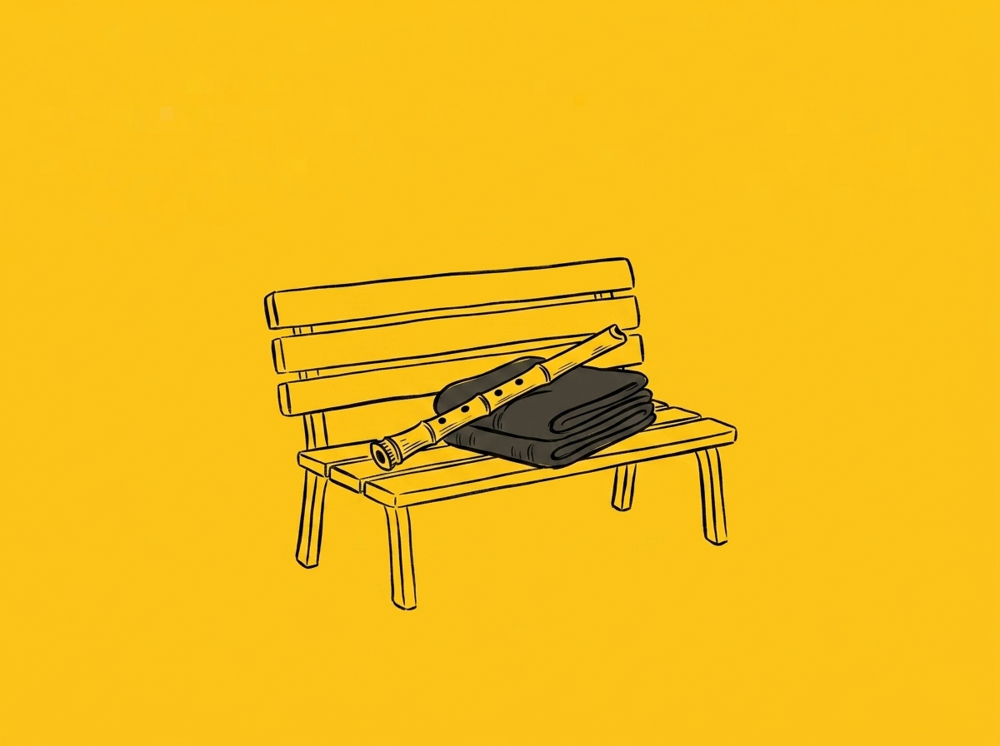

# 【随笔】暴雨的边缘

中午刚往人才公园去的时候，天只是阴，云彩虽然铺满了整个天空，却还是半透明的灰白色。自行车坐垫依然滚烫，我不得不照旧把披肩折成厚厚一叠垫在上面。可是刚停好车，我就听见脑后传来一声炸雷。

抬头看过去，半边天已经变成了深灰色，云层在风的吹动下，还在继续奋力地搅拌着，颜色越来越深沉。我一面快步往公园里走，一面检查了一下自己拎着的布袋子——没有伞，早上出门就没拿这玩意儿。脑子里盘算了一下，我决定不再去平时吹尺八的那片草坪，而是直接往旁边那处有遮雨顶檐的座椅走去。

两只燕子一样的鸟儿从我耳边嗖地掠过，然后继续俯冲，贴着地面只有十几公分的高度飞行了几十米，然后再爬升，钻进路边的树冠枝叶里藏了起来。我忽然有些怀疑，这是燕子吗？好像没听说深圳湾有燕子呢？那些穿着黑色燕尾服，优雅的小鸟儿，小时候春去秋回，总是躲在我们屋檐下衔泥做窝，现在似乎回到武汉时也未曾见到过。倒是那天阿宝在北京四合院酒店的院落屋檐下发现了两只。

不管怎么说，鸟儿们飞这么低抓虫子，算是小学课本里典型要下雨的征兆了。

座椅后面的地面上，躺卧着一个人睡午觉。不过，我觉得自己吹尺八的声音，应该也不可能比这户外的风雷之声大，就还是把折好的大披肩在椅子上垫着，坐好开始练习尺八。雷声依旧不时隆隆地从天边传来，我忍不住停下来先拍了一段视频发给大宝，然后继续闭上眼睛吹尺八。

天气闷热得不像样子，风时不时吹来，但并不太大。我一直想等着那暴雨来临前最后的一阵凉风，却只有一次从东南方吹过的风微微有些凉意。

没多久，闹钟响了，雨竟然还没有下下来。

我起身，回程。有些小小的雨点，零星地落在地面上，却一直没有变大。

一直到我回到公司，雨依然没有落下。我不禁有些纳闷，这场暴雨，要什么时候才能下来呢？