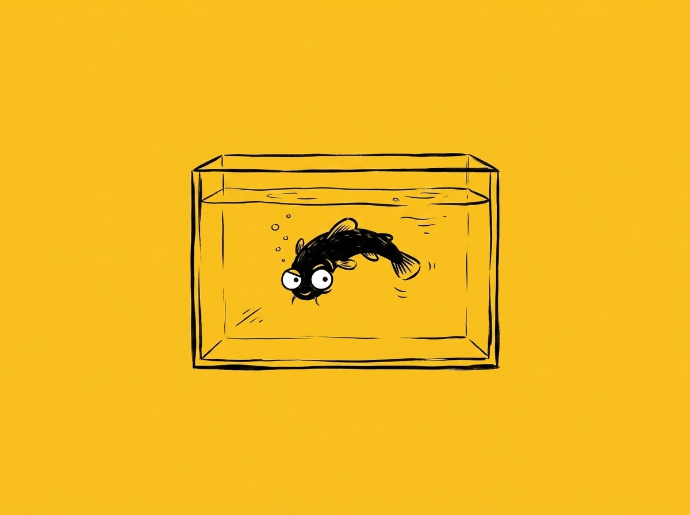

# 【随笔】顽强的泥宝

说实话，这个标题我犹豫了好多天。主要是担心民间所谓防谶的说法——比如，不能夸说自己没病、自己没被偷等等——一旦这么说，麻烦就在来的路上了。

但，泥宝的顽强或者说运气，实在是已经让我啧啧称奇了太多次。希望这点小小的记录不要给它带来什么不好的运气，希望它继续无知而快乐地活在那一方小小的透明塑料水盒子里。

……

泥宝是和一条红色的小金鱼一起来到我们家的——大鱼在幼儿园的活动中得到了它们俩，回家后先是养在一个小桶里，后来又转移到他那个装汽车模型的透明塑料盒子里。大鱼宣称，那是他的宠物，宝贝得不得了。我问他能不能记得给小鱼换水喂食，他还在犹豫，阿宝就跳出来说：

> 我可以帮弟弟给它们换水喂食。

家有两只猫，养其它生物时，我们不得不多加些小心。曾经阿宝和大鱼也养过两条泥鳅，结果有天出门，回来就发现，小泥鳅躺在客厅地板上，一只死翘翘，另一只仅剩下一个脑袋。于是，我们把这个小鱼缸放在阿宝房间的门背后，那是一个轻易不让猫咪染指的房间。

但有时候，阿宝会忘记照顾这些小东西。有一天，她的小珍珠鸟忘记喂水，口渴跳到这个鱼缸里把自己淹死了。

又一天，我们发现浑浊的鱼缸里，红色小金鱼翻了肚皮，不知是水太浑浊没有氧气，还是什么原因。

于是，只剩下了小泥鳅——大鱼给它起名叫泥宝。

……

阿宝暑假回老家，我接手了照顾家中所有小动物的任务，其中之一就是小泥宝。阿宝告诉我，每天只能喂一点点鱼饲料，换水时记得关上洗手池下水口，它可能会跑出去，水不要放太多也不能放太少。

可是有一天晚上回家，我发现泥宝躺在房间地板上一动不动，身上已经快干了，甚至还有血丝。我赶紧把它捡起来扔进鱼缸，它还是一动不动，肚皮朝天，一副完蛋了的样子。
  

我抱歉地给阿宝和大鱼视频，告诉她们这个不幸的消息。可是大宝告诉我说：

> 以前它也蹦出来过，你等一会儿，说不定它能活过来。

过了很久，它还是翻着肚皮，但是敲敲鱼缸，它会猛地挣扎一番。我不敢再惊动它，想了想，前一天换水留的水可能太多，于是我把水倒掉了一点点。又想着，是不是放得离鸟笼太近，叽叽喳喳的小鸟们吓到了它，又把鱼缸挪到离鸟笼远远的角落。

第二天，它又翻身回来。虽然依然不太动，但我知道，它已经活过来了。

……

旅行的 9 天，我专门给它在网上买了一个自动喂食器。只祈祷它千万不要在我不在家时乱蹦出来。还好，它老老实实待过了这 9 天。

……

等我们回来，它已经长胖了，大宝把它挪到了厨房里。

前两天下班回来，我发现厨房门开着一条缝，然而泥宝不见了。也不知道是不是猫咪袭击了鱼缸，仔细寻找，终于在厨房地面的角落里找到快干掉的泥宝，几乎都硬了。扔回水里，它也翘着肚皮一动不动。这次有了经验，我暂时不打扰它，第二天早上，它又把肚皮翻了回来。

阿宝告诉我，她也把泥宝捡回来过几次。

真不知道，它为什么那么爱蹦跶。

真希望，它能明白，老老实实待在鱼缸里，才能真正地、快乐地多活一阵子啊！

不过，一旦「危险」来临，它忍不住。

我们也忍不住那些「折腾」，也不知在更高级的生命看来，我们这些人类和乱蹦跶的泥宝是不是没什么区别呢。