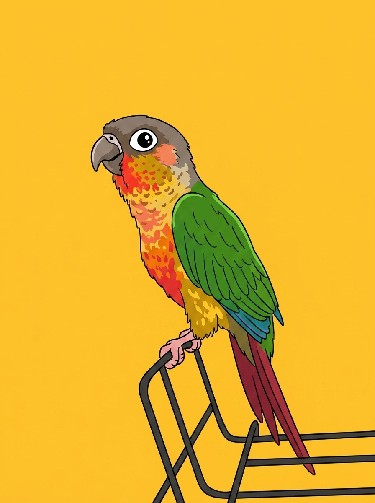

# 【随笔】新来的黏人精

阿宝花光了所有的零花钱，包括爷爷奶奶生日发的红包，还让妈妈赞助了一些，终于买回来她心心念念的小太阳。她让我猜她给它起了什么名字，我猜了几个没猜中，她便说：

> 你看看它像什么？

翠绿色的翅膀边缘泛着蓝色的光芒，灰色的脑袋，粉色的脸颊，眼睛旁一圈白色眼线。花脖子、红肚子、黄绿色的大腿，还拖着几根没长太长，朱红色的闪亮尾羽。

> 叫小彩虹？

> 答对了！
>
> 不过，去掉小字。嗯，现在它还小，也可以叫小彩虹。

听说小太阳是国家二级保护动物，算是有点身份。所以它脚上戴着环，还有个专属身份证。想必它们都是被人喂奶长大的，哪怕是现在也没有断奶，见到人就扑过来。一旦爬到手上，就死活不肯下来。有时候会顺着衣服，一路往脖子和脑袋上爬，弄得痒兮兮的。

晚上睡觉我们把它放在阳台的笼子里，它一副老大不愿意的样子，在笼子里上下翻腾，直到我们离开。一旦我们拉开窗帘偷偷看它一眼，它就又在笼子里爬上爬下。要是它现在已经会说话，一定会大叫：

> 快放我出来！放我出来！！放我出来！！！

最近，它开始学习飞行。通常喜欢紧紧抓住手指，然后拼命扇动翅膀，小爪子嵌在皮肤里，颇有些痛。偶尔，它能壮着胆子，哆嗦好一会儿后，从高处一跃而下，扑腾着，滑翔到我们身上，然后得意地从我们手中叼走一颗黑色葵花籽儿。

我开始期待，它是不是能像野生动物园的那些鹦鹉一样，能够自己飞出去，然后又飞回手边呢？

谁知道呢，毕竟这还只是一只没断奶的小东西。