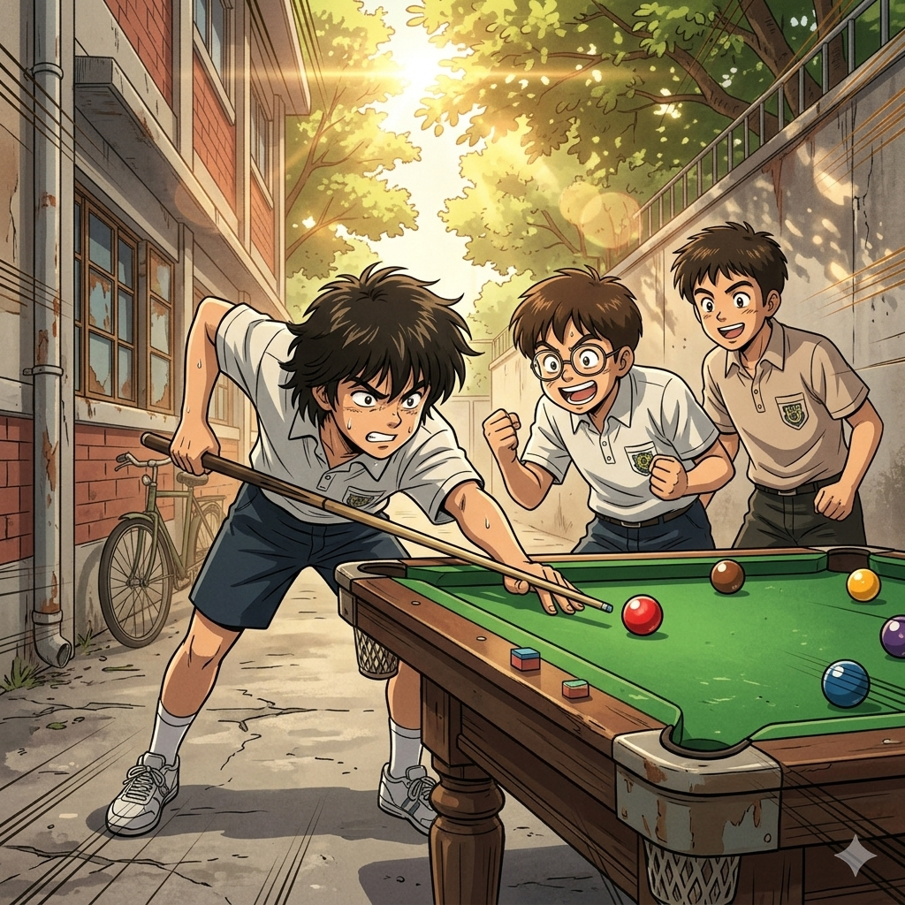

# 【生命•故事】（151）容易哮喘的孩子

记得中考时分，我童年时代的朋友 X 从外地回到了武汉。在复习的紧张间隙，我会找他玩儿，通常是在宿舍区小巷尽头的那张斯诺克台球桌上和他来上一两局。

由于我一向喜欢把朋友们撺掇在一起，X 和 我的高中同学 C 也认识了。这个回忆，让我对高一的记忆有了一种很恍惚的感觉：

> 究竟那时我主要的朋友圈是同桌 S，以及加上坐在我身后的 H 和坐在我前面的["三皮" （见那篇《谁说少年不识愁滋味》）](20250528【生命•故事】（135）谁说少年不识愁滋味.md)四人组呢，还是[好朋友 P（见那篇《足球小将》）](20260130【生命•故事】（150）足球少年和一些记忆碎片.md) 加上同学 C 的三人组呢？

此时此刻，看着窗外吸饱了雨水、饱满丰茂、生机盎然的树顶枝叶，看着那深深浅浅的绿树丛开始点缀着些许红色和黄色秋意，我在记忆碎片里捞起来的，却是和同学 C 相处的一些情景。我记得他、还有 P、我们三人常常一起玩。

记得他和我身高差不多，头发油油的，总是乱糟糟地耷拉在脑袋上，好像没有戴眼镜（不像我和 P ）。但他的举止，有时候会透出那么一丝丝的奇怪（这样回想起来，P 有时也让人感觉也有些怪，难道当时我也是一个怪小孩？）。他的父母是武汉水运工程学院的教授，那所大学在我大学毕业之后，在高校的合并潮流中，和我就读的大学合为一体。但在我读高中的年代，那是一所颇为独立、有着自己骄傲的高等学府。

我记得去 同学 C 家玩时，引起我注意的，有一些关于上海交大、西安交大的照片、历史书籍。他的父母，好像都是来自于交通大学，这让我一度认为这所大学，和那几所「交通大学」有着一脉相承的历史渊源。

当然，到他们家去玩时，最最让我印象深刻的事情，说来惭愧，居然是——哈密瓜！

<待续>