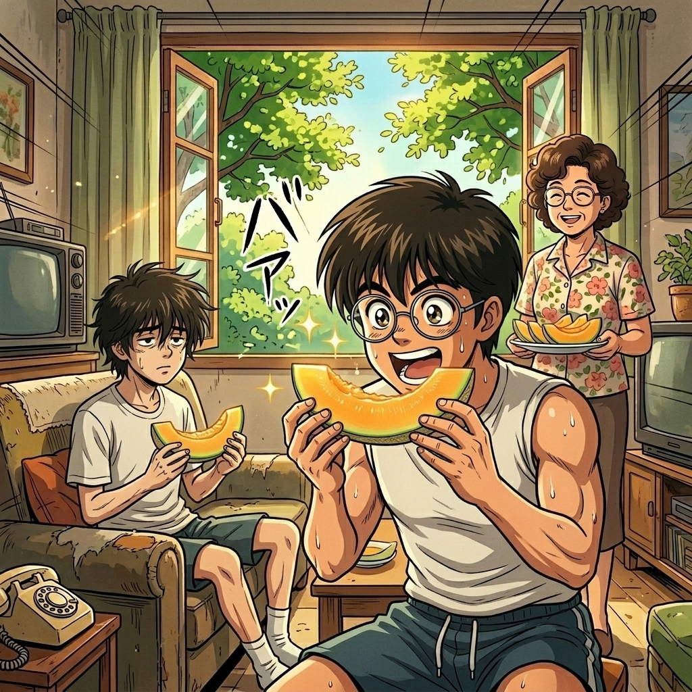

# 【生命•故事】（151）容易哮喘的孩子（续）

那是在夏天，或者是暑假，或者是靠近暑假的某些个周末。以前鱼塘间的小路已经被修成了大路，从东湖一直到长江边。估计是新修的缘故，我记忆中，有好长一段路没有什么大树，沿途灰扑扑的都是尘土。

我和 C 常常在夏日的阳光下，骑着自行车从我家一路骑到他们家。拐进校园，就是浓密的树荫了。他们家坐落在学校的宿舍区，那是些藏在树木间的四、五层小楼。蝉鸣呱噪，我们把自行车停在楼下，冲上楼。满脸的汗水混着灰尘乱淌，黏在眼角，刺得眼睛有些难受。

我扭过头，用短袖擦擦脸上的汗。来开门的通常是 C 的妈妈，卷发、戴着眼镜、特别和蔼的一位阿姨。一进他们家门，她总是很热情地和我打招呼，我就不由得变得礼貌起来。腼腆地叫一声阿姨好，然后在她的指引下去卫生间洗上一把脸。通常等我洗完脸出来时，她就已经给我们端上了几片切好的冰镇西瓜。

不过有一次，她拿给我们的是一种金黄色的瓜果，看样子，个头和西瓜大小差不多，但是被切成非常薄的一片一片。我拿起一片，轻轻咬了一口，不像西瓜那么水灵灵，却甜得像蜜一样。我惊讶地抬起头，问：

> 这是什么瓜？

她妈妈说：

> 哈蜜瓜，新疆哈蜜瓜。

我想起语文课上学过的那篇新疆吐鲁番的文章——原来这就是传说来自新疆的哈蜜瓜呀？

  

我细细的品尝着，小小的咬了一口，又一口。冰凉、甜蜜的滋味从嘴里一直渗到心里。我一直啃到只剩下最后那一层薄薄的皮，还舍不得放下。C 的妈妈一定是看到了我这嘴馋的模样，赶紧又从冰箱里拿出瓜了，又给我切了一片。说：

> 想吃还有呢。

接着她又转头问 C：

> 你还要吗？

C 摇了摇头，表示吃不下了。我悄悄看了一眼，见 C 留下的瓜皮比我剩下的要厚很多。

> 剩下那些还很甜呢，真浪费啊！

我琢磨着，但是没吭声。吃完第二片，虽然心里还馋着，但也还是没好意思再要。毕竟，这个瓜这么少见，一定非常贵吧？不然，为啥他们自己吃，也是切这么薄呢？

这么想着，甜蜜蜜的滋味却一直留在了心里。算起来，这应该是我生命中第一次品尝哈蜜瓜吧。

<待续>