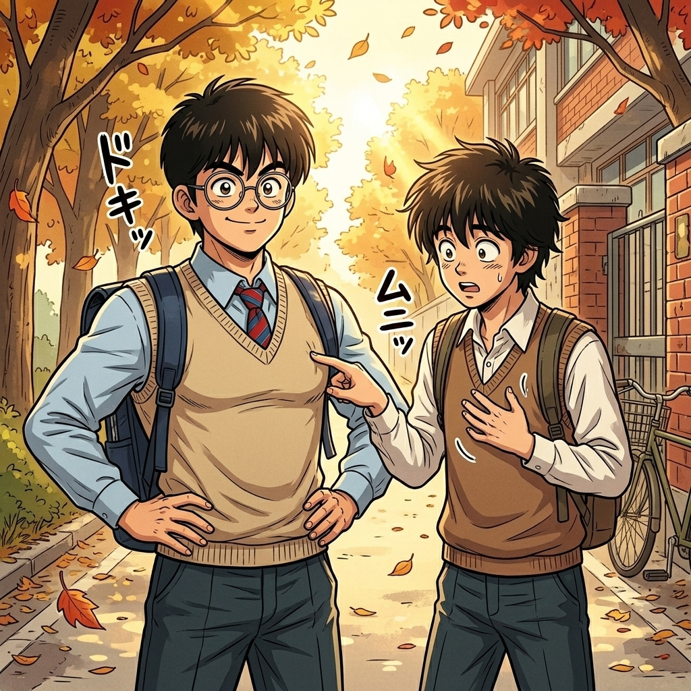

# 【生命•故事】（151）容易哮喘的孩子（续二）

刚认识 C 的父母时，简直觉得那就是所谓别人家的神仙父母，既温柔、又厉害，家里还有各种我以前见都没见过的东西。

相处久了，我却发现一件奇怪的事情。C 似乎对他的父母有些隐隐的不满，而 C 的父母经常当着 C 的面夸我独立，成熟。以至于我有段时间，一直有一种错觉：自己在他父母心中，其实比他更厉害了。

其实，相比我以前的朋友们，我更像是一个家教严、乖乖听话的「好学生」。没想到和 C 相处起来，我的位置变了，他才是那个乖乖听话，甚至有些孱弱的「好宝宝」。

记得有一次，在外面疯玩之后到他家。C 显得状态很不好，他的妈妈马上拿了些药来给他。他爸爸正好也在家，颇为严厉地告诉他，以后要注意些。C 转过脸去，一副不乐意听的表情。他妈妈却转头来温柔地对我解释：

> C 有哮喘，玩的时候需要注意了。
>
> 太激烈的运动可能会发作。

我似懂非懂地点点头。但那时，我并不知道哮喘是什么，尤其是发作起来又是什么景象，只知道按照武汉话的说法，就是容易「齁」吧。我大约转头就忘记他妈妈的嘱咐了。

……

记得春秋两季，C 常常穿一件羊毛背心。有时，我也会穿一件那样的背心。

我们俩身高差不多，胖瘦差不多，再穿成一样，大部分时候我会忘记他身体状态和我有什么不同。然而有一次放学，他拉着我书包时，无意间碰到了我的胸部，惊讶地说：

> 那是什么？

我丈二和尚摸不着头脑：

> 什么是什么？

他又拍了拍我书包带子下的胸膛，我也拍了拍自己，莫名其妙地问：

> 怎么了？

他表情奇怪地后退一步打量我，然后问：

> 你怎么会有？

我大约明白了，想起自己放假时有和 X 一起去练习散打，玩那些铁疙瘩健身器材。便得意地收缩了一下胸肌，说：

> 这不很正常吗？

他继续摇摇头，表示他就没有。我有点不相信地摸了摸他的胸膛，呃——那确实是像小男孩一样的身板儿，没有一点点肌肉的感觉。

我俩若有所思地不再说话，大约我们都在想：

> 原来，人和人是不一样的啊！

……

我一直觉得，C 的父母把他保护得太好。但没想到高一暑假，他的父母作出了一个让我们惊讶的决定。他们允许我们俩自己去桂林阳朔旅游。理由是，有我一起，他们很放心。

我父母似乎没有任何纠结就也同意了，不知他们内心的理由，是不是有 C 和我同行呢？