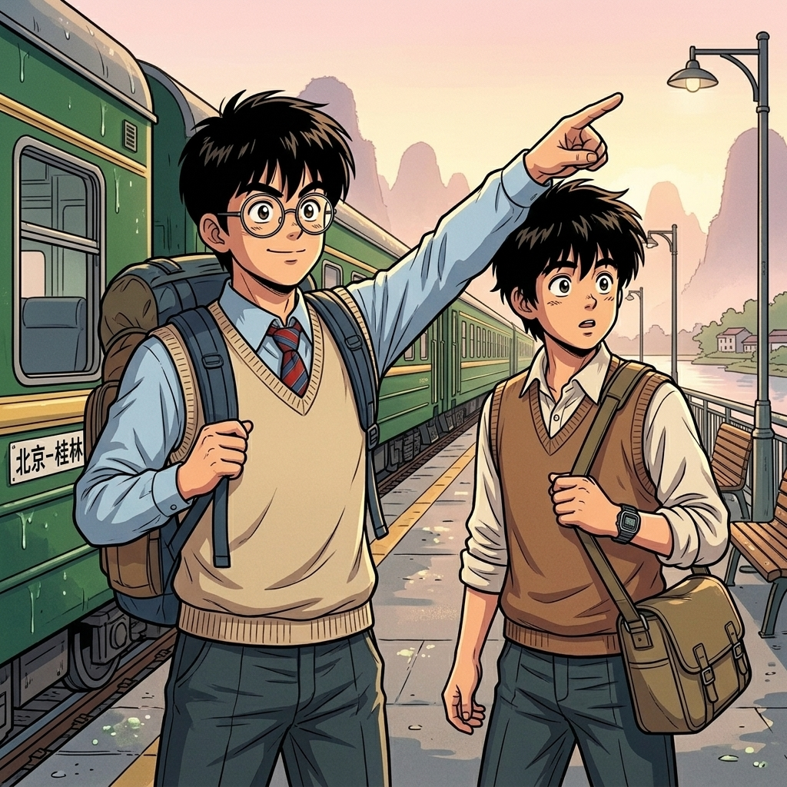

# 【生命•故事】（152）我想去桂林

等《我想去桂林》这首歌流行起来的时候，我觉得自己颇为幸运。在最有时间的少年时代，我就去过了桂林，不必像歌中唱的那样遗憾：

> 有时间的时候没有钱，
>
> 有了钱却没时间……

已经完全想不起来，我们是怎么规划那次旅行的了。那个年代，没有携程，没有12306，不但没有手机，甚至公用电话都不多。我们一定是揣着两颗雀跃的心，上了绿皮火车就一路向往着远方的桂林了。父母被我们名正言顺地抛在脑后，开始一段完全由我们自己主宰的生活。

脑海中竟然完全没有父母去火车站送我们的画面，或许他们只不过送我们到家门口？毕竟那时已经 16 岁，父母亲在我们这个年纪时，早就开始离家远行了。

绿皮火车给人留下的印象，总是那么温馨、烟火气十足。火车上有许多人和我们聊天，听说我们要去桂林。有人告诉我们，那里的人说话和你们武汉人很像。我有点小小惊讶，要说四川人说话和湖北话有些相像我是知道的。但桂林和我们也像？这个从没听说过，我满腹狐疑。等到了才发现，根本不是那么回事儿。

到桂林的时候，天还没怎么亮。我们背着包，出了火车站就一直走。想不起来当时我们是怎么决定住哪个酒店的，也不记得我们是不是提前研究过地图。我就记得刚离开火车站广场时，天还黑黢黢的，有个阿姨和我说话，我搭理了两句，但 C 埋头一直走，我只好跟过去。等那阿姨走远了，C 才开口，问我刚刚她在说什么。我说：

> 她和我们说，你们两个小男孩要小心。
>
> 不要听那些小姑娘的，跟着她们到偏僻的地方去……

C 轻轻地切了一声：

> 我们怎么可能那么笨！

我却说：

> 发现没？桂林人说话和武汉话完全不一样嘛……

……

走到酒店（或者是招待所、旅馆，我记不清当时住的到底是什么地方了），天已经亮了。夜晚的凉爽一点一点退去，我们毫无睡意，回头打量了一下身后刚刚穿行过的街道。赶路时看不清街边的模样，现在一切清晰地呈现在眼前。和我们熟悉的江城显然不同，但又说不出到底哪里不一样。或许是天际线？或许只是空气中弥漫着的，当时我们并不明白是什么的酸笋气息？

但我们毫不在意，无视旅途劳顿的我们，直接就开始仔细研究，那放在酒店门口的旅行团广告招牌了。

<待续>