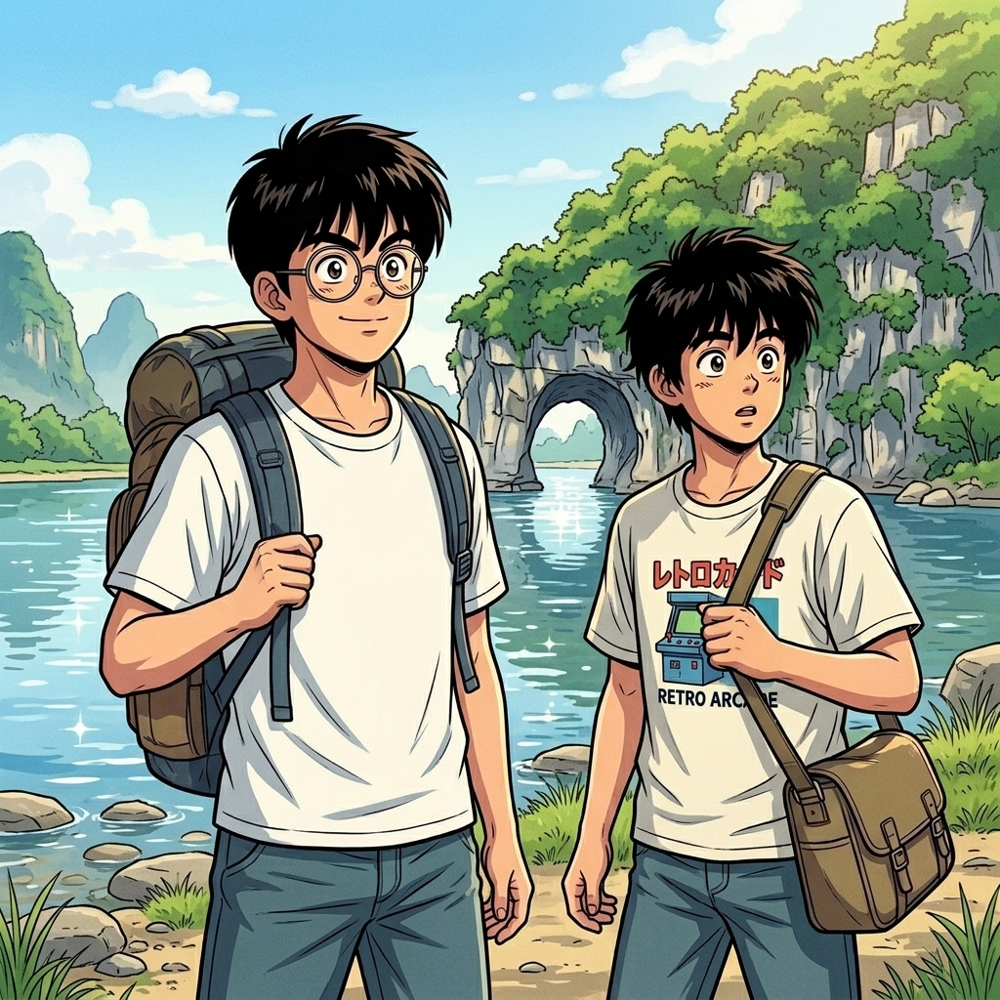

# 【生命•故事】（152）我想去桂林（续）

> 漓江肯定是要去的！

C 指着旅行团介绍的牌子说。

那是用毛笔写在一张大纸上的介绍，寥寥几行：

* 漓江一日游，XX 元
* 靖江半日游，XX 元
* 桂林一日游，XX 元
* 阳朔两日游，XX 元
* ……

我点点头，问：

> 靖江是个什么江？漓江的支流吗？

C 摇摇头，说：

> 我觉得桂林我们可以自己玩，然后报一两个团就行。

我表示同意：

> 江上游玩要坐船，报团省心，要不就报这个漓江和靖江的团吧？
>
> 可是，阳朔呢？

C 说：

> 不去了吧？时间太长……

我说：

> 可是，我听说桂林山水甲天下，阳朔山水甲桂林呀。小学时候就听人这么说过。

C 想了想，有些坚决地说：

> 我们主要就是来桂林玩的，那样的话，桂林可能就没多少时间玩了。

我说：

> 好吧，那就以后再说，以后还有很多假期呢，时间有的是。

……

谁曾想，后来再去阳朔，已经是很多很多年以后，和许多别的朋友一起。

那时候，我和 C 已经在人生的长河中走散，渐渐失去了联系。

……

我们去了象鼻山，围绕着它转了好几圈，只为了找到那最最经典的角度——然而，我们当时并没有相机，那印象刻在脑子里，闭上眼睛似乎还能看到：

> 夏日闪闪的阳光，山上青翠的树，山脚下公园转来转去的游人，三三两两，有些举着不同颜色的太阳伞，红的，花的。似乎还有些小孩子就在山下清澈的漓江里嬉戏着，黝黑的皮肤上沾满了水珠，闪烁着晶莹的光泽。
>
> 那座如大象一般的小山，就这么静静地伫立在漓江边，把巨大的鼻子插入江中，一动不动待在我的记忆里。

   

……

靖江并不是江——等我们参加了那半日游才知道，原来依然是在桂林城里转。闹了半天，原来靖江指的是靖江王府。

闹了这么个乌龙，也没有办法，来都来了。自由活动时，我们俩便往旁边的一座小山爬去——桂林许多这样平地里拔地而起的小山，郁郁葱葱长满了树，上山的路上其实颇为凉爽。

大约是午饭时分，爬到后来，只剩下我们两人。从树丛中钻出来，我才发现，这山顶是一个小小的平台，一棵树都没有。

太阳正当顶，阳光灼热地直射大地，全都砸在这平台上，C 还在我身后没上来。整个山顶只有我一人，四下望去，没有树，没有人，没有任何东西，山顶的大小让我也看不见山下的城市。

只有我一个人，暴露在这强烈的光线中，我只觉得四周白茫茫的一片，感觉自己几乎被融化在光里。

我感到一种深深的恐惧，无法言说，我不明白为什么在这样的强光下，会产生这样的恐惧感。当时我一定想不到，这种恐惧，这种感觉，在后来的几十年间，会一次又一次重返我的梦中。

我转身就要下山，遇到 C 正好上来。他不明白我为什么就急着要下山，还是坚持自己爬上山顶看了一圈。

> 哦，啥都没有，走吧！

他从我身边轻快地走过，重新钻进树荫里。我连忙跟了上去，凉风从树间吹来，我听见自己肚子悄悄地「咕咕」叫了两声……

<待续>