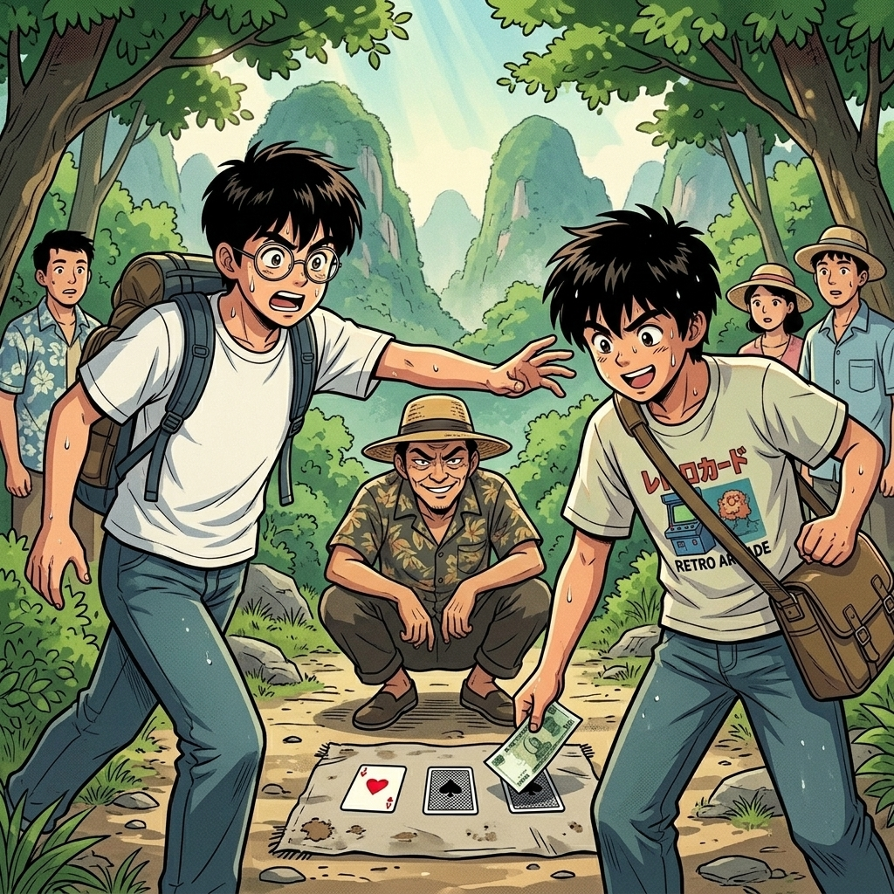

# 【生命•故事】（152）我想去桂林（续二）

下山小路一个拐角处的树荫下，聚着一帮人。

我们凑过去一看，是有人在拿着三张扑克变魔术赌钱。三张牌里有两张黑色，一张红色，坐在那里的一个家伙用看起来并不算迅速的手法，刷刷换位。然后让周围围观的人押注红色扑克的位置。押对了赢双倍，输了钱就归庄家。

围观的人老老少少，穿着各异，见我们好奇地停下来，有人主动往旁边稍微挪了一下，好让我们挤进内圈一窥究竟。当时的我们并不知道，这一停步，让我们就此陷入了九十年代那些与「红蓝铅笔」、「猜单双」齐名的江湖骗局之中。

坐庄的家伙慢条斯理，旁边几个押注的人却蠢得让人惊讶。明明红色在中间，他们却偏偏咋咋唬唬把手里的钱压在另外的扑克上，然后全部输光。旁边有人悄悄对我说：

> 笨哪！明明在中间嘛！！！

庄家二话不说，把钱全部装进自己的小包，再次洗牌。还是很明显，那张红桃K这次被换到了旁边的位置。一个戴着旧军帽的人一把按住这张扑克，说：

> 就是这张！

庄家说：

> 看准了就放钱，压好了开牌。

其它人往别的牌上扔了几张零钱，戴帽子的家伙咋呼地说：

> 就是这张，就是这张，我肯定赢！

我们好奇地继续看着，他一脚踩住这张牌，一面转过头开始在自己的黄绿色旧军用书包里翻找。我正纳闷，他为什么要转头呢，就看见庄家把他脚下踩住的牌抽出来，和旁边的一张交换了位置。他这才夸张地转回头来，我没忍住，说：

> 人家都换了！

他压根不理我，庄家也冲我瞪了一眼，让我闭嘴。我心里叹息一声：

> 唉，演得这么夸张，看样子是一伙儿的。

果然，他夸张地把钱压在那张被换走的扑克上，没人跟着下注，大呼小叫地输掉了钱，显得痛心疾首的样子。

> 肯定不止这么点猫腻。

我这么想着，脚却挪不动窝，抬头看了一眼 C ，他也正认真琢磨着这帮人在玩什么把戏。于是我便抱紧自己的背包，继续观察。

又是几轮，这会儿，庄家的手法有了变化。他竟然把红桃 K 在我毫无觉察的情况下，换到了另外的位置。但这时，我发现，即便如此，不管换到哪儿，红桃 K 的一角，总是被悄悄地折起来。

我心想：

> 原来是这么个花样啊。不对！

我发现，旁边两张牌的角上，也有折痕。我抬头正准备告诉 C 我的发现，却见 C 掏出一张纸币，啪地压在那张翻角的扑克上。我伸手过去拦他，但他比我更快，钱已经落地。我惊呼：

> 你干嘛啊？

他说：

> 我看准了！

我还没来得及再说第二句，庄家迅速地结束了这局押注，翻开扑克。果然——这次翻角的扑克，变成了黑色，红桃 K 又不知不觉地跑去了另一处。

我无语地看向 C，他愤怒地和老板争辩，说：

> 我还要换呢，没押定！

旁边几人开启了嘲讽模式，大约是撺掇着有本事再来之类。

我见 C 有点上头，甚至还想掏钱。赶紧一把拽住他，快步离开了这群人。他有点愤怒，一边走一边还回头看。我说：

> 你没看见，每张扑克的角都有折痕吗？他们故意让你以为，折角的一定是红桃 K。

C 气哼哼：

> 那你怎么不告诉我？

我无奈地说：

> 我正想和你说呢，你就掏钱了。

他不依不饶：

> 那你怎么不拦住我？

我说：

> 我拦得住吗？你手那么快！
>
> 再说，我哪想得到，你居然会掏钱。我以为，你也只是想看看咋回事儿呢。
>
> 你看那个人拿钱时，别人那样换牌他都假装不知道，明显是一伙的呀，谁知道旁边还有多少同伙，在这儿肯定是专门骗人钱的呀。

C 说：

> 那你既然看明白了，我们再去，把钱赢回来！

我说：

> 才看明白这一两层，我们怎么知道，人家后面到底还有啥连环套路呢？

C 还想回去找他们算账，我拉着他赶紧继续往山下走。

> 行了，小心你身上的钱。别被偷走了！你看看自己钱放好没？

C 拍了拍包，说：

> 我分开放好的，不会让人知道我钱放哪里的。

我擦了擦汗，山风的清凉似乎一点都没能消解这正午的酷暑。肚子又咕咕叫起来，我问道：

> 那我们这会儿去吃点啥东西呢？

C 气鼓鼓地说：

> 不吃了！

我看他这么生气，问：

> 你刚刚押了多少钱啊？

他说：

> 五十！

我呀了一声：

> 你怎么不拿 5 块、10 块的试试先呢？

他说：

> 手里最小就是这张了……

我叹了口气，那可是可以买100碗米粉的巨款。我把找地方吃饭的念头压了回去，默默地跳下山路最后两级台阶，不再说话。

路边树荫茂密，知了躲在不知哪片树叶后面拼命地叫着。空气中弥漫着不知哪里来的酸笋味儿，久久不能消散。可当年的我并不知道，内心深处滋生出的那点傲慢之心，那种自己可以看破骗局套路的傲慢之心，在几十年后会给自己一次又一次怎样惨痛的教训。

<待续>

