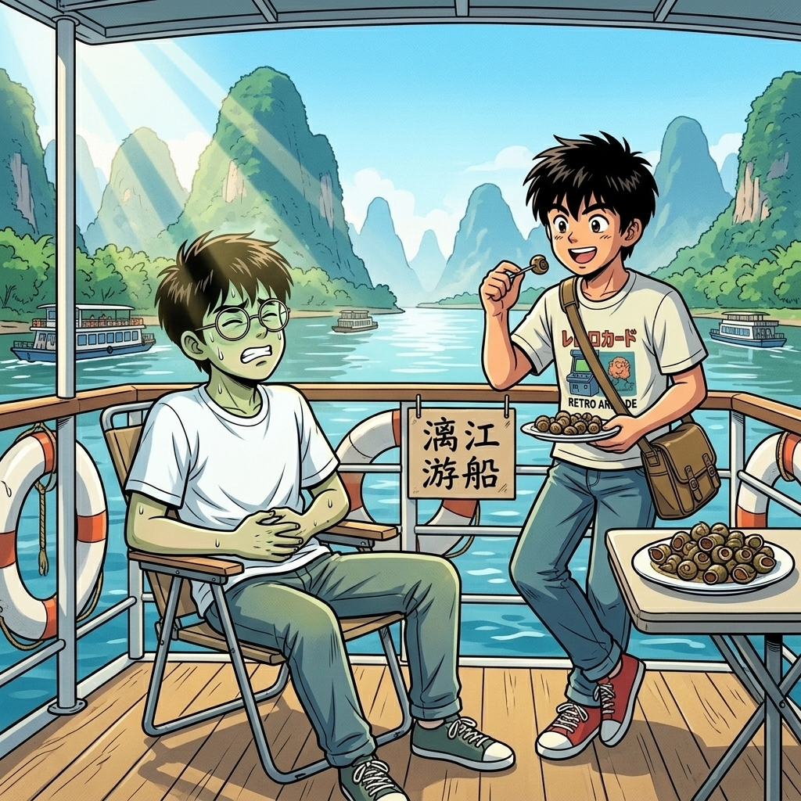

# 【生命•故事】（152）我想去桂林（续三）

记不清当时我们是不是真的就没吃午饭，反正，旅行还在继续。

按照原计划，我们坐上了漓江的游船，开始享受从桂林到阳朔的那一段美丽山水。然而，在我的记忆中，似乎没有存储什么漓江风光的画面。只记得，阳光很猛，江水很清很浅，清到可以直接看见江底闪闪发光的小石子。让我印象深刻的是那些在江中玩水的本地小孩儿，江水只齐他们的腰深。小家伙们全都光着屁股，水花被他们拍得漫天飞舞，黝黑的皮肤上挂满了水珠，泛出撒了金粉一样的粼光。

每次遇到对面驶回的游船时，两边船上的导游就会开始对歌，就好像《刘三姐》电影里那样，游客们也大多兴致勃勃地跟着唱上一阵子。

C 想要在游船上吃一顿本地美食——炒田螺，还有一种什么鱼——我感觉有点奢侈（以前出门玩，母亲总是准备很多路上的食物，几乎不在外面买吃的，更何况是游船），但想了想，最后还是同意了。

现在回想起那盘炒田螺，依然会不由自主地猛吞口水。又辣又鲜，我们俩眨眼就吃光了整盘田螺，每一颗螺蛳壳都被我们仔细咂摸过，还是嗦着热辣辣的嘴唇，意犹未尽。C 一直念叨着，要再来一盘，但我们到底有没有再来一盘呢？记不得了，至于那盘鱼什么味道，我也一点印象都没有。

我只记得，后来没多久，我就拉肚子了。在船上一趟又一趟地跑厕所，肚子痛得几乎直不起腰来。太阳猛烈，但我还是跑到外面。铁质的栏杆烫得让人不敢触碰，除了我，没有谁一直待在外面。不过，对那时的我来说，不管是晒着背，还是晒着肚子，那暖暖的阳光，都能让我剧烈的肚子痛，稍微缓解那么一点点。

我虚弱地看着 C，纳闷地问他：

> 你没事儿？

他摇摇头，表示根本没有任何感觉。看着他精神十足地在船上跑来跑去，完全沉醉在美食的余韵和漓江的美景之中，我不禁既嫉妒，又不解——这家伙，平时不是跟弱鸡一样么……

<待续>