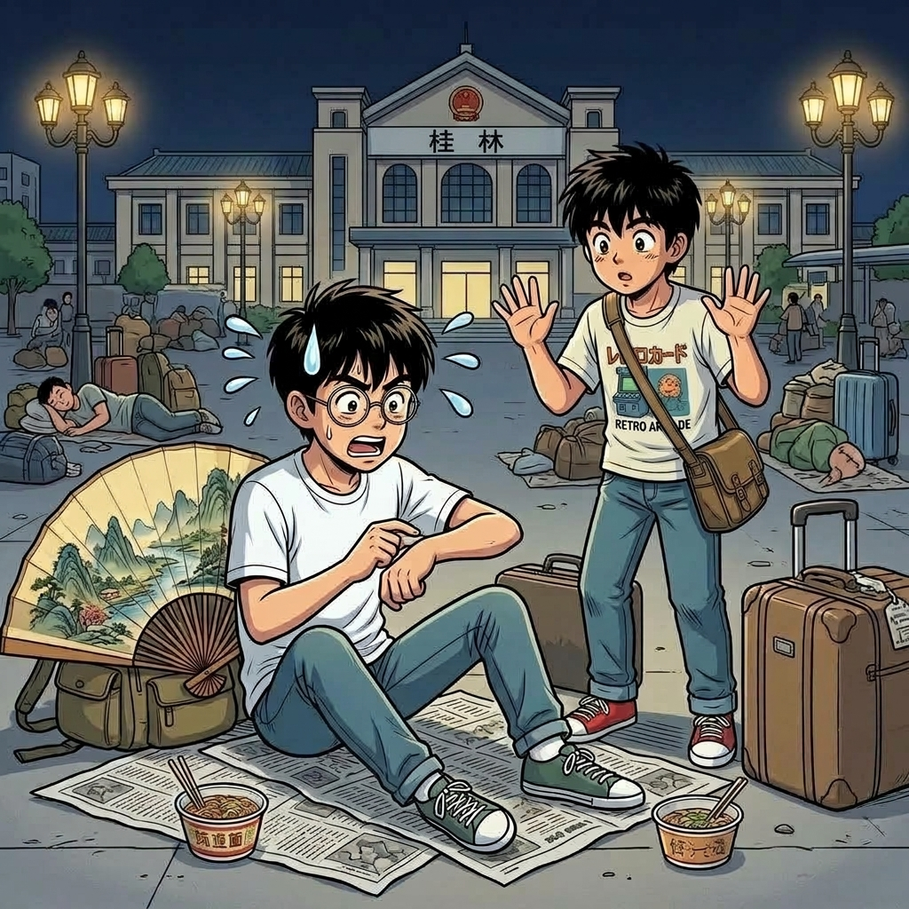

# 【生命•故事】（152）我想去桂林（续四）

快乐的时光总是短暂的，我们当时在桂林玩了多久呢，反正眨眼之间就到了回程的日子。C 给自己买了一堆纪念品，包括一把巨大的、只能挂在客厅的折扇。我也少少买了一些，至今还有印象的，是一对石头做的长方形镇纸。

那上面是和桂林山水有关的诗与画，上了一层釉。沉甸甸的，摸上去冰冰凉，我喜欢把它们贴在脸上，喜欢在炎热的夏天享受那从石头传来的冰凉与舒适。哪怕是后来不小心把其中一块摔成了两节，把另一块摔缺了角，我也没有把它们扔掉。

用 502 粘好后，这一对镇纸又继续陪伴了我许久，直到后来我离开武汉……

那天回程的火车应该是凌晨的，那天夜里，我们没有住旅社，而是选择了在火车站度过最后一晚。

火车站的广场上，到处都是等车的旅客，或坐或卧，各自一摊守着自己的行李。我们俩也在广场找了个地方，买了几张报纸垫在地上，把背包放在一起，坐在那里吃着快餐面，聊着天，等着上火车的时间到来。

后半夜，我实在困得顶不住了，慢慢地躺倒在地上。薄薄的一张报纸，既隔不住水泥地的坚硬，也隔不开暴晒一天后那延绵不绝、如同火炉一般的热度。但我实在管不了那么多，就这么枕着包，昏昏欲睡。C 把他的那些东西拴在我手里，自己独自去溜达。

过了一会儿，我在迷迷糊糊之中听见他回来，问我时间。

我困得完全睁不开眼睛，就伸出左手来，嘟囔着说：

> 你自己看吧……

于是，他把我的手表取了下来，又走开了。

又过了一会儿，他又回来，问我：

> 现在几点了？

我纳闷地睁开眼睛，说：

> 我手表不是在你那里吗？

他说：

> 没有啊？

我稍微清醒了一点，坐起身来。但手表确实已经不在自己手上——那可是自己考上心仪高中后，父母送给自己的礼物，一块金色的，武汉手表厂新产带日历的机械手表。我赶紧又翻了翻包，到处都没有。

我很是生气：

> 刚刚你回来问我时间，我让你自己看时间，你就拿过去了。
>
> 你忘记了吗？

C 说：

> 不可能啊！我刚刚回来！！！

我顿时完全清醒过来，原来是被贼偷了！我们赶紧检查了一下所有的行李，还好钱和其它什么东西都没丢。再问问周围的人，都表示没注意，同情，但是告诉我们——这是没有办法的事情，火车站就是这么乱，只能自己小心！

……

这趟美好的旅程，就这么留下了一个无奈又伤心的记忆收尾。

回到家之后没多久，自己就病倒了。还挺严重：高烧，然后绕着腰长了半圈水疱，从腹部正中绕到脊梁骨正中，破了又长，长了又破，怎么都不消。折腾几周，留下了些至今还能看见的疤痕。

后来听说，这染上的是带状疱疹病毒，凶险之极。传说如果水疱是绕着腰长一整圈，就会有生命危险。

……

很多年以后，有一次去 C 在南京的家里，我记得也是穿过了梧桐树的树荫后，进了他新买的房子，他们家好像是在一楼。

他一面和我抱怨着，全怪固执的父母，一定让他全款买房不许贷款；不然他就可以买大一点的房子了，甚至可以多买一套。

一面把哇哇哭着的小宝宝放在婴儿床上，然后熟练地撕开一张干净尿布垫在小宝宝身下，拿着湿纸巾开始仔细地给小宝宝擦拭身体。

我抬头四处打量，发现客厅里挂着的，正是当年他从桂林背回去的那把巨大的折扇。